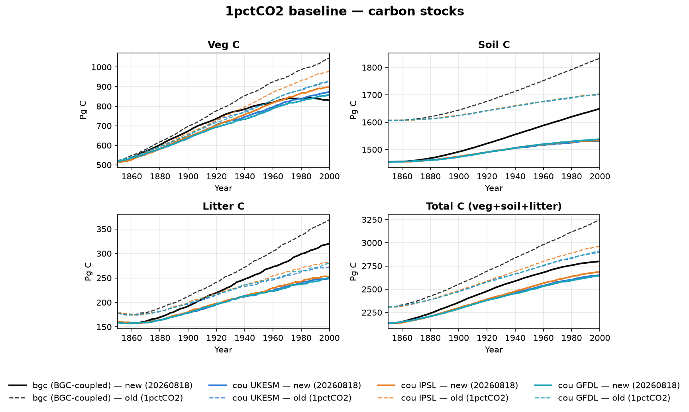
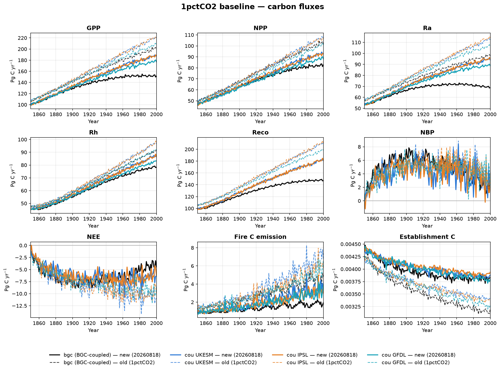
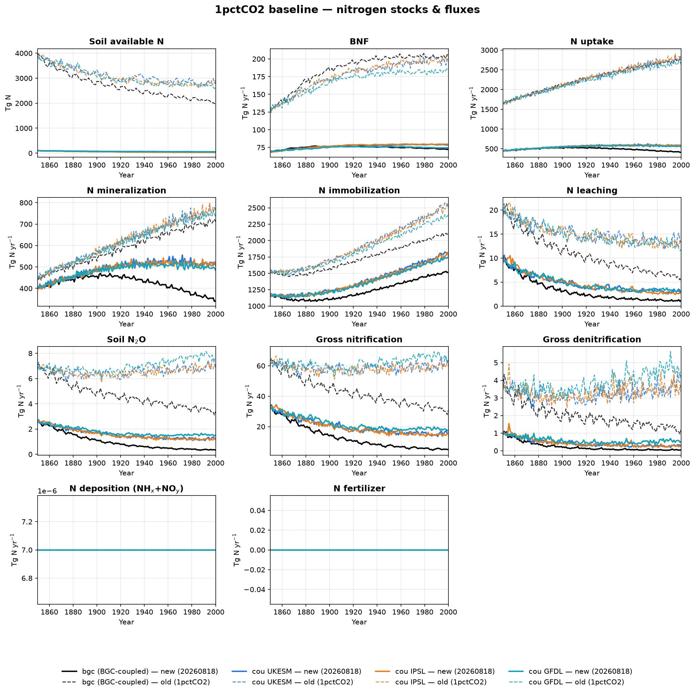
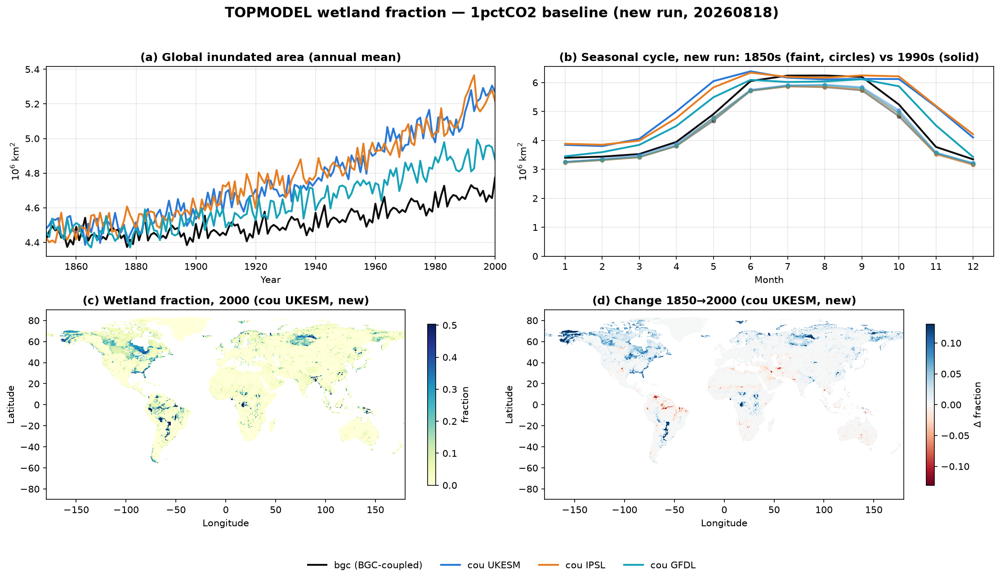

# 1pctCO2 baseline re-run (2026-08-18): C & N stocks, and wetland fraction

A fresh run of the **1pctCO2 baseline** factorial (`1pctCO2_20260818/baseline`,
LPJ `a64008bc`) against the **previous baseline** (`1pctCO2/baseline`). Global
area-weighted annual totals, 1850–2000, for the **bgc** stage and all three
**cou** ESM drivers. Colour = stage, **solid = new run, dashed = old run**.

The new run differs from the old one by exactly two compile flags —
**`LUH_NFERT`** (fertilizer read from the LUH file's own `fertl_*` fields
instead of the HaNi streams) and **`NO_MANURE`** (manure application zeroed) —
plus the newer LPJ commit. It also adds `wet_frac`, `cProduct` and the
`woodharvest_*` outputs, which the old run did not write.

!!! warning "N deposition is effectively zero in **both** runs — a driver unit bug"
    The 1pctCO₂ Ndep drivers (`nhx_wiemip_lpj_final.nc` / `noy_wiemip_lpj_final.nc`)
    carry a **per-second** rate: the file inherits `units = "kg m-2 s-1"` from
    input4MIPs and its `history` shows only a `cdo -mulc,1000` (→ g m⁻² s⁻¹), with
    no seconds-to-month conversion. Under `MONTHLY_NITROGEN` LPJ reads those same
    numbers as **g N m⁻² month⁻¹** (`iterateyear.c` divides by days-in-month to get
    a daily rate), so the model receives roughly 2.6×10⁶ times too little N.
    Interpreted correctly the file gives a sensible **19.3 Tg N yr⁻¹** of NHx in
    1850; as LPJ reads it, global deposition is **7×10⁻⁶ Tg N yr⁻¹** — i.e. zero.
    The `nhx`/`noy` locals that carry this are passed straight into
    `update_daily()`, so this is **not** a diagnostic-only problem: the soil really
    gets no deposited N. The values are bit-identical between the two vintages, so
    this is a **pre-existing driver-preparation bug, not something the flag change
    introduced**. Fix is a `× 86400 × ndaysmonth` (or `× seconds-per-month`) scaling
    on the driver files.

    Consequence: with `NO_MANURE` on and `mnfert ≡ 0`, the **new** baseline's only
    external N source is BNF (~72–79 Tg N yr⁻¹). Read every nitrogen number below
    in that light.

## Carbon stocks



**The new baseline holds ~9% less total carbon.** At year 2000 the cou stages
land at 2646–2686 Pg C versus 2899–2961 Pg C before (−8.5 to −9.3%); the bgc
stage drops further, −13.8%. The deficit is spread across all three pools rather
than concentrated in one: SoilC −10% (1531–1538 vs 1701–1704 Pg C), LitC −9 to
−11%, VegC −6 to −8% in the cou stages and −20% in bgc.

Two things are worth noting about *where* the difference comes from:

- **The runs start apart, not just end apart.** New bgc SoilC begins at ~1450 Pg C
  where the old run began at ~1607 Pg C. The divergence is inherited from the
  spinup, so it is not a transient-phase artifact — the new flag set changes the
  equilibrium the model spins up to.
- **The driver spread is unchanged.** SoilC still lands within ~0.5% across the
  three ESMs (1531/1533/1538 Pg C), and IPSL is still the VegC/GPP outlier on the
  high side. Whatever changed, it moved all three drivers by the same amount.

`cProduct` and all six `woodharvest_*` outputs are **identically zero** in every
run. That is expected, not a failure: every 1pctCO2 stage is `CONST_LU`
(land use pinned at 1850), so there is no land-use transition and no harvest.

## Carbon fluxes



- **Productivity is down ~13–15%.** GPP 187/188/177 vs 220/221/207 Pg C yr⁻¹
  (UKESM/IPSL/GFDL), NPP −13%, Rh −10%. Ra falls hardest in bgc (−30%), and the
  new bgc Ra actually *turns over* and declines after ~1960 — the old bgc Ra rose
  monotonically to 2000.
- **Fire roughly halves.** fireC 3.53/3.01/3.86 vs 6.77/5.79/6.66 Pg C yr⁻¹
  (−42 to −48%). With less N there is less biomass, so less fuel — fire is
  responding to the productivity change rather than to anything in SPITFIRE.
- **The land sink weakens.** NBP at 2000 is 2.83 (UKESM) and 3.21 (IPSL)
  Pg C yr⁻¹ against 4.21 and 4.11 before. NEE moves consistently (−6.4/−6.2 vs
  −11.0/−9.9 Pg C yr⁻¹; LPJ's NEE excludes fire, which is why |NEE| > NBP).
- Establishment C is the one variable that goes *up* (+13 to +20%), but it is
  ~0.004 Pg C yr⁻¹ — negligible either way.

## Nitrogen stocks & fluxes



This is where the flag change shows up hardest, and the direction is toward
*more* physically plausible numbers, not away from them.

- **Soil available N collapses by ~98%**, from 2053–2923 Tg N to 36–58 Tg N. The
  old run's ~2800 Tg N standing available-N pool was not defensible.
- **N uptake drops ~79–85%**, 2635–2801 → 410–579 Tg N yr⁻¹. The old value is
  the more suspicious one: at 2800 Tg N yr⁻¹ it *exceeded* its own supply terms
  (mineralization 764 + BNF 200 + deposition ≈ 0 ≈ 964 Tg N yr⁻¹), which cannot
  balance. In the new run uptake (579) sits just below mineralization (509) plus
  BNF (79) — internally consistent. Whatever was inflating uptake in the old
  configuration is gone.
- **Every loss term shrinks with it**: leaching −75 to −80%, soil N₂O −80 to −83%
  (1.2–1.5 vs 6.8–7.6 Tg N yr⁻¹), gross nitrification −72 to −76%, gross
  denitrification −88 to −92%.
- **BNF drops ~60%** (72–79 vs 185–206 Tg N yr⁻¹). This one runs *against* the
  expected direction: the new run is far more N-limited, so a demand-driven BNF
  should rise. It falls instead, which suggests LPJ's BNF is keyed to something
  other than N deficit here. Worth a look on its own.
- N deposition and N fertilizer are both flat zero — see the warning above for
  deposition; `mnfert ≡ 0` is expected under `CONST_LU` at 1850, when LUH2
  synthetic fertilizer is still ~0.

## Wetland fraction (TOPMODEL)



New run only — `wet_frac` was not an output variable in the old baseline, so
there is nothing to compare against.

- **Global inundated area grows through the run**, 4.45 → 5.27 (UKESM) /
  5.22 (IPSL) / 4.88 (GFDL) 10⁶ km², while the fixed-climate **bgc** stage rises
  only 4.45 → 4.77. So most of the wetland expansion is a *climate* response, not
  a CO₂ response — the bgc stage isolates the CO₂-only part and it is small.
- **The seasonal cycle is large, and it both amplifies and shifts.** In the 1850s
  inundation ran ~3.2 10⁶ km² (December) to ~5.9 10⁶ km² (July–August). By the
  1990s the cou stages run ~3.8 (February) to ~6.4 10⁶ km² (June) — the peak gains
  ~0.5 10⁶ km², the minimum gains ~0.6, and the peak arrives **1–2 months earlier**.
  The fixed-climate bgc stage shows the amplification but almost none of the shift
  (3.35 → 6.25 10⁶ km², still peaking in August), so the phase change is a climate
  response, not a CO₂ one.
- **Spatially** the wetlands sit where expected: boreal North America and western
  Siberia, the Amazon, the Congo, and SE Asia. The 1850→2000 change map is
  dominated by **boreal gains** (Alaska, Hudson Bay, W Siberia) against **Amazon
  and Sahel-margin losses**. The boreal pattern is consistent with the ice-fraction
  and water-table scaling in `topmodel.c::wetdfrac`, which ties inundated fraction
  to the permafrost module's water-table depth — but that attribution is inferred
  from the code path, not diagnosed here.

!!! note "How the inundated area is computed"
    LPJ accumulates `output.wetfrac` on the **PRIMARY stand only** and writes it
    unscaled by `stand->frac` (`output.c:fwriteoutput_monthly`, where `frac = 1`).
    Multiplying by full cell area therefore gives the inundated area *as if* the
    primary stand covered the whole cell — an upper bound wherever land use has
    displaced primary vegetation. Under `CONST_LU` at 1850 that displacement is
    small and time-invariant, so the **trend** is unaffected even though the
    absolute level is biased slightly high.

## Global totals at year 2000

| Variable | Unit | bgc new | bgc old | UKESM new | UKESM old | IPSL new | IPSL old | GFDL new | GFDL old |
|---|---|---:|---:|---:|---:|---:|---:|---:|---:|
| Veg C | Pg C | 830 | 1,045 | 873 | 926 | 901 | 980 | 858 | 929 |
| Soil C | Pg C | 1,649 | 1,833 | 1,531 | 1,701 | 1,533 | 1,701 | 1,538 | 1,704 |
| Litter C | Pg C | 321 | 369 | 249 | 273 | 252 | 281 | 250 | 280 |
| Total C (veg+soil+litter) | Pg C | 2,800 | 3,247 | 2,653 | 2,899 | 2,686 | 2,961 | 2,646 | 2,912 |
| GPP | Pg C yr⁻¹ | 151 | 199 | 187 | 220 | 188 | 221 | 177 | 207 |
| NPP | Pg C yr⁻¹ | 82.7 | 102 | 93.1 | 108 | 92.6 | 107 | 88.2 | 101 |
| Ra | Pg C yr⁻¹ | 68.8 | 97.8 | 94.1 | 112 | 95.1 | 114 | 88.8 | 106 |
| Rh | Pg C yr⁻¹ | 78.3 | 91.4 | 86.7 | 96.8 | 86.4 | 96.8 | 83.2 | 92 |
| Reco | Pg C yr⁻¹ | 147 | — | 181 | 209 | 181 | 211 | — | 198 |
| NBP | Pg C yr⁻¹ | 2.55 | — | 2.83 | 4.21 | 3.21 | 4.11 | — | 1.9 |
| NEE | Pg C yr⁻¹ | −4.46 | — | −6.36 | −11 | −6.21 | −9.9 | — | −8.55 |
| Fire C emission | Pg C yr⁻¹ | 1.92 | 4.78 | 3.53 | 6.77 | 3.01 | 5.79 | 3.86 | 6.66 |
| Soil available N | Tg N | 40.4 | 2,053 | 56.4 | 2,781 | 36.3 | 2,923 | 57.6 | 2,658 |
| BNF | Tg N yr⁻¹ | 72 | 206 | 78.7 | 200 | 79.4 | 197 | 74.4 | 185 |
| N uptake | Tg N yr⁻¹ | 410 | 2,726 | 579 | 2,793 | 579 | 2,801 | 549 | 2,635 |
| N mineralization | Tg N yr⁻¹ | 342 | 711 | 509 | 764 | 509 | 770 | 485 | 734 |
| N immobilization | Tg N yr⁻¹ | 1,517 | 2,113 | 1,803 | 2,522 | 1,773 | 2,512 | 1,746 | 2,386 |
| N leaching | Tg N yr⁻¹ | 1.18 | 6.09 | 3.11 | 13.1 | 2.7 | 13.4 | 2.95 | 11.8 |
| Soil N₂O | Tg N yr⁻¹ | 0.337 | 3.38 | 1.21 | 6.84 | 1.19 | 7.09 | 1.49 | 7.59 |
| Gross nitrification | Tg N yr⁻¹ | 4.96 | 30.8 | 15.4 | 59.9 | 15 | 62.5 | 17.8 | 64.3 |
| Gross denitrification | Tg N yr⁻¹ | 0.0334 | 1.2 | 0.265 | 3.32 | 0.241 | 3.51 | 0.524 | 4.49 |
| N deposition (NHₓ+NO_y) | Tg N yr⁻¹ | 7×10⁻⁶ | 7×10⁻⁶ | 7×10⁻⁶ | 7×10⁻⁶ | 7×10⁻⁶ | 7×10⁻⁶ | 7×10⁻⁶ | 7×10⁻⁶ |
| N fertilizer | Tg N yr⁻¹ | 0 | — | 0 | — | 0 | — | 0 | — |
| Inundated area | 10⁶ km² | 4.77 | — | 5.27 | — | 5.22 | — | 4.88 | — |

## Coverage gaps

- **new cou-GFDL is missing `mreco`, `mnbp`, `mnee` and `cProduct`.** Its netCDF
  merge (SLURM 2738662) was **killed by preemption** on `normal(preemptable)`
  before finishing, and the dependent `csv` job never ran. Everything else for
  GFDL (23 of 26 variables, including `wet_frac`) is complete and shown. Re-running
  the merge fills the four gaps.
- **old bgc has no `mreco`/`mnbp`/`mnee`/`cProduct`**, so the old bgc lines are
  absent from those panels — that vintage simply did not write them.
- The old baseline has a `ctrl` stage that the new run does not. Rather than plot
  a dangling single-vintage line, `ctrl` is left out of every panel here.

## Reproducing

Code lives next to the data at
`/mnt/beegfs/scratch/tc229954e/wiemip_results/1pctCO2_20260818/code/`:

```bash
sbatch --array=0-207%24 submit_aggregate.sbatch   # one (vintage, stage, var) per task
sbatch submit_plots.sbatch                        # figures + tables from cached CSVs
```

`aggregate_one.py` writes one global-annual-total CSV per triple and skips any
that already exist, so re-running after a late merge only does the missing work.
Area weighting uses `wiemip_driver_data/gridarea.nc`, cell-for-cell on the shared
0.5° grid. Old-vintage numbers here reproduce the previously published
[ESM driver comparison](esm_drivers.md) table exactly (VegC 926/980/929, fireC
6.77/5.79/6.66 Pg C yr⁻¹), which validates the aggregation path.
