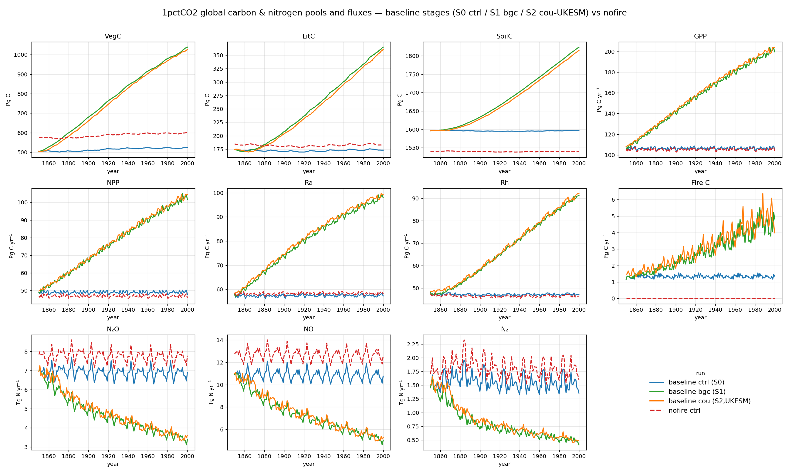

# 1pctCO2: baseline stages (S0/S1/S2) vs nofire — carbon & nitrogen pools and fluxes

Global totals from the 1pctCO2 baseline run, broken out by coupling stage, with
the **nofire** control overlaid (0.5°, 1850–2000, one variable per panel):

- **ctrl (S0)** — constant (mean) CO₂, fixed recycled 1850–1869 climate. The
  control: pools/fluxes should be near-stationary.
- **bgc (S1)** — rising 1pctCO₂ pathway, fixed recycled climate. The
  **biogeochemically-coupled** run: the carbon cycle "sees" rising CO₂ but the
  climate does not change, so it isolates the **CO₂-fertilization** response.
- **cou (S2, UKESM)** — rising CO₂ **and** transient UKESM climate. The **fully
  coupled** run: CO₂ fertilization plus climate change.
- **nofire ctrl** — the S0 control with SPITFIRE removed (untuned), as on the
  baseline-vs-nofire comparison. No fire C by construction.

Units: carbon **pools** VegC/LitC/SoilC are end-of-year stocks in **Pg C**;
carbon **fluxes** GPP/NPP/Ra/Rh/fire C are annual totals in **Pg C yr⁻¹**
(monthly outputs summed per year; fire C native annual); soil **N-gas** fluxes
N₂O/NO/N₂ are annual totals in **Tg N yr⁻¹**. (The NO/N₂ source files are
labelled `g C m⁻²` in the model output but are nitrogen emissions.) All totals
are gridcell value × area, summed globally.

Approximate global totals, first year 1850 → last year 2000:

| Variable | Unit | ctrl S0 | bgc S1 | cou S2 (UKESM) | nofire |
|----------|------|--------:|-------:|---------------:|-------:|
| VegC  | Pg C       | 505 → 524   | 505 → 1039 | 505 → 1027 | 575 → 599   |
| LitC  | Pg C       | 174 → 173   | 174 → 365  | 174 → 361  | 185 → 183   |
| SoilC | Pg C       | 1596 → 1596 | 1596 → 1824| 1596 → 1815| 1540 → 1540 |
| GPP   | Pg C yr⁻¹  | 107 → 105   | 107 → 200  | 108 → 204  | 105 → 104   |
| NPP   | Pg C yr⁻¹  | 49 → 48     | 49 → 102   | 50 → 104   | 47 → 46     |
| Ra    | Pg C yr⁻¹  | 58 → 57     | 58 → 98    | 58 → 99    | 59 → 58     |
| Rh    | Pg C yr⁻¹  | 48 → 47     | 48 → 91    | 48 → 92    | 48 → 46     |
| Fire C| Pg C yr⁻¹  | 1.2 → 1.4   | 1.2 → 4.8  | 1.5 → 4.0  | 0 (no fire) |
| N₂O   | Tg N yr⁻¹  | 7.0 → 6.9   | 7.0 → 3.4  | 7.0 → 3.6  | 7.8 → 7.8   |
| NO    | Tg N yr⁻¹  | 10.9 → 10.8 | 10.9 → 5.0 | 11.0 → 5.3 | 12.7 → 12.6 |
| N₂    | Tg N yr⁻¹  | 1.5 → 1.4   | 1.5 → 0.4  | 1.5 → 0.5  | 1.7 → 1.6   |

## What the stages show

- **CO₂ fertilization is large (bgc).** Under the rising 1pctCO₂ pathway with
  fixed climate, **VegC roughly doubles** (≈505 → 1040 Pg C) and **GPP nearly
  doubles** (≈107 → 200 Pg C yr⁻¹), with LitC and SoilC following. This is the
  pure carbon-cycle response to CO₂.
- **Climate modestly damps the carbon gain (cou vs bgc).** Adding transient
  UKESM climate leaves the trajectories very close to bgc — slightly **lower**
  end-of-run stocks (VegC ≈1027 vs 1039 Pg C) despite marginally higher GPP,
  i.e. climate change slightly offsets the fertilization benefit for stocks.
- **Soil N-gas emissions fall as CO₂ rises.** N₂O, NO and N₂ **roughly halve**
  in bgc/cou (e.g. N₂O ≈7 → 3.4 Tg N yr⁻¹) as more nitrogen is immobilized into
  the rapidly growing biomass and litter, leaving less mineral N for
  nitrification/denitrification.
- **Fire C grows with the extra fuel.** Annual fire C rises from ≈1.2 to
  ≈4–5 Pg C yr⁻¹ in bgc/cou as vegetation (and thus fuel load) builds up.
- **Removing fire (nofire vs ctrl).** Against the S0 control, the no-fire run
  holds ~70 Pg C more VegC and ~10 Pg C more LitC, ~55 Pg C less SoilC, and
  modestly higher soil N-gas emissions.

!!! note "Untuned, and not fully equilibrated"
    The control (S0) and nofire runs share the same upward **VegC drift** and
    **elevated first-year Rh** — an incomplete-spin-up / initialisation
    transient rather than a forced signal. The nofire run is also **untuned**;
    the model-tuning suite will be used to re-tune the no-fire factorial back
    toward the baseline's stocks and fluxes.
