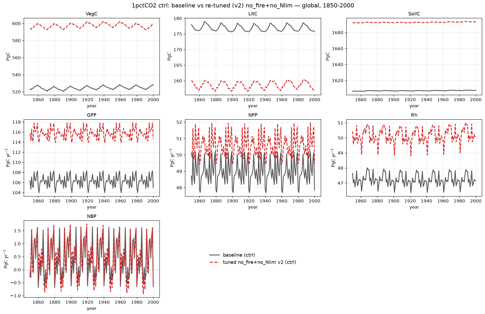

# 1pctCO2 ctrl: baseline vs re-tuned no_fire+no_Nlim

Global control-run (S0) comparison of the 1pctCO2 **baseline** against the
**re-tuned no_fire+no_Nlim** permutation — SPITFIRE compiled out **and**
N-limitation disabled (`NONLIM`), with parameters fit by CMA-ES against the
baseline. One variable per panel, 0.5° global totals, 1850–2000 (baseline solid
grey, tuned dashed red).

Units: carbon **pools** VegC/LitC/SoilC are end-of-year stocks in **Pg C**;
**fluxes** GPP/NPP/Rh are annual totals in **Pg C yr⁻¹**; **NBP** = NPP − Rh +
flux_estab (fire C is zero by construction). All totals are gridcell value ×
area, summed globally.

Global totals at 2000 (baseline → tuned):

| Variable | Unit | baseline | tuned | error |
|----------|------|---------:|------:|------:|
| VegC  | Pg C      | 528  | 598  | +13.4% |
| LitC  | Pg C      | 176  | 157  | −10.5% |
| SoilC | Pg C      | 1607 | 1693 | +5.3%  |
| GPP   | Pg C yr⁻¹ | 105  | 115  | +9.2%  |
| NPP   | Pg C yr⁻¹ | 48   | 50   | +3.4%  |
| Rh    | Pg C yr⁻¹ | 47   | 50   | +6.1%  |

## What the tune achieves

Removing N-limitation inflates productivity, so the raw no_fire+no_Nlim run runs
far above the baseline (GPP +29%, SoilC +10%). The re-tune brings the model back
toward the baseline on most stocks and fluxes:

- **GPP +9%** (from +29% untuned) — the productivity inflation is largely
  corrected by lowering the topline photosynthesis scaling and autotrophic
  respiration together.
- **SoilC +5%** (from +10%), **NPP +3%**, **Rh +6%** — all within ~6% of the
  baseline, and near-stationary in time as a control run should be.
- **VegC +13%** is the residual: pulling GPP down while keeping NPP on target
  shifts carbon out of the soil and litter pools and into vegetation, so biomass
  runs high. LitC correspondingly sits ~10% low.

Overall the tuned run matches the baseline to within ~8% RMS across the six
targets (vs ~14% untuned), with the vegetation/soil carbon partitioning the main
remaining offset.
