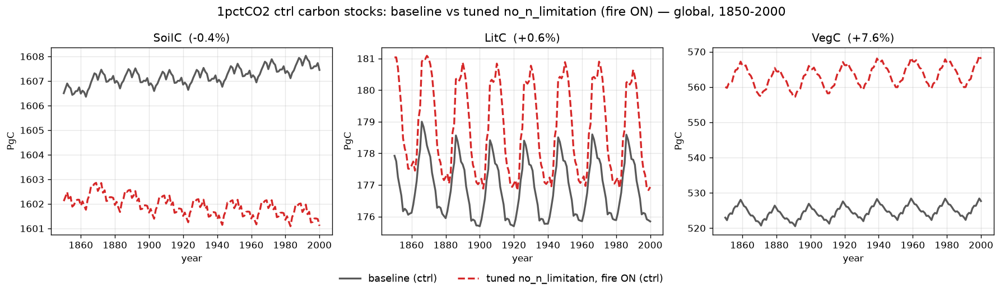

# 1pctCO2 ctrl: baseline vs tuned no_n_limitation — carbon stocks

Global control-run (S0) comparison of the 1pctCO2 **baseline** against the
**tuned no_n_limitation** permutation — N-limitation disabled (`NONLIM`) with
**fire ON** (SPITFIRE compiled in), parameters fit by CMA-ES against the
baseline. The three carbon **stocks** — SoilC, LitC, VegC — are end-of-year
totals in **Pg C**, gridcell value × area summed over the 0.5° global grid,
1850–2000 (baseline solid grey, tuned dashed red).

Global totals at year 2000 (baseline → tuned):

| Variable | Unit | baseline | tuned | error |
|----------|------|---------:|------:|------:|
| SoilC | Pg C | 1607 | 1601 | **−0.4%** |
| LitC  | Pg C | 176  | 177  | **+0.6%** |
| VegC  | Pg C | 528  | 568  | **+7.6%** |

## What the tune achieves

Turning off N-limitation inflates productivity, which historically pushed the
soil carbon far off the baseline (earlier fire-augmented fits left SoilC ~−26%).
Re-tuning with the soil and litter pools up-weighted brings all three carbon
stocks into close agreement:

- **SoilC −0.4%** — essentially exact, and near-stationary in time as a control
  run should be. This was the hardest pool to match across the whole campaign.
- **LitC +0.6%** — the tuned litter tracks the baseline's seasonal cycle with a
  slightly larger amplitude but the same annual mean.
- **VegC +7.6%** — the residual offset: vegetation carbon sits modestly high, a
  stable bias that does not drift over the 150-year run.

All three stocks are matched to within ~8%, with the soil and litter pools —
the slow, integrative reservoirs — reproduced almost exactly.
