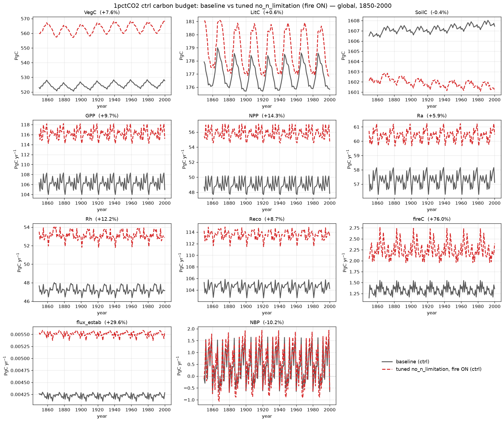

# 1pctCO2 ctrl: baseline vs tuned no_n_limitation — carbon stocks

Global control-run (S0) comparison of the 1pctCO2 **baseline** against the
**tuned no_n_limitation** permutation — N-limitation disabled (`NONLIM`) with
**fire ON** (SPITFIRE compiled in), parameters fit by CMA-ES against the
baseline. The three carbon **stocks** — SoilC, LitC, VegC — are end-of-year
totals in **Pg C**, gridcell value × area summed over the 0.5° global grid,
1850–2000 (baseline solid grey, tuned dashed red).

Global totals at year 2000 (baseline → tuned):

| Variable | Unit | baseline | tuned | error |
|----------|------|---------:|------:|------:|
| SoilC | Pg C | 1607 | 1601 | **−0.4%** |
| LitC  | Pg C | 176  | 177  | **+0.6%** |
| VegC  | Pg C | 528  | 568  | **+7.6%** |

## What the tune achieves

Turning off N-limitation inflates productivity, which historically pushed the
soil carbon far off the baseline (earlier fire-augmented fits left SoilC ~−26%).
Re-tuning with the soil and litter pools up-weighted brings all three carbon
stocks into close agreement:

- **SoilC −0.4%** — essentially exact, and near-stationary in time as a control
  run should be. This was the hardest pool to match across the whole campaign.
- **LitC +0.6%** — the tuned litter tracks the baseline's seasonal cycle with a
  slightly larger amplitude but the same annual mean.
- **VegC +7.6%** — the residual offset: vegetation carbon sits modestly high, a
  stable bias that does not drift over the 150-year run.

All three stocks are matched to within ~8%, with the soil and litter pools —
the slow, integrative reservoirs — reproduced almost exactly.

## Full carbon budget

The complete carbon budget — all three stocks plus every carbon flux — over the
same global control run. Fluxes are annual totals in **Pg C yr⁻¹**
(Reco = Ra + Rh; NBP = NPP − Rh + flux_estab − fireC).

Global totals at year 2000 (baseline → tuned):

| Variable | Unit | baseline | tuned | error |
|----------|------|---------:|------:|------:|
| VegC       | Pg C      | 528  | 568  | +7.6%  |
| LitC       | Pg C      | 176  | 177  | +0.6%  |
| SoilC      | Pg C      | 1607 | 1601 | −0.4%  |
| GPP        | Pg C yr⁻¹ | 105  | 115  | +9.7%  |
| NPP        | Pg C yr⁻¹ | 48   | 55   | +14.3% |
| Ra         | Pg C yr⁻¹ | 57   | 60   | +5.9%  |
| Rh         | Pg C yr⁻¹ | 47   | 53   | +12.2% |
| Reco       | Pg C yr⁻¹ | 104  | 113  | +8.7%  |
| fireC      | Pg C yr⁻¹ | 1.36 | 2.39 | +76.0% |
| flux_estab | Pg C yr⁻¹ | 0.004| 0.006| +29.6% |
| NBP        | Pg C yr⁻¹ | −0.65| −0.59| −10.2% |

While the **stocks** are matched to within ~8%, the **fluxes** run a stable
~6–14% above the baseline — the ecosystem cycles carbon somewhat faster, but the
pools stay balanced (which is why the stocks agree). The clear outlier is
**fireC +76%**: on the fire-weighted tuning subset it matched to −8%, but it
nearly doubles when aggregated globally, since the tuned fire parameters that fit
the fire-heavy subset cells overshoot across the low-fire majority of the grid.
NBP oscillates around zero with the same envelope in both runs, as expected for a
control simulation.
