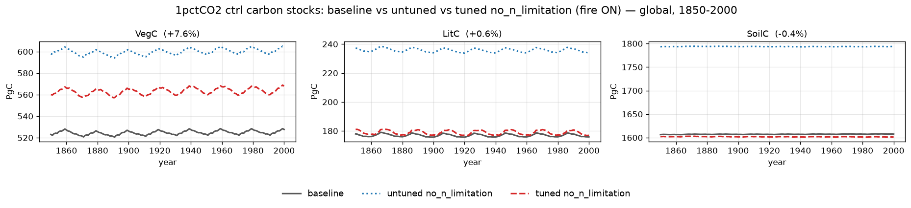
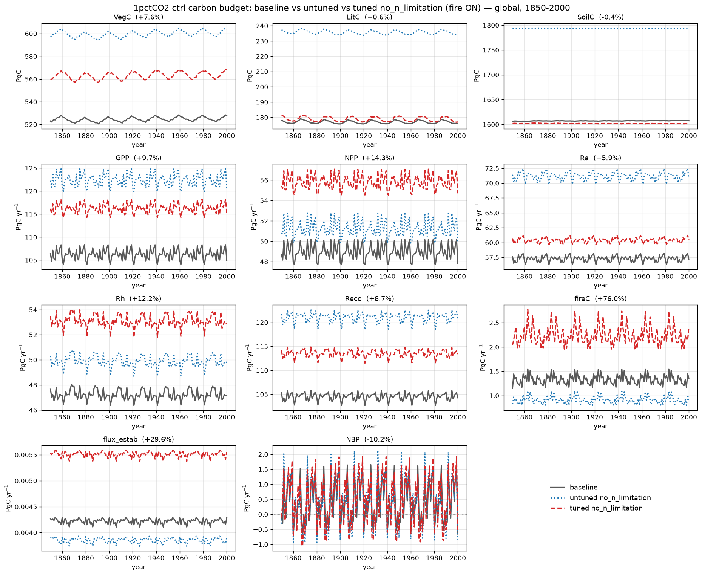

# 1pctCO2 ctrl: no_n_limitation — untuned vs tuned vs baseline

The effect of the CMA-ES tune on the **no_n_limitation** permutation (N-limitation
disabled via `NONLIM`, fire ON). Three global control runs (S0) compared:
**baseline** (grey solid), the **untuned** perturbation with default parameters
(blue dotted), and the **tuned** parameters (red dashed). Turning off
N-limitation lets productivity and the carbon pools run well above the baseline;
the tune pulls them back.

## Carbon stocks

## Full carbon budget

Global totals at year 2000 (error is tuned vs baseline):

| Variable | Unit | baseline | untuned | tuned | tuned err |
|----------|------|---------:|--------:|------:|----------:|
| VegC       | Pg C      | 528  | 604  | 568  | +7.6%  |
| LitC       | Pg C      | 176  | 234  | 177  | +0.6%  |
| SoilC      | Pg C      | 1607 | 1793 | 1601 | −0.4%  |
| GPP        | Pg C yr⁻¹ | 105  | 121  | 115  | +9.7%  |
| NPP        | Pg C yr⁻¹ | 48   | 50   | 55   | +14.3% |
| Ra         | Pg C yr⁻¹ | 57   | 71   | 60   | +5.9%  |
| Rh         | Pg C yr⁻¹ | 47   | 50   | 53   | +12.2% |
| Reco       | Pg C yr⁻¹ | 104  | 121  | 113  | +8.7%  |
| fireC      | Pg C yr⁻¹ | 1.36 | 0.89 | 2.39 | +76.0% |
| flux_estab | Pg C yr⁻¹ | 0.004| 0.004| 0.006| +29.6% |
| NBP        | Pg C yr⁻¹ | −0.65| −0.84| −0.59| −10.2% |

## What the tune corrected

Removing N-limitation inflates the carbon pools sharply — the **untuned** run sits
**SoilC +12%, LitC +33%, VegC +14%** above the baseline, with GPP +15% and
autotrophic respiration +24%. The tune brings the stocks almost exactly back onto
the baseline:

- **SoilC +12% → −0.4%** and **LitC +33% → +0.6%** — the two slow soil/litter
  reservoirs, badly inflated by the perturbation, are recovered essentially
  perfectly.
- **VegC +14% → +7.6%** — roughly halved, a small residual high bias.
- The **fluxes** end a stable ~6–14% above baseline: the tuned ecosystem cycles
  carbon somewhat faster (higher GPP/NPP/Rh) while the pools stay balanced.
- **fireC** is the outlier: the untuned run *under*-burns (−35%), and the tuned
  fire parameters — fit against a fire-weighted subset — *over*-correct to +76%
  when aggregated globally, overshooting across the low-fire majority of the grid.

Overall the tune's headline achievement is recovering the soil and litter carbon
stocks, which the raw no_n_limitation perturbation throws off by 12–33%.
