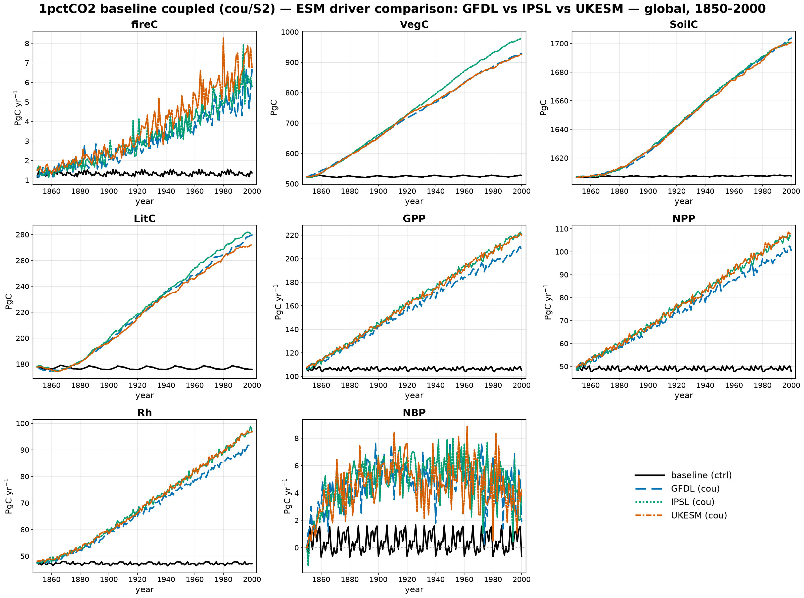

# 1pctCO2 coupled: ESM driver comparison (GFDL / IPSL / UKESM)

The 1pctCO2 **baseline** run under the fully-coupled (**cou** / S2) stage — rising
1pctCO₂ **and** transient ESM climate — for the three ESM climate drivers **GFDL**,
**IPSL**, and **UKESM**, with the **baseline ctrl** (S0: constant CO₂, fixed
climate) as a flat reference. One panel per variable (fireC, VegC, SoilC, LitC,
GPP, NPP, Rh, NBP), global area-weighted annual totals, 1850–2000.

Global totals at year 2000:

| Variable | Unit | baseline ctrl | GFDL | IPSL | UKESM |
|----------|------|--------------:|-----:|-----:|------:|
| fireC | Pg C yr⁻¹ | 1.36  | 6.66  | 5.79  | 6.77  |
| VegC  | Pg C      | 528   | 929   | 980   | 926   |
| SoilC | Pg C      | 1607  | 1704  | 1701  | 1701  |
| LitC  | Pg C      | 176   | 280   | 281   | 273   |
| GPP   | Pg C yr⁻¹ | 105   | 207   | 221   | 220   |
| NPP   | Pg C yr⁻¹ | 48    | 101   | 107   | 108   |
| Rh    | Pg C yr⁻¹ | 47    | 92    | 97    | 97    |
| NBP   | Pg C yr⁻¹ | −0.65 | 1.90  | 4.12  | 4.21  |

## What the drivers show

- **The coupled response dwarfs the driver spread.** Relative to the control, all
  three ESMs roughly double GPP (105 → ~210 Pg C yr⁻¹) and VegC (528 → ~950 Pg C)
  under the 1pctCO₂ pathway — the CO₂-fertilization signal is far larger than the
  differences between climate models.
- **IPSL is the outlier for vegetation.** IPSL carries the most vegetation and
  litter carbon (VegC 980 vs ~926 Pg C for GFDL/UKESM) and the highest GPP, i.e. its
  climate is the most favourable for productivity here; GFDL is the coolest/driest,
  sitting lowest on GPP, NPP and Rh.
- **Soil carbon is driver-insensitive.** SoilC lands within ~0.2% across the three
  ESMs (1701–1704 Pg C) — the slow soil pool integrates over the climate noise.
- **NBP spans the driver uncertainty.** The land sink ranges from +1.9 (GFDL) to
  +4.2 Pg C yr⁻¹ (UKESM) at year 2000, the clearest driver-dependent signal.
- **Fire triples–quintuples** under the coupled runs (1.4 → ~6–7 Pg C yr⁻¹) as the
  growing biomass builds fuel load, with UKESM burning most.
