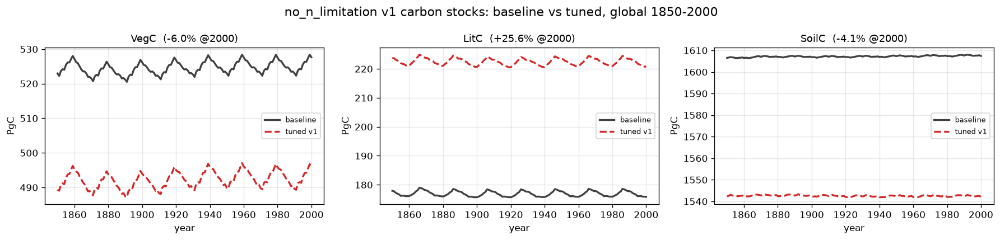
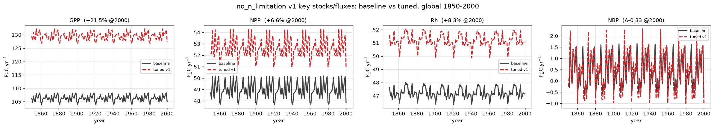
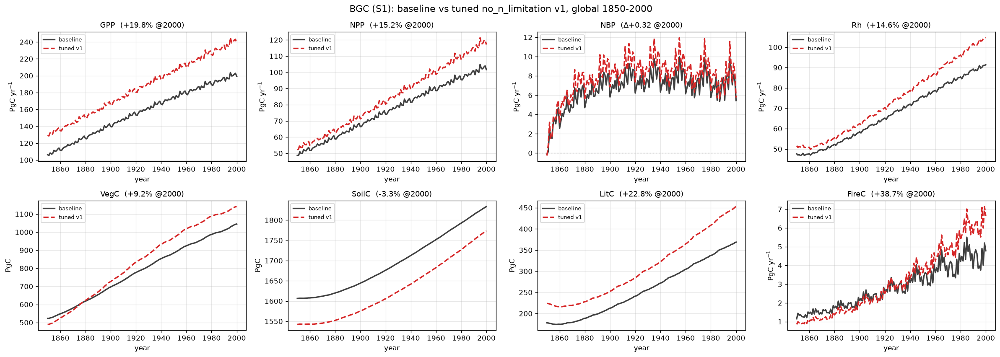
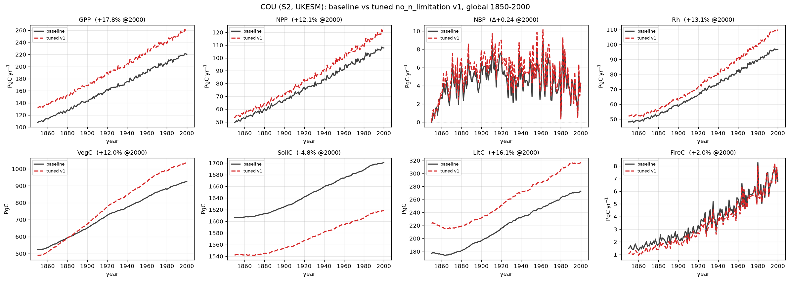

# 1pctCO2 ctrl: no_n_limitation (baseline vs tuned)

The **no_n_limitation** factorial — N-limitation disabled (`NONLIM`), fire ON —
against the 1pctCO2 **baseline**. Two global control runs (S0): **baseline**
(grey solid) and the CMA-ES **tuned** parameters (red dashed). All values are
global, area-weighted annual totals, 1850–2000. Per-variable final-year errors
(tuned vs baseline) are in the table below.

!!! note "Simplified parameter menu (2026-07)"
    This page now reflects a **simplified** re-tune, mirroring the no_fire
    simplification: the same 7 mortality/soil-litter-turnover parameters
    (`century_klitter_scale`, `century_ksoil_scale`, `mort_max`, `k_mort`,
    `ramp_gddtw`, `longivity_scale`, `grass_turnover_scale`) plus two
    photosynthesis levers (`alphaa`, `bc3_scalar`), since removing N-limitation
    directly inflates GPP — down from the original 26-parameter menu. Fire stays
    compiled in for both baseline and this perturbation, so `firec` is a live
    target/output throughout. The representative tuning subset reuses the exact
    same 3000 cells as the no_fire v2/v3 campaign (pure area-weighted,
    deterministically identical selection against the same baseline), plus one
    fix: SPITFIRE reads climate input via LPJ's hardcoded `tmin`/`tmax` netCDF
    variable names, which had drifted out of sync with the driver files in the
    dedicated tuning LPJ checkout (a mismatch invisible to no_fire, since that
    build has SPITFIRE compiled out) — corrected directly in `climate.h`. CMA-ES
    plateaued at generation 8 (loss 0.159) — a looser fit than the retired
    26-parameter campaign's 0.067, reflecting the smaller lever set; no untuned
    reference run exists yet for this simplified subset.

## Carbon stocks

## Key stocks & fluxes

Global totals at year 2000 (error is tuned vs baseline):

| Variable | Unit | baseline | tuned | tuned err |
|----------|------|---------:|------:|----------:|
| VegC  | Pg C      | 527.7  | 495.9  | −6.0%  |
| SoilC | Pg C      | 1607.5 | 1542.0 | −4.1%  |
| LitC  | Pg C      | 175.8  | 220.8  | +25.6% |
| GPP   | Pg C yr⁻¹ | 105.0  | 127.5  | +21.5% |
| Rh    | Pg C yr⁻¹ | 47.1   | 51.1   | +8.3%  |
| NPP   | Pg C yr⁻¹ | 47.8   | 51.0   | +6.6%  |
| NBP   | Pg C yr⁻¹ | −0.65  | −0.99  | −0.33 (abs) |

## What the tune corrected

For reference, the retired 26-parameter campaign's **untuned** perturbation (a
different tuning subset, kept here only for scale) held **VegC +14.5%, SoilC
+11.6%, LitC +33.2%, GPP +15.0%** above baseline — removing N-limitation
inflates every pool and flux. The simplified 9-parameter tune, working from a
much smaller lever set:

- **SoilC +11.6% → −4.1%** — the CENTURY turnover scales pull the slow soil
  pool from over- to slightly under-baseline, overshooting the correction.
- **VegC +14.5% → −6.0%** — similarly overshoots past baseline rather than
  landing near it.
- **LitC +33.2% → +25.6%** — barely moves. With only two CENTURY scales and no
  litter-chemistry levers (the dropped `ligcfrac_leaf`/`ligcfrac_wood`), the
  simplified menu has limited ability to bring litter turnover down.
- **GPP +15.0% → +21.5%** — `alphaa`/`bc3_scalar` alone don't fully offset the
  N-limitation removal; GPP actually runs *hotter* than the untuned baseline,
  since the optimizer traded some GPP suppression for the SoilC/VegC fit.

Net: a real but partial correction, weaker than the retired campaign's tighter
fit (SoilC −0.4%, LitC +0.6%, GPP +9.7%) — the cost of a much smaller,
more physically-targeted parameter set.

## Rising-CO₂ stages: bgc & cou

The parameters were fit against the **ctrl** state only. These panels show the
tuned no_n_limitation run under the rising-1pctCO₂ stages — **bgc** (S1, fixed
recycled climate) and **cou** (S2, transient UKESM climate) — against the
baseline. Two lines: baseline (black) vs tuned (vermillion).

### bgc (S1, rising CO₂ / fixed climate)

| Variable | Unit | baseline | tuned | err |
|----------|------|---------:|------:|----:|
| VegC  | Pg C      | 1044.9 | 1141.4 | +9.2%  |
| SoilC | Pg C      | 1833.5 | 1773.9 | −3.3%  |
| LitC  | Pg C      | 368.7  | 452.8  | +22.8% |
| GPP   | Pg C yr⁻¹ | 199.4  | 238.8  | +19.8% |
| NPP   | Pg C yr⁻¹ | 101.6  | 117.1  | +15.2% |
| Rh    | Pg C yr⁻¹ | 91.4   | 104.7  | +14.6% |
| fireC | Pg C yr⁻¹ | 4.8    | 6.6    | +38.7% |
| NBP   | Pg C yr⁻¹ | 5.4    | 5.8    | +0.32 (abs) |

### cou (S2, transient UKESM climate)

| Variable | Unit | baseline | tuned | err |
|----------|------|---------:|------:|----:|
| VegC  | Pg C      | 925.8  | 1037.0 | +12.0% |
| SoilC | Pg C      | 1700.8 | 1618.6 | −4.8%  |
| LitC  | Pg C      | 272.8  | 316.7  | +16.1% |
| GPP   | Pg C yr⁻¹ | 220.1  | 259.4  | +17.8% |
| NPP   | Pg C yr⁻¹ | 107.8  | 120.9  | +12.1% |
| Rh    | Pg C yr⁻¹ | 96.8   | 109.5  | +13.1% |
| fireC | Pg C yr⁻¹ | 6.8    | 6.9    | +2.0%  |
| NBP   | Pg C yr⁻¹ | 4.2    | 4.4    | +0.24 (abs) |

**Caveat:** as with no_fire, the ctrl-only fit runs hot under rising CO₂ — VegC
+9–12%, GPP +18–20%, LitC +16–23% at bgc/cou. Unlike no_fire, `fireC` also
drifts, especially at bgc (+38.7%) where the fixed-climate fuel load
accumulates against the inflated VegC/LitC pools; cou's transient climate
keeps `fireC` much closer to baseline (+2.0%).
