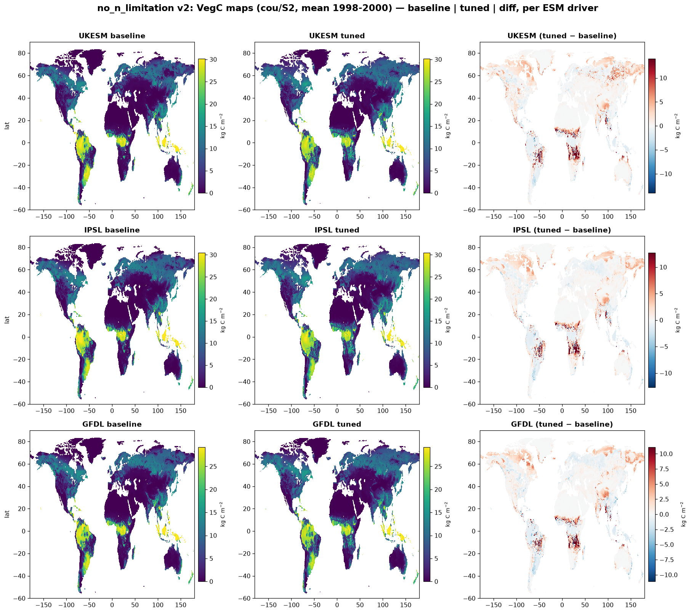

# 1pctCO2 ctrl: no_n_limitation (baseline vs tuned)

The **no_n_limitation** factorial — N-limitation disabled (`NONLIM`), fire ON —
against the 1pctCO2 **baseline**. Two global control runs (S0): **baseline**
(grey solid) and the CMA-ES **tuned** parameters (red dashed). All values are
global, area-weighted annual totals, 1850–2000. Per-variable final-year errors
(tuned vs baseline) are in the table below.

!!! note "Simplified parameter menu v2 (2026-07)"
    This page now reflects a **v2** re-tune, cut down further from the v1
    9-parameter menu to just **5 direct, non-redundant levers** — one per
    carbon stock, plus the root-cause productivity throttle:
    `century_klitter_scale` (LitC), `century_ksoil_scale` (SoilC), `mort_max` +
    `k_mort` (VegC), and `alphaa` (GPP — the fraction of PAR assimilated at
    canopy level, `photosynthesis.c: apar = fpar*par*alphaa`). v1's `alphaa`
    barely moved off its 0.5 default (converged 0.52) despite GPP running
    +21.5% hot, because its loss weighted 8 targets equally, letting CMA-ES
    trade the GPP fit away for the flux targets. v2 fixes this two ways:
    `vegc`/`litc`/`soilc` are upweighted 5× in the loss, and `alphaa`'s bounds
    are widened down to (0.30, 0.55) (matching what the retired 26-parameter
    campaign needed for the same problem). CMA-ES converged via loss-plateau
    at generation 14 (loss 0.180, `alphaa` settled at 0.484) — and the global
    result below confirms it worked: every ctrl stock/flux landed
    substantially closer to baseline than v1. Fire stays compiled in for both
    baseline and this perturbation, so `firec` is a live target/output
    throughout. Subset and the tmin/tmax `climate.h` fix are unchanged from
    v1 (see prior campaign notes); no untuned reference run exists yet for
    this simplified subset.

## Carbon stocks

## Key stocks & fluxes

Global totals at year 2000 (error is tuned vs baseline):

| Variable | Unit | baseline | tuned | tuned err |
|----------|------|---------:|------:|----------:|
| VegC  | Pg C      | 527.7  | 513.6  | −2.7%  |
| SoilC | Pg C      | 1607.5 | 1655.4 | +3.0%  |
| LitC  | Pg C      | 175.8  | 193.8  | +10.2% |
| GPP   | Pg C yr⁻¹ | 105.0  | 117.8  | +12.3% |
| Rh    | Pg C yr⁻¹ | 47.1   | 49.5   | +5.0%  |
| NPP   | Pg C yr⁻¹ | 47.8   | 49.5   | +3.4%  |
| NBP   | Pg C yr⁻¹ | −0.65  | −0.79  | −0.14 (abs) |

## What the tune corrected

v2 vs the retired v1 fit — every single ctrl variable improved:

| Variable | v1 err | v2 err |
|----------|-------:|-------:|
| VegC  | −6.0%  | **−2.7%** |
| SoilC | −4.1%  | **+3.0%** |
| LitC  | +25.6% | **+10.2%** |
| GPP   | +21.5% | **+12.3%** |
| Rh    | +8.3%  | **+5.0%**  |
| NPP   | +6.6%  | **+3.4%**  |
| NBP (abs) | −0.33 | **−0.14** |

- **GPP +21.5% → +12.3%** — this is the fix that mattered most. Letting
  `alphaa` actually drop (0.52 → 0.484) directly cut excess canopy-level
  photosynthesis, instead of leaving the other four params to fight an
  unconstrained productivity surplus.
- **LitC +25.6% → +10.2%** — the single biggest swing. Once GPP wasn't
  dumping as much carbon into litterfall, `century_klitter_scale` (pushed up
  to 1.12) had a much easier job bringing the pool back down.
- **VegC −6.0% → −2.7%** and **SoilC −4.1% → +3.0%** — both landed closer to
  baseline in magnitude; SoilC flipped from under- to slightly over-baseline,
  but by less than half the miss.

Net: the 5-parameter, target-reweighted re-tune achieved a **materially
tighter fit than v1** with a *smaller* parameter set — confirming the
diagnosis that v1's loose fit was a loss-weighting problem, not a fundamental
limit of a small lever set.

## Rising-CO₂ stages: bgc & cou

The parameters were fit against the **ctrl** state only. These panels show the
tuned no_n_limitation run under the rising-1pctCO₂ stages — **bgc** (S1, fixed
recycled climate) and **cou** (S2, transient UKESM climate) — against the
baseline. Two lines: baseline (black) vs tuned (vermillion).

### bgc (S1, rising CO₂ / fixed climate)

| Variable | Unit | baseline | tuned | err |
|----------|------|---------:|------:|----:|
| VegC  | Pg C      | 1044.9 | 1127.7 | +7.9%  |
| SoilC | Pg C      | 1833.5 | 1888.5 | +3.0%  |
| LitC  | Pg C      | 368.7  | 400.0  | +8.5%  |
| GPP   | Pg C yr⁻¹ | 199.4  | 224.7  | +12.7% |
| NPP   | Pg C yr⁻¹ | 101.6  | 112.5  | +10.7% |
| Rh    | Pg C yr⁻¹ | 91.4   | 100.1  | +9.5%  |
| fireC | Pg C yr⁻¹ | 4.8    | 6.1    | +26.6% |
| NBP   | Pg C yr⁻¹ | 5.4    | 6.4    | +0.93 (abs) |

### cou (S2, transient climate — UKESM, IPSL, GFDL)

The tuned v2 parameters were also run under **cou** driven by two more ESMs
(IPSL, GFDL), branching off the same ctrl-only-tuned parameter set — this checks
whether the fit generalizes across which model supplies the transient climate,
not just which CO₂ pathway is used.

| Variable | Unit | UKESM err | IPSL err | GFDL err |
|----------|------|----------:|---------:|---------:|
| VegC  | Pg C      | +11.7% | +8.0%  | +6.3%  |
| SoilC | Pg C      | +2.1%  | +1.9%  | +2.1%  |
| LitC  | Pg C      | +5.6%  | +2.6%  | +3.6%  |
| GPP   | Pg C yr⁻¹ | +10.8% | +9.9%  | +9.0%  |
| NPP   | Pg C yr⁻¹ | +8.4%  | +8.1%  | +7.1%  |
| Rh    | Pg C yr⁻¹ | +8.8%  | +7.9%  | +7.5%  |
| NBP   | Pg C yr⁻¹ | +0.96 (abs) | +0.79 (abs) | +0.35 (abs) |
| fireC | Pg C yr⁻¹ | −6.5%  | +3.5%  | −2.6%  |

**Caveat:** LitC and the carbon stocks/fluxes stay much closer to baseline
than v1 at both stages (e.g. bgc LitC +8.5% vs v1's +22.8%; cou LitC +2.6–5.6%
vs v1's +16.1%), **consistently across all three ESM drivers** — the v2 fix
generalizes beyond the single UKESM driver it wasn't even fit against. The one
exception is **NBP**, which drifts further from baseline than v1 did at bgc
(+0.93 vs v1's +0.32 PgC/yr) and at cou-UKESM (+0.96 vs v1's +0.24 PgC/yr) —
NBP is a small residual of NPP−Rh, so even though both fluxes individually
track baseline better under v2, their difference is more sensitive to the
small remaining mismatch between them under rising-CO₂ forcing that the
ctrl-only fit didn't constrain. Notably, the NBP miss actually **shrinks**
under IPSL and GFDL (+0.79, +0.35) relative to UKESM (+0.96), so this looks
like ESM-specific noise in the NPP/Rh balance rather than a systematic v2
regression.

### Spatial pattern, per ESM driver

VegC carries the largest tuned-vs-baseline signal at cou (+6–12%, see above) —
these maps show *where* that excess sits, for each driving ESM (mean of the
last 3 simulated years, 1998–2000).

Unlike no_fire, this excess is smaller in magnitude (locally up to ~10 kg C
m⁻²) but shows the same **tropical concentration** — Amazon and Congo basin —
plus a visible diffuse warming band across high-northern-latitude boreal
forest (Siberia/Canada, ~50–70°N) that's more prominent here than in the
no_fire maps. Both features repeat consistently across UKESM, IPSL, and GFDL.
