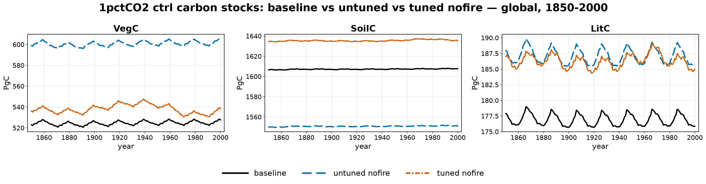
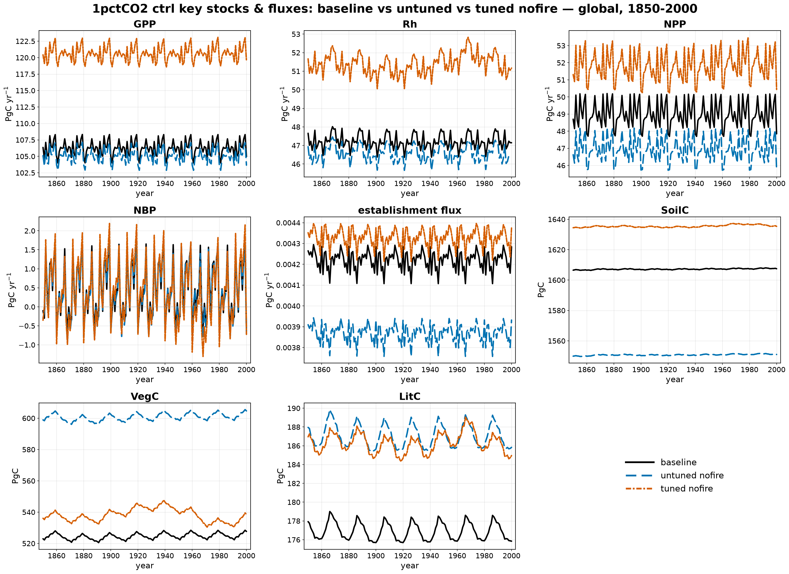
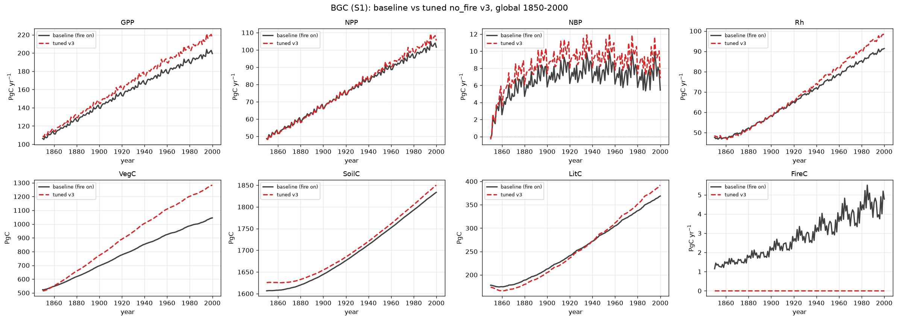
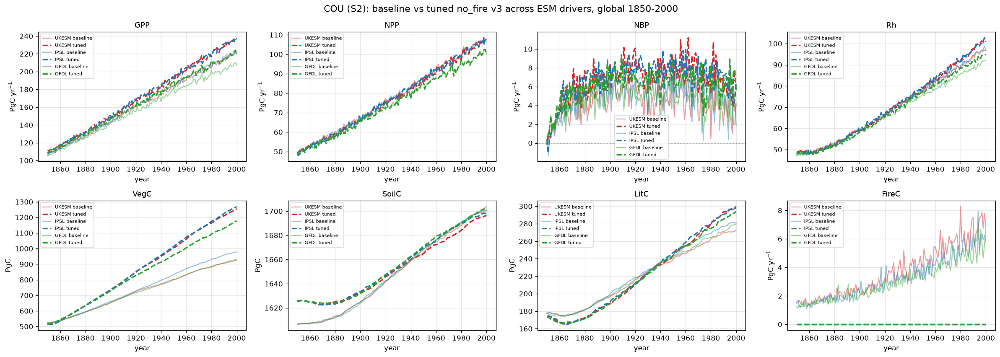
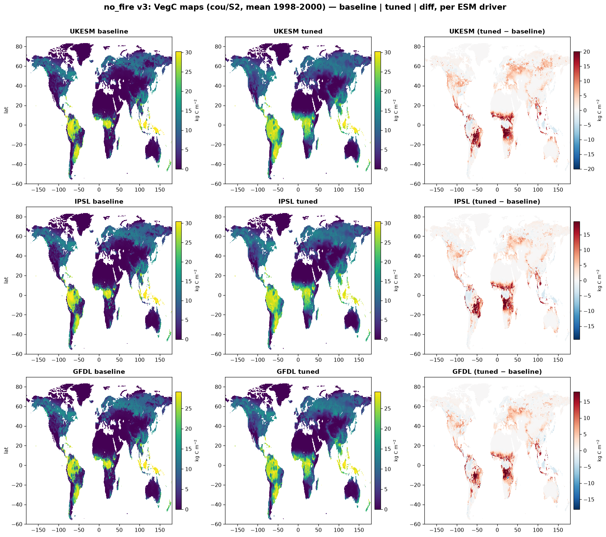

# 1pctCO2 ctrl: nofire (untuned vs tuned vs baseline)

The **nofire** factorial — SPITFIRE compiled out (fire off), N-limitation on —
against the 1pctCO2 **baseline**. Three global control runs (S0): **baseline**
(grey solid), the **untuned** perturbation with default parameters (blue dotted),
and the CMA-ES **tuned** parameters (red dashed). All values are global,
area-weighted annual totals, 1850–2000. Per-variable final-year errors (tuned
vs baseline) are in the table below.

!!! note "Simplified parameter menu (2026-07)"
    This page now reflects a **simplified** re-tune: 7 mortality / soil-litter-turnover
    parameters (`century_klitter_scale`, `century_ksoil_scale`, `mort_max`, `k_mort`,
    `ramp_gddtw`, `longivity_scale`, `grass_turnover_scale`) rather than the original
    12-parameter menu, which mixed in photosynthesis/allocation/N-chemistry levers
    unrelated to fire's absence. `longivity_scale` also fixes a bug in the original
    tune: it scales each PFT's own `.par`-file leaf-longevity default rather than
    overwriting all 10 PFTs with one absolute value. The representative tuning
    subset was rebuilt at 3000 cells with pure area-weighting (no fire-contribution
    reweighting), after a diagnostic showed a small `a_fire` fire-floor term was
    still systematically over-selecting cells where removing fire inflates VegC the
    most. CMA-ES converged via loss-plateau at generation 8 (loss 0.0051, vs the
    12-param version's 0.043) after warm-starting through three rounds of refinement.

## Carbon stocks

## Key stocks & fluxes

Global totals at year 2000 (error is tuned vs baseline):

| Variable | Unit | baseline | untuned | tuned | tuned err |
|----------|------|---------:|--------:|------:|----------:|
| VegC  | Pg C      | 527.7  | 604.7  | 520.3  | −1.4%  |
| SoilC | Pg C      | 1607.5 | 1551.0 | 1626.8 | +1.2%  |
| LitC  | Pg C      | 175.8  | 185.8  | 171.6  | −2.4%  |
| GPP   | Pg C yr⁻¹ | 105.0  | 103.7  | 107.5  | +2.4%  |
| Rh    | Pg C yr⁻¹ | 47.1   | 46.4   | 48.0   | +1.8%  |
| NPP   | Pg C yr⁻¹ | 47.8   | 45.7   | 47.2   | −1.3%  |
| NBP   | Pg C yr⁻¹ | −0.65  | −0.71  | −0.78  | −0.13 (abs) |

## What the tune corrected

Removing fire mainly reshuffles the vegetation and litter pools: the **untuned**
nofire run holds **VegC +14.6%** (fire no longer burns down biomass) and **SoilC
−3.5%** relative to the baseline. The simplified 7-parameter tune brings every
stock within ~2.4% of baseline — a tighter fit than the original 12-parameter
tune achieved (VegC +2.1%/SoilC +1.7%), using fewer, more physically-targeted
levers:

- **VegC +14.6% → −1.4%** — leaf-longevity scaling (`longivity_scale`) and the
  tree/grass mortality/turnover levers (`ramp_gddtw`, `mort_max`, `k_mort`,
  `grass_turnover_scale`) bring the fire-loss biomass excess back in line.
- **SoilC −3.5% → +1.2%** and **LitC −2.4%** — the CENTURY turnover scales
  (`century_klitter_scale`, `century_ksoil_scale`) hold both pools within a
  couple of percent.
- The **fluxes** stay close to baseline (GPP +2.4%, Rh +1.8%, NPP −1.3%) — unlike
  the productivity overshoot the fire-stratified subset produced previously, this
  representative (pure area-weighted) subset generalizes fluxes as well as stocks.

## Rising-CO₂ stages: bgc & cou

The parameters were fit against the **ctrl** state only. These panels show how the
tuned no_fire run behaves under the rising-1pctCO₂ stages — **bgc** (S1, fixed
recycled climate) and **cou** (S2, transient UKESM climate) — against the baseline.
Two lines: baseline (black) vs tuned (vermillion); the untuned perturbation was
ctrl-only so it doesn't appear here.

### bgc (S1, rising CO₂ / fixed climate)

| Variable | Unit | baseline | tuned | err |
|----------|------|---------:|------:|----:|
| VegC  | Pg C      | 1044.9 | 1282.9 | +22.8% |
| SoilC | Pg C      | 1833.5 | 1850.1 | +0.9%  |
| LitC  | Pg C      | 368.7  | 392.0  | +6.3%  |
| GPP   | Pg C yr⁻¹ | 199.4  | 216.2  | +8.5%  |
| NPP   | Pg C yr⁻¹ | 101.6  | 105.5  | +3.8%  |
| Rh    | Pg C yr⁻¹ | 91.4   | 98.6   | +7.9%  |
| fireC | Pg C yr⁻¹ | 4.8    | 0      | (no fire) |
| NBP   | Pg C yr⁻¹ | 5.4    | 6.8    | +1.40 (abs) |

### cou (S2, transient climate — UKESM, IPSL, GFDL)

The tuned no_fire parameters were also run under **cou** driven by two more ESMs
(IPSL, GFDL), branching off the same ctrl-only-tuned parameter set — this checks
whether the fit generalizes across which model supplies the transient climate,
not just which CO₂ pathway is used.

| Variable | Unit | UKESM err | IPSL err | GFDL err |
|----------|------|----------:|---------:|---------:|
| VegC  | Pg C      | +35.5% | +29.6% | +26.8% |
| SoilC | Pg C      | −0.2%  | −0.1%  | −0.1%  |
| LitC  | Pg C      | +9.8%  | +6.2%  | +5.3%  |
| GPP   | Pg C yr⁻¹ | +7.6%  | +7.2%  | +6.4%  |
| NPP   | Pg C yr⁻¹ | −0.1%  | +0.5%  | −0.1%  |
| Rh    | Pg C yr⁻¹ | +4.2%  | +4.0%  | +3.0%  |
| NBP   | Pg C yr⁻¹ | +2.55 (abs) | +2.40 (abs) | +3.72 (abs) |
| fireC | Pg C yr⁻¹ | 0 (no fire) | 0 (no fire) | 0 (no fire) |

**Caveat:** because the tune only constrained the control state, the CO₂-forced
stages run somewhat hot on VegC and the productivity fluxes (VegC +23% bgc /
+27–36% cou, GPP +6–9%) — the ctrl-tuned parameters don't constrain the transient
CO₂-fertilization response. This is smaller than in the previous 12-parameter
tune (which ran +28% bgc / +52% cou on VegC), but SoilC — the pool the tune
targets most directly — stays within ~1% at every stage, **across all three
driving ESMs**. GFDL's larger NBP miss (+3.72 PgC/yr vs UKESM's +2.55) is mostly
a small-baseline effect: GFDL's own baseline NBP (1.90 PgC/yr) is under half
UKESM's (4.21), so the same absolute NPP/Rh mismatch reads as a much bigger
share of a smaller number.

### Spatial pattern, per ESM driver

VegC carries the largest tuned-vs-baseline signal at cou (+27–36%, see above) —
these maps show *where* that excess sits, for each driving ESM (mean of the
last 3 simulated years, 1998–2000).

The excess is concentrated in the same **tropical forest belt** across all
three ESMs — the Amazon and Congo basins carry the largest and darkest
tuned-minus-baseline signal (locally >15 kg C m⁻² over 1998–2000), with only
a faint, diffuse warming visible at high northern latitudes. This is exactly
where SPITFIRE burns the most biomass in the baseline, so it's the physically
expected fingerprint of removing fire — not an artifact of any one climate
driver, since the pattern and rough magnitude repeat under UKESM, IPSL, and
GFDL alike.
