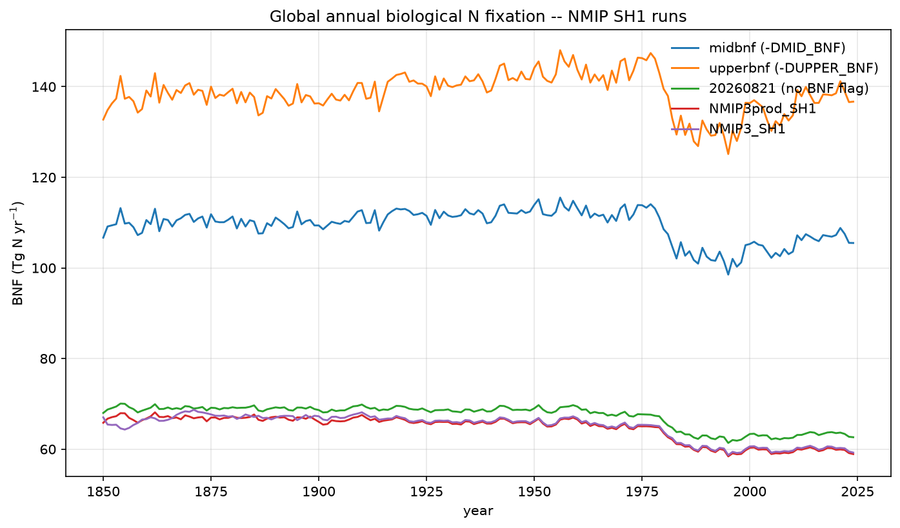
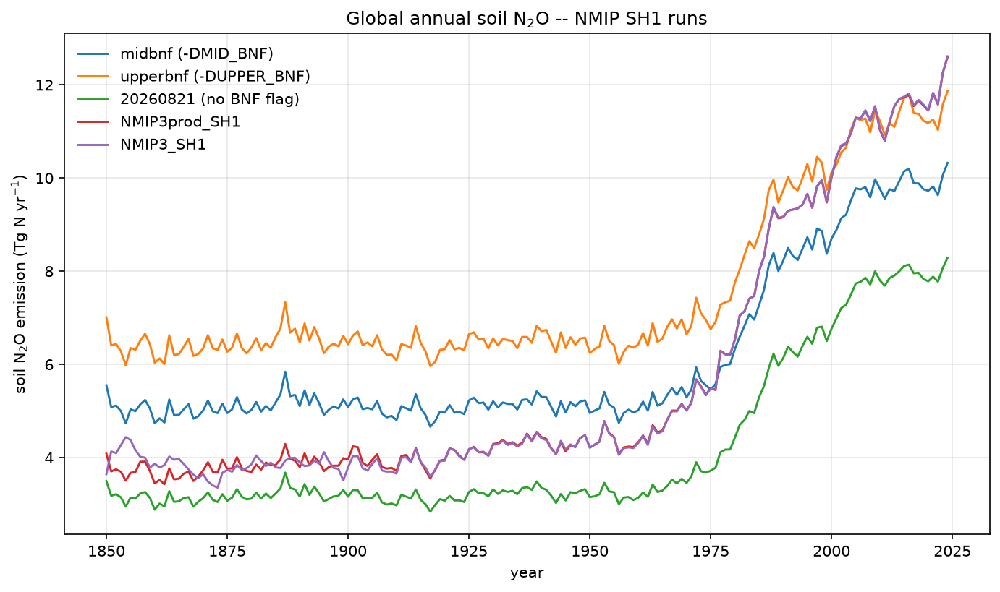
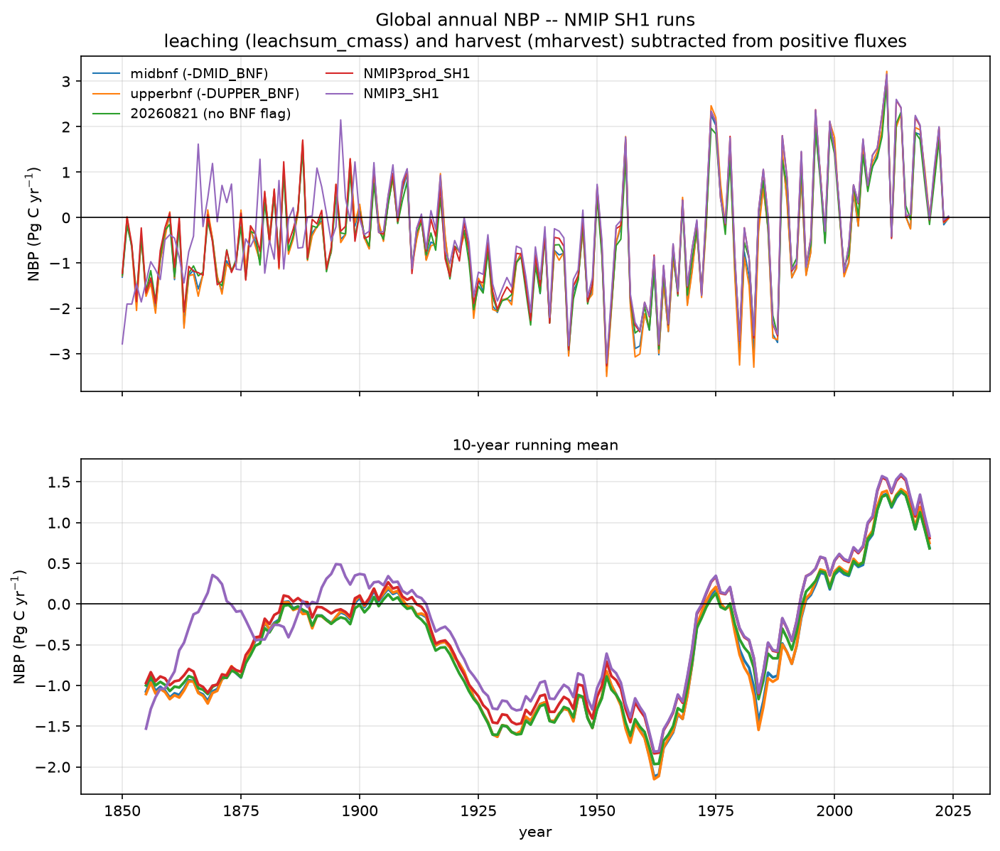
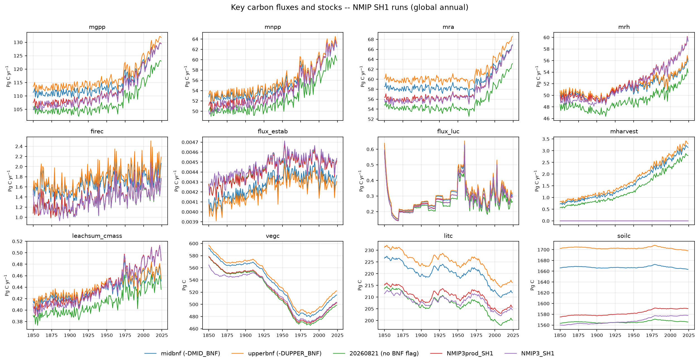
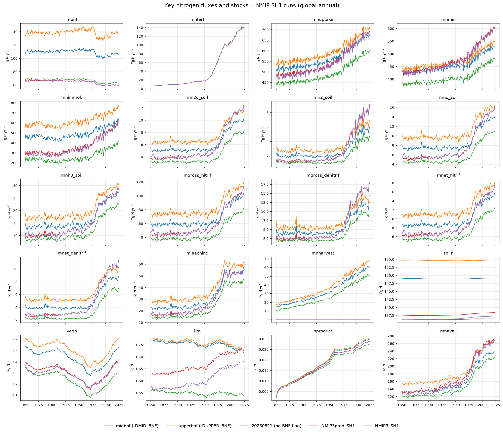
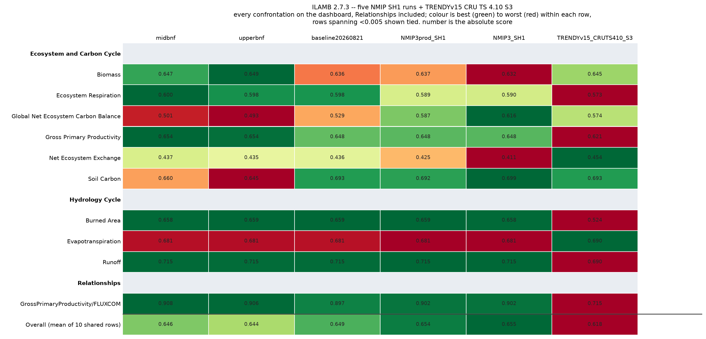
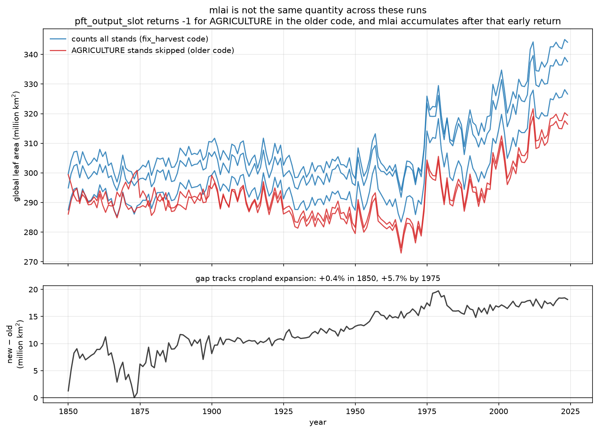

# NMIP SH1 — BNF sensitivity, C & N budgets, ILAMB

[**Open the full ILAMB site →**](../results/ilamb-nmip-sh1/index.html)

Five SH1 runs, 1850–2024, global. Three of them are the `fix_harvest` runs and
differ from each other only by the BNF compile flag in `Makefile.inc`:

| label | run | BNF flag |
|---|---|---|
| `midbnf` | `nmip-20260822-midbnf` | `-DMID_BNF` |
| `upperbnf` | `nmip-20260822-upperbnf` | `-DUPPER_BNF` |
| `baseline20260821` | `nmip-20260821` | none |
| `NMIP3prod_SH1` | `nmip/NMIP3prod_SH1` | none, pre-`fix_harvest` |
| `NMIP3_SH1` | `nmip/NMIP3_SH1` | none, pre-`fix_harvest` |

The ILAMB section below carries a sixth run for reference, **TRENDYv15 CRU TS
4.10 S3** (`trendy/v15/simulations/new_spinup/CRU410/S3`, 1700–2025). It is a
different driver, spinup and code vintage, not an SH1 run, and it is not in the
budget figures — only in the benchmarking.

## Biological N fixation



Three tiers, flat across the record until a step down around 1978–80 that
appears in every run. 1995–2024 means: **upperbnf 135.2, midbnf 104.9,
baseline20260821 62.9, NMIP3_SH1 59.9, NMIP3prod_SH1 59.6 Tg N/yr**.

## Soil N₂O



2024 values span **8.29 Tg N/yr** (no BNF flag) to **12.61** (NMIP3_SH1), with
midbnf at 10.32 and upperbnf at 11.87.

The BNF flag does nearly all of its work on nitrogen and almost none on carbon:
N₂O spans 4.3 Tg N/yr across these runs while NBP moves 0.18 Pg C/yr, most of
which is the two older runs rather than the BNF setting.

## NBP



NBP is recomputed from component fluxes for all five runs rather than read from
each run's `mnbp.nc`. Those files were built at different times with different
negative-flux groups — only midbnf and upperbnf included leaching, and
NMIP3_SH1 had no `mnbp` at all — so the stored versions are not comparable. One
formula for all five:

```
NBP = (flux_estab + mnpp)
    - (firec + woodharvest_{1,10,100}yr + deforestProduct_{2,25}yr
       + flux_luc + leachsum_cmass + mharvest + mrh)
```

`mharvest` stands in for `flux_harvest`, which these runs never wrote; summed
over a year it is the same quantity. Verified against the pipeline's own
`compute_nbp` for midbnf: max difference **1.6 × 10⁻⁵ Pg C/yr**.

The lower panel is a 10-year running mean. Interannual swings are ±3 Pg C/yr
and the spread between runs is ~0.2, so the annual panel alone hides it.

**midbnf is a net source in 127 of 175 years.** The long unbroken stretch is
1918–1949 (32 years, mean −1.32 Pg C/yr), then 1957–1967 (11 years, mean
−2.07). The smoothed curve only turns durably positive around 1990. Since then
the negative years are 1991, 1992, 1994, 1995, 1998, 2002, 2003, 2005, 2012,
2016, 2020, 2023 and 2024 — including each of the last two, though only
marginally (−0.09 mean).

## C & N fluxes and stocks

Variables are taken from the registry groups in
`pipeline/registries/output_registry.py` — `BASELINE_DIAGNOSTICS` for carbon,
`NITROGEN_DIAGNOSTICS` for nitrogen, plus the NMIP list's extra C pools and N
pools. Fluxes are summed to the year; pools are averaged, since a monthly pool
summed over twelve months would be twelve times its real size.





## The harvest bug is visible in these panels

`mharvest` and `mnharvest` are **identically zero across the whole record in
both pre-`fix_harvest` runs**. That carbon does not disappear — it leaves as
respiration instead. 1995–2024 means, midbnf against NMIP3prod_SH1:

| term | midbnf | NMIP3prod_SH1 |
|---|---|---|
| harvest export | 2.87 | 0.00 |
| `mrh` | 53.90 | 56.97 |
| `mnpp` | 60.98 | 61.06 |

The extra 3.07 Pg C/yr of Rh in the old run accounts for the 2.87 Pg C/yr of
harvest the new runs export, with NPP essentially unchanged. This is why the
NBP curves nearly coincide despite one group missing a 3 Pg C/yr term, and it
means old-vs-new comparisons are not like-for-like in mechanism even where the
totals agree.

## Soil carbon barely moves

Global soil carbon is close to inert in all of these runs. Over 1850-2024:

| pool | SH1 runs, range as % of mean | TRENDYv15 CRU TS |
|---|---|---|
| `soilc` | **0.5 – 1.2 %** | 2.1 % |
| `litc` | 5 – 8 % | 6.5 % |
| `vegc` | 18 – 22 % | 17.7 % |

Vegetation carbon loses ~80 Pg C over the historical period and litter tracks
it, but soil carbon moves by under 20 Pg C on a ~1600 Pg C pool while land use,
climate and CO<sub>2</sub> all change. The absolute levels differ a lot between
runs (1563 to 1702 Pg C for the SH1 five, 1290 for TRENDYv15) but those are
spinup equilibria rather than responses.

This is why the ILAMB Soil Carbon row should not be read as a discriminator:
`cSoil` is scored from a single year (`selyear,2000`), so it compares a spatial
snapshot of the state spinup produced.

## ILAMB benchmarking



Every confrontation on the card is scored for **all six runs** — there are no
grey cells, and the Relationships block and section headers are shown as the
dashboard shows them. Means over the 10 rows: **NMIP3_SH1 0.655, NMIP3prod_SH1
0.654, baseline20260821 0.649, midbnf 0.646, upperbnf 0.644, TRENDYv15 CRU TS
0.618.**

**Net Ecosystem Exchange is new here.** Every run merges `mnee` and ILAMB-Data
ships two NEE products, but the shipped config never declared the
confrontation, so it had been scoring nothing for anyone. It is the weakest row
on the card for every model (0.411–0.454).

**Leaf Area Index and Carbon Dioxide are excluded.** LAI ranks how much land
each run's `mlai` definition omits rather than model skill (see below).
Carbon Dioxide had a single source, `NOAA.Emulated`, which emulates atmospheric
CO<sub>2</sub> from the model's `nbp` — and the NBP definitions here are not
consistent, so it was scoring a definition difference through an emulator.

**Four further confrontations were removed rather than left grey.** Surface Air
Temperature, Precipitation, Soil Carbon Extended and the two LeafAreaIndex
relationships all require the model's own `tas` and `pr`. ILAMB's
`ConfSoilCarbon` calls `extractTimeSeries("tas")` and `("pr")` on the model, and
the LAI relationships are declared against `Precipitation/GPCPv2.3`, so none of
them can be computed without those fields. `mtair`, `mppt` and `mch4e` were
never written to the SH1 runs' **binary** output — this is not a merge that was
skipped, so it cannot be repaired without re-running LPJ with those variables in
the output list.

They could in principle be reconstructed from the CRUJRA driver, since `tas` and
`pr` are pass-through forcing fields and ILAMB only needs 1980–2020 for them.
That was not done: the driver's `pre` is labelled `mm/6h` on daily records and
`tmp` carries no units attribute, so a reconstruction risks a silent factor-of-4
error in Precipitation and in the Koven turnover-time confrontation. Scoring six
runs on a card where only one can answer four of the rows is worse than scoring
them on the rows they can all answer.

Among the five SH1 runs the spread is small everywhere. The BNF pair takes
Biomass, GPP and Ecosystem Respiration by small margins; the two older runs take
NBP by a larger one.

**None of the separating rows is a clean model-quality signal.**

- **NBP** was a definition difference; it was made comparable across the SH1
  five by recomputing it (above). The TRENDYv15 run's NBP still is not — it has
  neither `leachsum_cmass` nor `mharvest`, so its `mnbp` omits leaching and runs
  roughly 0.5 Pg C/yr looser.
- **Leaf Area Index** was a definition difference and cannot be repaired, so it
  is no longer on the card, see below.
- **Soil Carbon** is not a dynamic comparison. Global soil C moves by only
  **0.5–1.2 % across 175 years** in these runs, against 18–22 % for `vegc` and
  5–8 % for `litc`; the TRENDYv15 run is 2.1 %. ILAMB's `cSoil` confrontation
  also takes a single year (`selyear,2000`), so it scores a spatial snapshot of
  whatever state spinup left behind. The between-run differences (1563 to 1702
  Pg C) are different spinup equilibria, not different responses.

So the overall-mean ranking should not be read as a quality ordering. On this
set of confrontations these runs are not meaningfully distinguishable, and the
rows that look like they distinguish them are measuring definitions and spinup
states.

The TRENDYv15 run's differences: Burned Area (0.524 against 0.658), GPP (0.621
against 0.648–0.654) and the GPP/FLUXCOM relationship (0.715 against
0.897–0.908). Its two strongest rows on the earlier card, Leaf Area Index and
Carbon Dioxide, were both among those removed, which is why its overall mean
now sits below the SH1 five rather than among them.

Across the five SH1 runs alone, Evapotranspiration, Burned Area and Runoff agree
to 0.0003–0.0009 — BNF should not move hydrology or fire, and it does not. Those
rows separate only once the TRENDYv15 run, with its different driver and code,
joins the table.

## `mlai` is not the same quantity across these runs



The older runs compute gridcell LAI over a different set of stands. In
`update_daily.c`, `update_pft_outputs_daily` early-returns on a negative slot,
and `mlai` is accumulated *after* that return:

```c
/* older code (NMIP3prod_SH1, NMIP3_SH1) */
static int pft_output_slot(const Stand *stand, const Pft *pft, int npft) {
    if (stand->landusetype == GRASSLAND)
        return npft + (stand->irrigation ? NGRASS : 0);
    if (stand->landusetype == AGRICULTURE || pft->par->id >= npft)
        return -1;                    /* caller: if (slot < 0) return; */
    return pft->par->id;
}

/* fix_harvest code — no stand test at all */
static int pft_output_slot(const Pft *pft, int npft, int month) {
    return pft->par->id < npft ? (month * npft) + pft->par->id : -1;
}
```

So **the older runs omit AGRICULTURE stands from `mlai` entirely, and the
`fix_harvest` runs count every stand.** The `lai_day` expression and the
`fpc * stand->frac / ndaysmonth` weighting are byte-identical between the two —
only the set of stands reaching the accumulation differs.

The data carries the signature: global leaf area agrees to **+0.4 % in 1850**,
when there is almost no cropland, then diverges monotonically to **+5.7 % by
1975** as cropland expands, and holds there.

This is what the ILAMB LAI row is measuring. Every run is biased high against
both satellite products, and the more complete definition is biased higher
still:

| vs AVH15C1 | midbnf | upperbnf | 20260821 | NMIP3prod_SH1 | NMIP3_SH1 | TRENDYv15 CRU TS |
|---|---|---|---|---|---|---|
| period mean | 2.366 | 2.281 | 2.397 | 2.216 | 2.230 | 1.918 |
| bias | +1.148 | +1.063 | +1.179 | +0.998 | +1.012 | +0.700 |
| LAI score | 0.461 | 0.468 | 0.463 | 0.505 | 0.504 | 0.541 |

The TRENDYv15 CRU TS run is a **third** definition and it completes the pattern.
There, `mlai` accumulates inside the `else` branch after `GRASSLAND` and
`AGRICULTURE` are peeled off, so it counts natural stands only — excluding both.
The three definitions rank monotonically by how much land they omit:

| stands counted in `mlai` | period mean | bias | LAI score |
|---|---|---|---|
| all stands (`fix_harvest`) | 2.37–2.40 | +1.06 … +1.18 | 0.461–0.468 |
| excluding AGRICULTURE (older SH1) | 2.22–2.23 | +1.00 … +1.01 | 0.504–0.505 |
| natural only (TRENDYv15 CRU TS) | 1.918 | +0.700 | 0.541 |

The LAI ranking is a ranking of how much land each definition leaves out, not of
model skill.

Satellite LAI covers the whole grid cell, cropland included, so the
`fix_harvest` definition is the correct one — yet it scores worst of the three. Omitting cropland was masking part of a large
pre-existing high bias of roughly +1.0 LAI unit. The old runs' better LAI score
is a compensating error, not better agreement.

Unlike NBP, this cannot be repaired after the fact: the cropland contribution
was never written to the older runs' output. **The LAI confrontation has
therefore been removed from the card** — the scores quoted above are from the
earlier run that still carried it, and are kept here as the evidence for why.

`mch4e` is absent everywhere, so there is no CH₄ confrontation. The five SH1
runs each formatted to an identical 12-variable set; the TRENDYv15 run to 14,
the extra two being the `tas` and `pr` that made the removed confrontations
scoreable for it alone.

## Caveats

**`ilamb.cfg` in the pipeline is still stale.** It looks for `biomass`/`vegc`
while `format_ilamb.sh` renames the variable to `cVeg`, so Biomass silently
scores nothing despite a weight of 5. This run used a local config copy setting
`alternate_vars = "vegc,cVeg"` — the same workaround as the TRENDYv15 page. The
fix has still not been made upstream.

**Nine nitrogen variables carry the wrong units attribute.** `mn2_soil`,
`mno_soil`, `mnh3_soil`, `mgross_nitrif`, `mgross_denitrif`, `mnet_nitrif`,
`mnet_denitrif`, `mleaching` and `mnavail` are all labelled `g c m-2` in their
NetCDF attributes. They are nitrogen. They are treated as g N here.

**Per-PFT output was not merged** for these runs, so PFT- and stand-level
members of the registry groups are absent from the budget figures.

**Soil carbon is effectively static** in every run here (see above), so
neither the budget panels nor the ILAMB Soil Carbon row say much about soil
carbon response.

**Two variables mean different things across code vintages** and are not
comparable between the `fix_harvest` runs and the older two: `mharvest`/
`mnharvest` (zero in the older runs) and `mlai` (cropland omitted in the older
runs). Both are documented above.

## Reproducing

ILAMB inputs are staged as symlinks per run with a consistently rebuilt `mnbp`,
so nothing is written into the run directories — `NMIP3prod_SH1` and the
upperbnf run are registry-published. Scripts live in
`scratch/tc229954e/ilamb_sh1_20260823_full/code/`: `prep_ilamb_inputs.py`,
`run_ilamb.sh`, `plot_ilamb_landing.py` and the local `ilamb_sh1.cfg`, which adds the NEE confrontation and the `vegc,cVeg` fix. The
budget figures come from `plot_sh1_n2o_nbp.py` and `plot_c_n_budget.py` in the
midbnf run's `code/` directory.

The NetCDF that ILAMB writes alongside its figures (192 MB) is not committed —
only the HTML and figures needed to browse the results.
