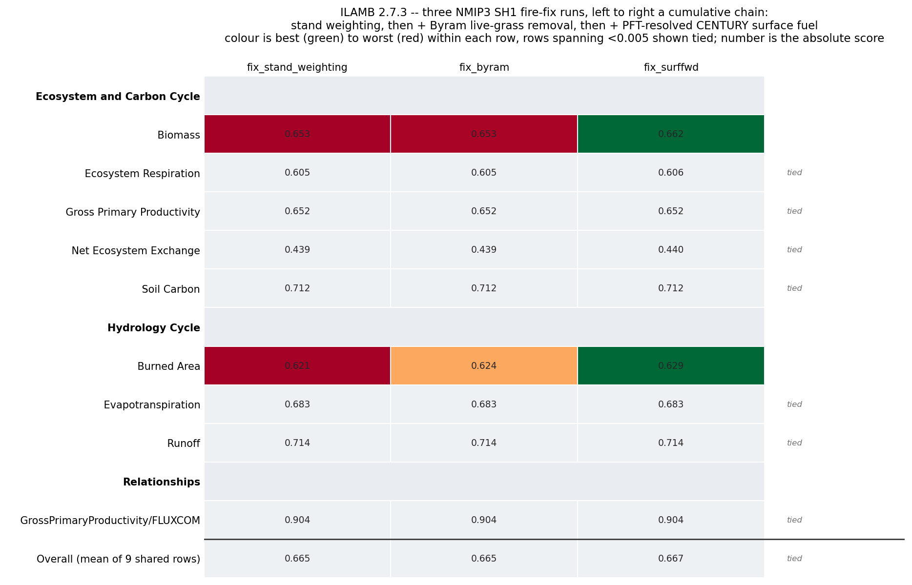

# NMIP SH1 — SPITFIRE fix-chain ILAMB comparison

[**Open the full ILAMB site →**](../results/ilamb-nmip-sh1-fire-fixes/index.html)

Three NMIP3 SH1 runs, 1850–2024, global, benchmarked with ILAMB 2.7.3 against
the same nine-row confrontation set used on the
[fix-spitfire / fix-permafrost page](sh1_fixes_ilamb.md).

**These are not three independent fixes — they are a cumulative chain.** A
source diff of the three `LPJ_snapshot/` trees shows each run is the one to its
left plus exactly one more change, and nothing else:

| model | run directory | adds, relative to the column on its left |
|---|---|---|
| `fix_stand_weighting` | `nmip-fix-fire-stand-weighting/NMIP3_fix_fire_stand_weighting_SH1` | the fire stand-weighting fix — the base of this trio |
| `fix_byram` | `nmip-fix-byram/NMIP3_fix_byram_no_globfirm_SH1` | `dailyfire.c`: live grass removed from the Byram flaming-front numerator |
| `fix_surffwd` | `nmip-fix-surffwd/NMIP3_fix_surffwd_SH1` | `moistfactor.c` + `fuelload.c`: new `pft_fuel_mass()` splits the CENTURY surface pools (`SURFMETA/SURFSTRUCT/SURFFWD/SURFCWD`) by PFT |

Driver, spinup, coordinates and output variable list are identical across all
three; the only differences are those source changes. The `fix_byram` run here
is the `no_globfirm` rebuild — all three are `-DSPITFIRE` only, and
`fix_surffwd` additionally adds a compile-time guard in `lpj.h` making
`GLOBFIRM` + `SPITFIRE` an `#error`, so the
[double-counted-fire-model problem](sh1_bnf.md) cannot recur in this lineage.
`firef` is clean in all three and Burned Area is safe to score.

**There is no un-fixed baseline.** These three are the only `NMIP3*` run
directories left on scratch, so the card is an incremental ablation of the
chain, not a fix-versus-control comparison. The absolute scores are not
meaningful against anything outside this trio.

## Scorecard

| row | `fix_stand_weighting` | `+ fix_byram` | `+ fix_surffwd` | spread |
|---|---|---|---|---|
| Biomass | 0.6533 | 0.6534 | **0.6618** | 0.0085 |
| Gross Primary Productivity | 0.6522 | 0.6522 | 0.6525 | 0.0003 |
| Ecosystem Respiration | 0.6053 | 0.6053 | 0.6056 | 0.0003 |
| Net Ecosystem Exchange | 0.4391 | 0.4390 | 0.4396 | 0.0006 |
| Soil Carbon | 0.7119 | 0.7119 | 0.7119 | 0.0000 |
| Evapotranspiration | 0.6830 | 0.6830 | 0.6829 | 0.0000 |
| Burned Area | 0.6215 | 0.6238 | **0.6295** | 0.0080 |
| Runoff | 0.7140 | 0.7141 | 0.7141 | 0.0001 |
| GPP/FLUXCOM relationship | 0.9040 | 0.9040 | 0.9039 | 0.0001 |
| **Overall (mean of 9 rows)** | **0.6649** | **0.6652** | **0.6669** | 0.0020 |

Every row is scored for all three models — no grey cells, and no confrontation
failed.

**Two rows move; seven are tied.** Burned Area and Biomass carry the entire
result. Everything else agrees to within 0.0006, which is not a difference these
runs can resolve. The overall mean moves by +0.0020 across the whole chain, and
reading that number as a quality ordering would be over-reading it — it is the
two moving rows diluted by seven flat ones.

The split between the two fixes is clean:

- **The Byram fix moves Burned Area only** (+0.0023), and nothing else by more
  than 0.0001. That is the expected footprint: it changes the flaming-front
  intensity numerator, which gates fire spread, and does not touch carbon
  allocation.
- **The surffwd fix moves both Burned Area** (a further +0.0057) **and Biomass**
  (+0.0085), and leaves hydrology flat to within 0.0001. Also expected: it
  changes which PFT's flammability and bulk density the surface fuel bed
  inherits, which feeds back through fire into vegetation carbon.

## Burned Area

GFED4.1S is the only Burned Area product on the card. Global period mean burned
fraction, and the score components:

| | `fix_stand_weighting` | `+ fix_byram` | `+ fix_surffwd` | GFED4.1S |
|---|---|---|---|---|
| Period mean (%) | 0.520 | 0.508 | 0.414 | 0.332 |
| Bias Score | 0.6817 | 0.6860 | 0.7126 | — |
| Spatial Distribution Score | 0.6410 | 0.6484 | 0.6501 | — |
| RMSE Score | 0.6666 | 0.6666 | 0.6666 | — |
| Seasonal Cycle Score | 0.4514 | 0.4514 | 0.4514 | — |

All three runs burn too much — the chain takes the global mean from 1.57× GFED
down to 1.25×, most of that in the surffwd step. Bias Score and Spatial
Distribution Score both improve monotonically along the chain.

**RMSE Score and Seasonal Cycle Score are identical to four decimal places
across all three runs.** The fixes are shifting the magnitude and the spatial
pattern of burned area, and not its month-to-month timing at all. Seasonal
Cycle Score at 0.451 is the weakest component in the row and is untouched by
any of this, so the fire seasonality problem is a separate one from what these
three fixes address.

## Biomass, and a caveat on how it improves

The Biomass row rises 0.6533 → 0.6618, and it does so for all four obs products
at once. But the global total moves the *wrong* way for three of them:

| dataset | total, `stand_weighting` (Pg C) | total, `+ byram` | total, `+ surffwd` | bias, `stand_weighting` → `+ surffwd` (kg m⁻²) | Bias Score | Spatial Score |
|---|---|---|---|---|---|---|
| ESACCI | 483.97 | 484.26 | 518.99 | +0.705 → **+0.964** | 0.645 → 0.659 | 0.892 → 0.898 |
| Saatchi | 473.66 | 473.94 | 508.92 | −0.859 → −0.444 | 0.611 → 0.624 | 0.878 → 0.879 |
| Thurner | 475.96 | 476.24 | 511.03 | +0.503 → **+0.671** | 0.544 → 0.555 | 0.721 → 0.735 |
| XuSaatchi | 482.87 | 483.15 | 518.12 | +0.094 → **+0.354** | 0.038 → 0.041 | 0.899 → 0.903 |

(Totals differ between rows only because each product has its own land mask;
the model field is the same. ESACCI and XuSaatchi are rescaled by 0.6375 and
1.275 in the config, as on every other ILAMB page on this site.)

The surffwd fix adds ~35 Pg C of vegetation carbon, ~7%. Against Saatchi, which
said the model was too *low*, that is a straightforward improvement. Against
ESACCI, Thurner and XuSaatchi, which all said the model was already too high,
the area-weighted mean bias gets **more** positive — and yet the Bias Score
improves for those three anyway.

That is not a contradiction, but it is worth being explicit about why: ILAMB's
Bias Score is the area-weighted mean of a pointwise `exp(−|bias(x)|/σ_ref(x))`
map, while the reported Bias is the area-weighted mean of `bias(x)` itself.
Both can rise together if the fix reduces the local error in many cells while
increasing it in a smaller number of high-biomass ones. The Spatial
Distribution Score rising for all four products points the same way — the fix
is changing *where* vegetation carbon sits more than it is fixing how much
there is in total.

**This page does not trace which cells drive that**, and the global total
moving further from three of four products is a real cost that the composite
score hides. The per-dataset bias maps in the
[full dashboard](../results/ilamb-nmip-sh1-fire-fixes/index.html) are the place
to start if that matters.

XuSaatchi's Bias Score of 0.038–0.041 is near-zero for every run in the chain,
as it has been on every SH1 page — the model sits far outside that product's
variability, and the fixes here do not change that.

## What is not on the card

The config is the nine-row trimmed set, carried over unchanged from the
[fix-spitfire page](sh1_fixes_ilamb.md), for the reasons established there and
on the [BNF/budget page](sh1_bnf.md):

- **Surface Air Temperature, Precipitation, Soil Carbon Extended** — need the
  model's own `tas` and `pr`. None of these runs wrote `mtair` or `mppt`. They
  could be reconstructed from the shared CRUJRA driver, but all three runs use
  the identical driver, so the row would be tied to machine precision and carry
  no information about the fixes.
- **Leaf Area Index** — a definition difference across code vintages rather
  than a model difference.
- **Global Net Ecosystem Carbon Balance and Carbon Dioxide** — NBP is a
  definition difference before it is a model difference. `nbp` *is* staged and
  formatted here (all three runs have an identical variable list, so their
  `mnbp` is built the same way and would in fact be comparable within this
  trio), but the row stays off the card to keep it comparable with the other
  SH1 pages on this site.

**Soil Carbon is still a single-year snapshot** (`selyear,2000`), so the flat
0.7119 across all three says the spinup equilibrium is unchanged, which is what
you would expect from fixes that act on fire.

## Reproducing

All scripts are in `scratch/tc229954e/ilamb_nmip_fixes_20260917/code/`.

`run_ilamb.sh` is the whole job: it reformats the three runs to ILAMB
conventions in parallel via the pipeline's `pipeline/util/format_ilamb.sh`, then
runs `ilamb-run` under `mpirun -np 12`. Because `format_ilamb.sh` only ever
reads `INPUT_DIR_NC` and writes under `OUTPUT_DIRECTORY`, it points straight at
each run's `ncdf_outputs` — there are no staging copies or symlink trees here,
and nothing is written into the run directories. Each run has its own netcdf
prefix (`RUNNAME`) and is given a short model name (`OUTPUT_RUNNAME`), which is
what becomes the column header on the dashboard.

`plot_ilamb_scorecard.py` renders the scorecard above from
`build/scalar_database.csv`, adapted from the SH1 BNF/budget page's
`plot_ilamb_landing.py`.

Reformat plus benchmark is about 19 minutes wall-clock on one `cpu(all)` node
with 12 tasks. The NetCDF ILAMB writes alongside its figures is not committed —
only the HTML and figures needed to browse the results.
