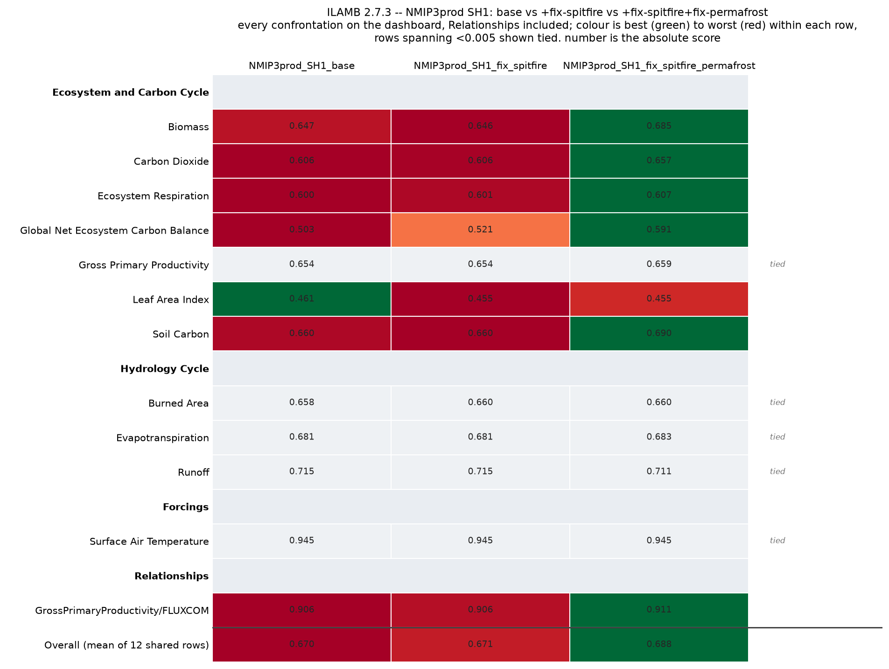

# NMIP SH1 — fix-spitfire / fix-permafrost ILAMB comparison

[**Open the full ILAMB site →**](../results/ilamb-nmip-sh1-fixes/index.html)

Three `NMIP3prod_fix_harvest_SH1` runs, 1850–2024, global, benchmarked with
ILAMB 2.7.3 against the same confrontation set used on the
[BNF/budget SH1 page](sh1_bnf.md):

| label | run directory |
|---|---|
| `NMIP3prod_SH1_base` | `nmip/NMIP3prod_fix_harvest_SH1` |
| `NMIP3prod_SH1_fix_spitfire` | `nmip-fix-spitfire/NMIP3prod_fix_harvest_SH1` |
| `NMIP3prod_SH1_fix_spitfire_permafrost` | `nmip-fix-spitfire-fix-permafrost/NMIP3prod_fix_harvest_SH1` |

The three differ only by which of the spitfire and permafrost fixes are
compiled in; driver, spinup, coordinates and output variable list are
otherwise identical, so the netcdf file prefix (`NMIP3prod_fix_harvest_SH1`)
is the same for all three and only the output directory distinguishes them.

## Scorecard

| row | base | +spitfire | +spitfire+permafrost |
|---|---|---|---|
| Biomass | 0.647 | 0.646 | 0.685 |
| Gross Primary Productivity | 0.654 | 0.654 | 0.659 |
| Leaf Area Index | 0.461 | 0.455 | 0.455 |
| Global Net Ecosystem Carbon Balance | 0.503 | 0.521 | 0.591 |
| Carbon Dioxide | 0.606 | 0.606 | 0.657 |
| Ecosystem Respiration | 0.600 | 0.601 | 0.607 |
| Soil Carbon | 0.660 | 0.660 | 0.690 |
| Evapotranspiration | 0.681 | 0.681 | 0.683 |
| Burned Area | 0.658 | 0.660 | 0.660 |
| Runoff | 0.715 | 0.715 | 0.711 |
| Surface Air Temperature | 0.945 | 0.945 | 0.945 |
| GPP/FLUXCOM relationship | 0.906 | 0.906 | 0.911 |
| **Overall (mean of 12 shared rows)** | **0.670** | **0.671** | **0.688** |

Surface Air Temperature is identical to six decimal places across all three
models. That's expected, not a coincidence: `tas` here is reconstructed once
from the shared CRUJRA driver (see below) rather than read from each model's
own output, so all three are scoring the exact same field against CRU4.02.

The fix-spitfire step alone moves the overall mean by +0.001 — essentially
flat. Adding the permafrost fix on top moves it by +0.018, concentrated in
three rows: **NBP** (+0.09 over base), **Biomass** (+0.04) and **Carbon
Dioxide** (+0.05, which is emulated from NBP by `NOAA.Emulated` and so tracks
it). Hydrology (Evapotranspiration, Burned Area, Runoff) is flat to within
0.005 across all three, consistent with a fix that acts on carbon-cycle
processes rather than the water balance. This page only reports the score
deltas — it does not trace which permafrost-fix mechanism drives the NBP/CO₂
move; that would need the kind of source-level diff the
[BNF page](sh1_bnf.md#the-harvest-bug-is-visible-in-these-panels) did for the
harvest bug.

## Biomass in detail

The composite score (0.647 → 0.685) hides a much bigger move underneath it:
**global vegetation carbon drops by ~88–90 Pg C (~18%)** with the permafrost
fix, consistent across all four independent obs products in the
confrontation. The fix-spitfire step alone only trims ~2%; the permafrost fix
does essentially all of it, in one step:

| dataset | model, base (Pg C) | model, +spitfire (Pg C) | model, +spitfire+permafrost (Pg C) | bias, base → fixed (kg m⁻²) | spatial score, base → fixed |
|---|---|---|---|---|---|
| ESACCI | 495.7 | 486.9 | 407.9 | +0.79 → +0.14 | 0.885 → 0.909 |
| Saatchi | 486.0 | 476.8 | 398.3 | −0.68 → **−0.90** | 0.880 → 0.879 |
| Thurner | 488.1 | 479.1 | 400.4 | +0.52 → **−1.08** | 0.663 → **0.879** |
| XuSaatchi | 495.0 | 486.0 | 407.1 | +0.18 → −0.47 | 0.896 → 0.907 |

Obs values are unchanged between runs — this is a real model shift, not a
benchmark artifact. It is not a clean bias correction: ESACCI and XuSaatchi
were overestimating and move toward zero bias, but Saatchi and Thurner
overshoot *past* zero into underestimate, with Saatchi's bias magnitude
getting worse. The score improves for all four anyway — most sharply for
Thurner (+0.14) — because the **Spatial Distribution Score** jumps for every
dataset. That score component compares the spatial *pattern*, not the global
total, so the fix is reshaping *where* vegetation carbon sits (pulled out of
high-latitude/permafrost zones is the natural read, though this page does not
trace the mechanism) closer to the observed pattern, even as the global total
now runs low against two of the four products.

## Surface Air Temperature: reconstructed from the CRUJRA driver

None of the three runs wrote `mtair` to binary output — same gap as the
BNF/budget SH1 page. Rather than leave the row gray, `tas` was reconstructed
from the CRUJRA `tmp` driver these runs were forced with
(`CRUJRA.0.5.tmp.daily.nc.chunked.nc`, same 0.5° global grid as the model
output), aggregated daily → monthly. All three runs use the identical driver
file, so this is computed once and shared across all three "models" — which
is exactly why the row above is tied to six decimal places.

**The driver's `units` attribute is wrong.** It reads `"Degrees Kelvin"`, but
the values are already Celsius: 2000 global annual mean is 8.7 (range −64 to
+43), physically impossible for Kelvin. A first attempt trusted the attribute
and subtracted 273.15, producing a −264°C global mean — caught before it went
anywhere by checking the raw values directly rather than trusting the
metadata. The final file applies no conversion.

`format_ilamb.sh`'s `tas` case only relabels the units attribute to `degC`
without converting the data (`ncatted -a units,tas,o,c,"degC"`), so this only
works because the reconstructed source is already Celsius, matching how LPJ's
own `mtair` output is written elsewhere on this cluster.

Nothing was written into the run directories: the reconstructed `mtair.nc` is
staged via symlinks alongside each run's real `ncdf_outputs/*.nc`, in
`ilamb_SH1_comparison/staged_inputs/<label>/` — the same convention the
BNF/budget SH1 page uses.

**Precipitation and Soil Carbon Extended stay gray.** Only `tmp` was
reconstructed, not `pre`. Precipitation needs `pr` directly. Soil Carbon
Extended (`ConfSoilCarbon`/Koven) needed `tas` too, but past that it also calls
`extractTimeSeries("pr", ..., expression="RAIN+SNOW")` — confirmed by
rerunning after `tas` was added: the traceback moved from the `tas` call to
the `pr` call in `ConfSoilCarbon.py`. So Koven needs both, and only one was
rebuilt here.

**The Biomass confrontation needed the same workaround as every other ILAMB
run on this site.** The pipeline's shipped `ilamb.cfg` looks for
`biomass`/`vegc` while `format_ilamb.sh` renames the variable to `cVeg`, so
without `alternate_vars = "vegc,cVeg"` the row silently scores nothing despite
carrying real weight. This run used the same patched config as the
[TRENDYv15 page](../trendyv15/ilamb.md#a-caveat-on-biomass), copied from
`trendy/v15/simulations/code/ilamb_cfg/ilamb_accum.cfg`. The fix has still not
been made upstream.

**Soil Carbon is a spinup snapshot, not a dynamic comparison** — `cSoil` is
scored from a single year (`selyear,2000`), so as on the BNF page, differences
here reflect spinup equilibria more than model response.

## Reproducing

All scripts live in `scratch/tc229954e/nmip-fix-spitfire-fix-permafrost/`.
`code/build_tas_from_crujra.py` reads the CRUJRA `tmp` driver and writes the
shared, monthly, degC `mtair.nc`. `code/run_ilamb_sh1.py` submits the
three-model ILAMB comparison via the pipeline's `submit_ilamb_job`, reading
`ilamb_SH1_comparison/staged_inputs/<label>/` — symlinks to each run's real
`ncdf_outputs/*.nc` plus the shared `mtair.nc` — rather than the run
directories directly. `code/plot_ilamb_scorecard.py` in
`ilamb_SH1_comparison/code/` renders the scorecard above from
`build/scalar_database.csv`, adapted from the SH1 BNF/budget page's
`plot_ilamb_landing.py`.

The NetCDF ILAMB writes alongside its figures is not committed — only the
HTML and figures needed to browse the results.
