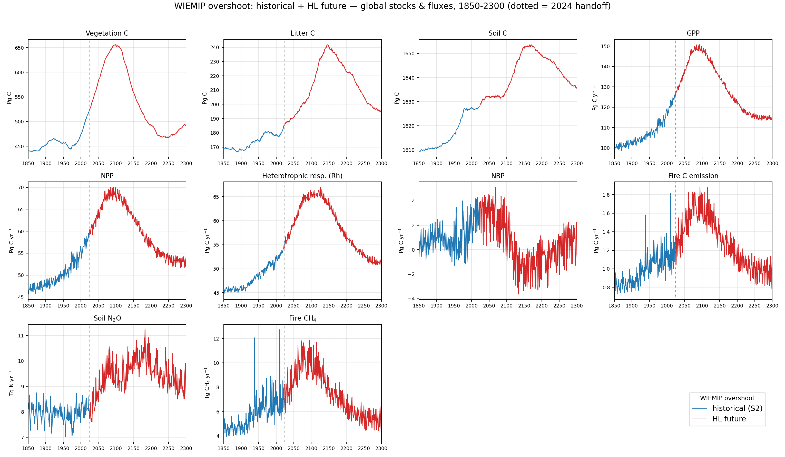

# WIEMIP Overshoots

The WIEMIP **overshoot** experiment with LPJ-EOSIM: a 1000+1000-yr spin-up →
historical run (`LPJ-hist`, S2, 1850–2023) and its control (`LPJ-hist-ctrl`, S0)
→ four future scenarios (**HL, M, HL_CF, L**; 2024–2300, UKESM), each branched
from the historical 2023 end-state. This page collects the overshoot drivers and
the LPJ-EOSIM carbon / trace-gas output.

## Overshoot scenario comparison

Global annual-mean forcing for the WIEMIP **overshoot** scenarios
(2024–2300), with the WIEMIP-CRUJRA historical record (1850–2023, grey)
prepended for context. Three GCM drivers — **IPSL-CM6A-LR**, **GFDL-ESM4**,
**UKESM1-0-LL** — and eight overshoot scenarios: Very low (VL), Low (L),
Medium-low (ML), Medium (M) and High (HL), plus the `-CF` variants.

These are **raw** annual means: no smoothing, no value-masking. The CSVs were
regenerated directly from the source NetCDFs (the GFDL↔IPSL labels were
accidentally switched at write time and are corrected here). All source files
were re-synced from the WIEMIP bucket and validated: every field is NaN-free
and every source-year is timestep-complete (1460/1460 6-hourly steps).

### By driver — all variables

Each figure is one driver; the 4×2 panels are the seven forcing variables and
the eight scenarios are overlaid (legend bottom right).

#### IPSL-CM6A-LR

#### GFDL-ESM4

#### UKESM1-0-LL

### By variable — all drivers

Each figure is one variable; the 4×2 panels are the eight scenarios and the
three drivers are overlaid in each panel.

#### Air temperature

#### Precipitation

#### Specific humidity

#### Surface pressure

#### Downward shortwave radiation

#### Downward longwave radiation

#### Wind speed

## SPITFIRE fire drivers — tmin, tmax, wind

Daily **minimum/maximum temperature** and **wind speed** are required by
SPITFIRE but were missing from the initial overshoot conversion. They were
generated with the same `format_LPJ` pipeline as the other CRUJRA drivers —
`tmin`/`tmax` as the daily min/max of the 6-hourly `tmp`, `wind` as the daily
mean — for the historical CRUJRA record (1850–2024) and the four UKESM overshoot
scenarios (2024–2300). Shown here as the **global annual mean** (area-weighted
over land cells); the dotted line marks the 2024 historical→future handoff.

#### Daily minimum temperature

#### Daily maximum temperature

#### Wind speed

## LPJ-EOSIM performance

Global stocks & fluxes — WIEMIP CRUJRA (overshoot, S2) vs regular CRUJRA (S3).
Note the two runs use different scenarios, so this is not a like-for-like
comparison.

### Historical + HL future — full trajectory (global totals)

Key stocks and fluxes over the whole **1850–2300** timeline: the historical run
(`LPJ-hist`, S2; blue) spliced with the **HL** future (2024–2300; red), each as
an area-weighted global total (`Σ value × cell area`). Pools in Pg C, carbon
fluxes in Pg C yr⁻¹; trace gases in native units (soil N₂O in Tg N yr⁻¹, fire
CH₄ in Tg CH₄ yr⁻¹). The dotted line marks the 2024 historical→future handoff.

### Overshoot scenario output — all variables

Global diagnostics for the four completed WIEMIP **overshoot** LPJ-EOSIM runs
(**HL**, **M**, **HL_CF**, **L**; 2024–2300), with the WIEMIP-CRUJRA historical
record (1850–2023, black) prepended. Each panel is one output variable; the
value is the **area-weighted global mean** in the variable's native units
(monthly variables are averaged to annual). This is a uniform diagnostic to show
global trajectories, not a carbon-budget integral. The dotted line marks 2024
(historical → scenario handoff).

### Historical vs control — global carbon & trace-gas budgets

Global **totals** (area-weighted integral, `Σ value × cell area`) for the
overshoot **historical** run (`LPJ-hist`, S2 — transient CO₂, climate, N
deposition, population; land use fixed at 2023) against its **control**
(`LPJ-hist-ctrl`, S0 — CO₂MEAN, constant N deposition and population, recycled
climate, constant land use), both 1850–2023 and both branched from the same
1000+1000-yr spin-up. The control isolates the drift of an unforced system; the
gap between the two is the modelled response to transient forcing.

As expected, the control (dashed) sits near its spin-up equilibrium while the
historical run (solid) shows the CO₂/climate/N-driven rise across all carbon
pools and fluxes. Pools are in Pg C, carbon fluxes in Pg C yr⁻¹; trace gases are
kept in their native units (soil N₂O in Tg N yr⁻¹, fire CH₄ in Tg CH₄ yr⁻¹).

### Soil carbon — sanity check vs TRENDYv13 LPJwsl

Is the mid-century rise and **~1980 flattening** of the historical soil-carbon
sink realistic, or an artefact? Comparing against the **TRENDYv13 LPJwsl S2**
run (an independent LPJ-family model, cSoil integrated the same way) says it's
real: both models show soil C accumulating strongly through the mid-20th century
and then **plateauing around 1980** — LPJwsl actually peaks ~1990 and declines
slightly after, while LPJ-EOSIM holds roughly flat. The S0 control stays at its
spin-up equilibrium throughout. Absolute pools differ (LPJ-EOSIM ~1610–1627 Pg C
vs LPJwsl ~1284–1317 Pg C) as expected from different soil-carbon schemes, so the
right panel shows the anomaly relative to 1901 to compare trends directly.

The signal is the classic split: the **soil/litter sink saturates under warming**
(decomposition catches up with rising inputs) while the vegetation sink keeps
growing under CO₂ fertilization.

### Soil carbon — permafrost ablation

Is the ~1980 soil-carbon plateau a permafrost artefact? To test, the full chain
(spin-up → historical) was rerun with **PERMAFROST disabled** (`LPJ-noperma-*`,
otherwise identical flags). **It isn't permafrost**: the plateau is present with
*and* without permafrost, and is in fact **stronger without** it — the
no-permafrost soil C peaks ~1980 and then declines, while the permafrost run
holds roughly flat. Decadal Δ soil C (Pg C/decade): 1970s +4.0 / +3.5, 1980s
−0.1 / −0.9, 1990s +0.7 / −0.4, 2000s −0.7 / −2.2 (permafrost / no-permafrost).

So permafrost soil dynamics don't drive the plateau; if anything they buffer the
post-1980 loss. This is consistent with the TRENDYv13 LPJwsl comparison above —
the signal is warming-driven decomposition catching up with litter inputs.
Absolute soil C is higher without permafrost (~1700 vs ~1610 Pg C). (Historical
1850–2023 shown; the no-permafrost HL future was still running at plot time.)

### Soil carbon — N-cycle ablation (what drives the ~1980 plateau)

Rerunning spin-up → historical with the **nitrogen cycle disabled** (and
permafrost off) settles it: **the ~1980 plateau is an N-limitation effect, not
permafrost.** Baseline and no-permafrost soil C both flatten/peak ~1980, but with
the N cycle off soil C rises **monotonically** through 2023 (no knee). Decadal Δ
soil C (Pg C/decade), baseline / no-perma / no-N: 1970s +4.0 / +3.5 / +7.5, 1980s
−0.1 / −0.9 / **+4.9**, 2000s −0.7 / −2.2 / **+3.9**.

Interpretation: as warming accelerates decomposition and CO₂ raises productivity,
**nitrogen becomes limiting and caps the soil-carbon sink around 1980**. Remove N
limitation and carbon accumulates unconstrained (absolute soil C is also much
higher without the N cycle, ~2200 vs ~1610 Pg C).

