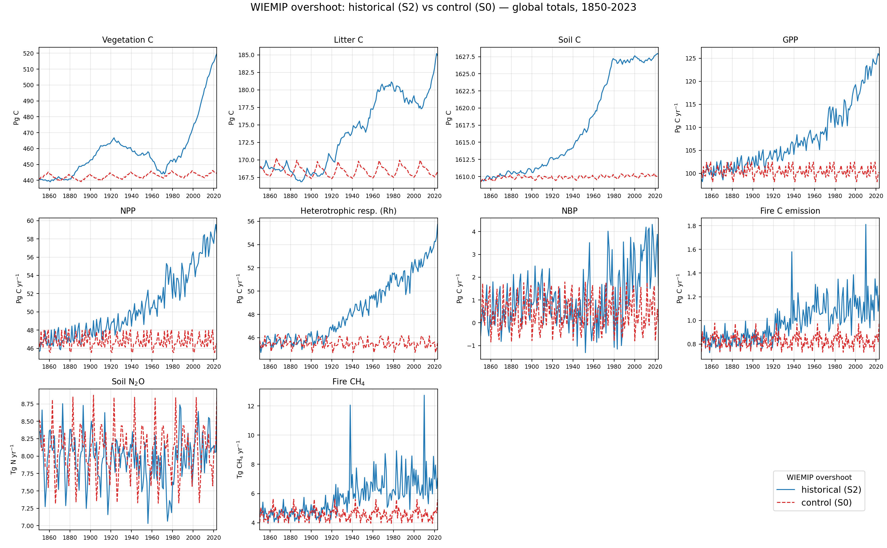

# WIEMIP Overshoots — LPJ Results

LPJ-EOSIM carbon and trace-gas output for the WIEMIP **overshoot** experiment:
a 1000+1000-yr spin-up → historical run (`LPJ-hist`, S2, 1850–2023) and its
control (`LPJ-hist-ctrl`, S0). The forcing data behind these runs is on the
[**Driver Data**](driver_data.md) page. Older future-scenario figures built with
a previous model version and flag set have moved to the
[**Archive**](archive.md).

## WIEMIP vs regular CRUJRA

Global stocks & fluxes — WIEMIP CRUJRA (overshoot, S2) vs regular CRUJRA (S3).
Note the two runs use different scenarios, so this is not a like-for-like
comparison.

## Historical vs control — global carbon & trace-gas budgets

Global **totals** (area-weighted integral, `Σ value × cell area`) for the
overshoot **historical** run (`LPJ-hist`, S2 — transient CO₂, climate, N
deposition, population; land use fixed at 2023) against its **control**
(`LPJ-hist-ctrl`, S0 — CO₂MEAN, constant N deposition and population, recycled
climate, constant land use), both 1850–2023 and both branched from the same
1000+1000-yr spin-up. The control isolates the drift of an unforced system; the
gap between the two is the modelled response to transient forcing.

As expected, the control (dashed) sits near its spin-up equilibrium while the
historical run (solid) shows the CO₂/climate/N-driven rise across all carbon
pools and fluxes. Pools are in Pg C, carbon fluxes in Pg C yr⁻¹; trace gases are
kept in their native units (soil N₂O in Tg N yr⁻¹, fire CH₄ in Tg CH₄ yr⁻¹).

## Soil carbon — sanity check vs TRENDYv13 LPJwsl

Is the mid-century rise and **~1980 flattening** of the historical soil-carbon
sink realistic, or an artefact? Comparing against the **TRENDYv13 LPJwsl S2**
run (an independent LPJ-family model, cSoil integrated the same way) says it's
real: both models show soil C accumulating strongly through the mid-20th century
and then **plateauing around 1980** — LPJwsl actually peaks ~1990 and declines
slightly after, while LPJ-EOSIM holds roughly flat. The S0 control stays at its
spin-up equilibrium throughout. Absolute pools differ (LPJ-EOSIM ~1610–1627 Pg C
vs LPJwsl ~1284–1317 Pg C) as expected from different soil-carbon schemes, so the
right panel shows the anomaly relative to 1901 to compare trends directly.

The signal is the classic split: the **soil/litter sink saturates under warming**
(decomposition catches up with rising inputs) while the vegetation sink keeps
growing under CO₂ fertilization.

## Soil carbon — permafrost ablation

Is the ~1980 soil-carbon plateau a permafrost artefact? To test, the full chain
(spin-up → historical) was rerun with **PERMAFROST disabled** (`LPJ-noperma-*`,
otherwise identical flags). **It isn't permafrost**: the plateau is present with
*and* without permafrost, and is in fact **stronger without** it — the
no-permafrost soil C peaks ~1980 and then declines, while the permafrost run
holds roughly flat. Decadal Δ soil C (Pg C/decade): 1970s +4.0 / +3.5, 1980s
−0.1 / −0.9, 1990s +0.7 / −0.4, 2000s −0.7 / −2.2 (permafrost / no-permafrost).

So permafrost soil dynamics don't drive the plateau; if anything they buffer the
post-1980 loss. This is consistent with the TRENDYv13 LPJwsl comparison above —
the signal is warming-driven decomposition catching up with litter inputs.
Absolute soil C is higher without permafrost (~1700 vs ~1610 Pg C). (Historical
1850–2023 shown; the no-permafrost HL future was still running at plot time.)

## Soil carbon — N-cycle ablation (what drives the ~1980 plateau)

Rerunning spin-up → historical with the **nitrogen cycle disabled** (and
permafrost off) settles it: **the ~1980 plateau is an N-limitation effect, not
permafrost.** Baseline and no-permafrost soil C both flatten/peak ~1980, but with
the N cycle off soil C rises **monotonically** through 2023 (no knee). Decadal Δ
soil C (Pg C/decade), baseline / no-perma / no-N: 1970s +4.0 / +3.5 / +7.5, 1980s
−0.1 / −0.9 / **+4.9**, 2000s −0.7 / −2.2 / **+3.9**.

Interpretation: as warming accelerates decomposition and CO₂ raises productivity,
**nitrogen becomes limiting and caps the soil-carbon sink around 1980**. Remove N
limitation and carbon accumulates unconstrained (absolute soil C is also much
higher without the N cycle, ~2200 vs ~1610 Pg C).

## Soil carbon — robustness to climate dataset & land use

Two further swaps confirm the ~1980 plateau is **not** an artefact of the
WIEMIP-processed climate or of the fixed-2023 land use. Both alternative runs use
the **raw CRUJRA reanalysis** (1901–2024, tmin/tmax variables renamed to LPJ's
convention; the 1850–1900 head recycled), branching from the same spin-up:

- **`truecrujra`** — raw CRUJRA, land use still fixed at 2023 (`CONST_LU`).
- **`crujra-translu`** — raw CRUJRA **plus transient land use** (`TRANSIENT_LU`,
  following the LUH-GCB2025 trajectory 1850–2023).

**Soil C plateaus at ~1980 in all three** (≈1627 Pg C at 1980, within ~1 Pg of
each other). The raw reanalysis differs from WIEMIP-CRUJRA at every timestep
(global-mean air temperature differs by ~0.03 °C post-1901 and ±0.1 °C in the
recycled pre-1901 head), so this is a genuinely different climate realization —
and the plateau is unchanged.

The **vegetation-C panel proves the transient-LU run is actually doing something**:
cropland expansion pulls vegetation C *down* from ~404 to ~377 Pg C through 1980
(versus ~440–450 Pg C when LU is frozen at 2023), before CO₂ fertilization
recovers it. So land use strongly reshapes the vegetation pool — yet the **soil-C
plateau is untouched** (transient LU nudges 2023 soil C up only ~+3.5 Pg C).

Together with the permafrost and N-cycle ablations above, this pins the plateau on
**intrinsic soil-pool turnover** (heterotrophic respiration catching up with
litter inputs under N limitation), robust to the climate dataset, the land-use
treatment, and the forcing details.

