# Historical + overshoot: stocks & fluxes

Global, area-weighted (`Σ value × cell area`) annual totals for the historical
run (`LPJ-hist-transientN`, S2, 1850–2023) continued by all six UKESM1-0-LL
overshoot future scenarios (2024–2300): **L**, **ML**, **ML (constant fire)**,
**M**, **HL**, **HL (constant fire)** — an ordered low→high overshoot-severity
spectrum, with each `_CF` variant holding fire disturbance fixed as a
sensitivity check against its base scenario. The drift control
(`LPJ-hist-ctrl`, S0) is not shown here — see
[**Historical vs control**](hist_vs_control.md) for that comparison.

Monthly output is grouped by calendar year and summed to an annual value before
area-weighting (a no-op for variables already reported annually). Carbon
stocks & fluxes are in **Pg C** / **Pg C yr⁻¹**; the nitrogen-cycle variables
(soil N₂O, biological N fixation) are in **Tg N yr⁻¹**; evapotranspiration is
an area-weighted global-mean depth in **mm yr⁻¹**.

## Global timeseries, 1850–2300

GPP, NPP, heterotrophic respiration (Rh), NBP, soil/vegetation/litter carbon,
soil N₂O, fire carbon emission, establishment flux, ecosystem respiration
(Reco), autotrophic respiration (Ra), biological N fixation (BNF), and
evapotranspiration — one panel per variable, historical (dark, solid) followed
by all six scenarios (blue ramp, light→dark = low→high overshoot severity;
dashed = constant-fire variant).

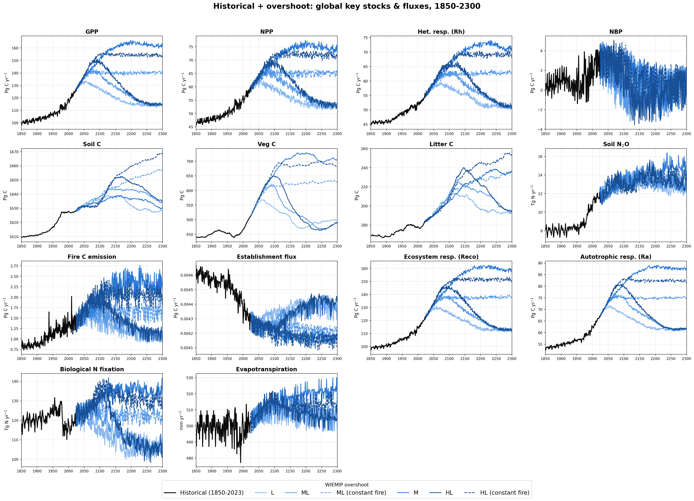

## Spatial patterns: end of historical vs end of overshoot

For each variable, the annual field at the end of the historical period (2023)
compared against the same field at the end of each of the six overshoot
scenarios (2300), on a shared color scale per variable so the panels are
directly comparable. NBP uses a diverging scale (blue = net sink, red = net
source); all other variables use a sequential scale.

### GPP

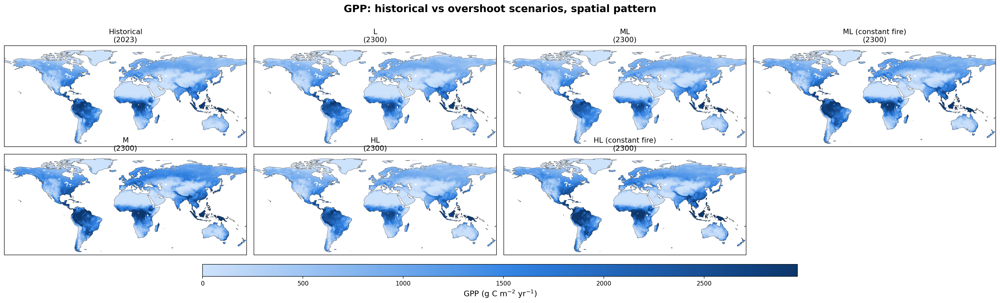

### NPP

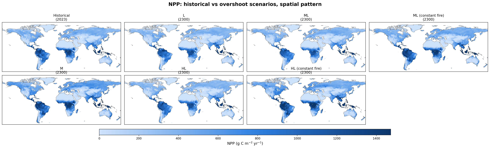

### Heterotrophic respiration (Rh)

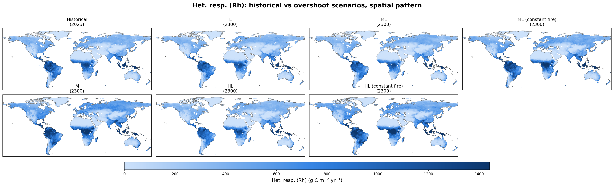

### NBP

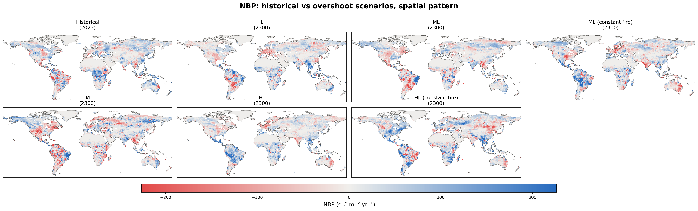

### Soil carbon

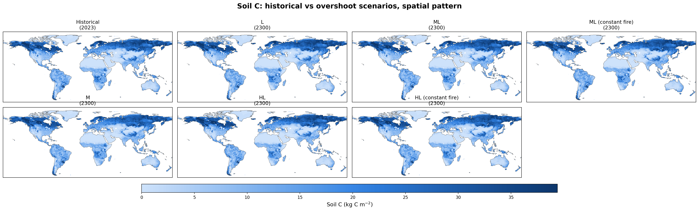

### Vegetation carbon

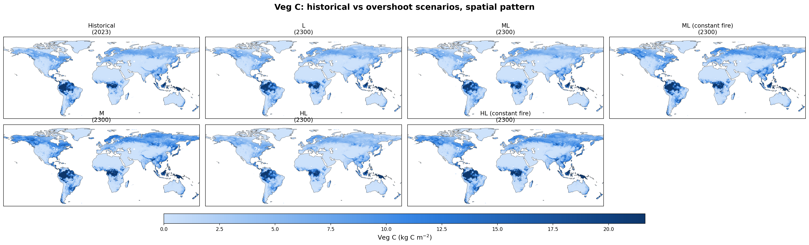

### Litter carbon

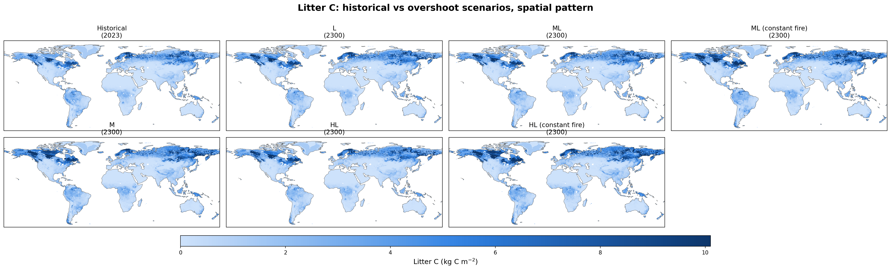

### Soil N₂O

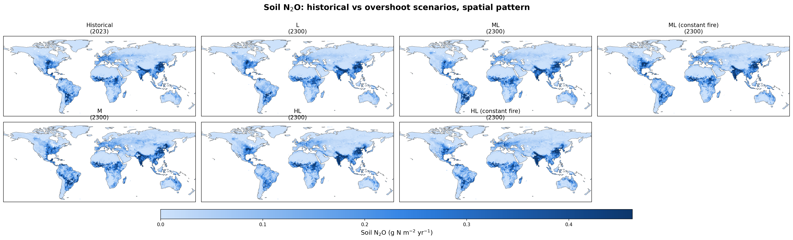

### Fire carbon emission

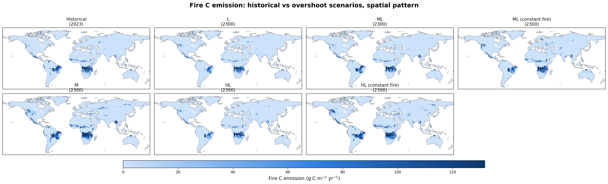

### Establishment flux

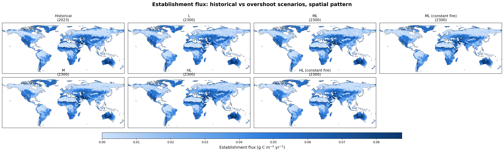

### Ecosystem respiration (Reco)

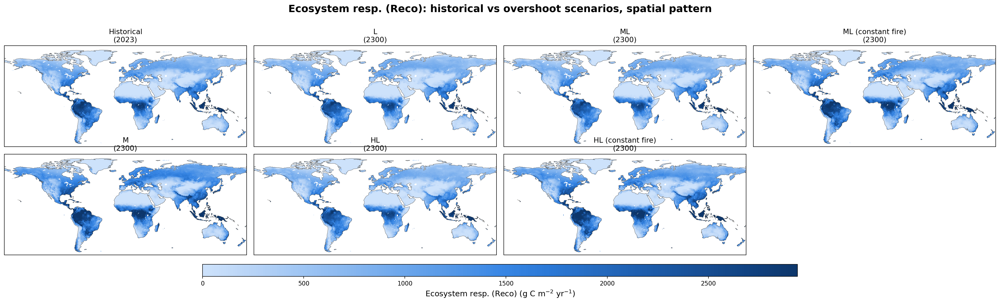

### Autotrophic respiration (Ra)

### Biological N fixation (BNF)

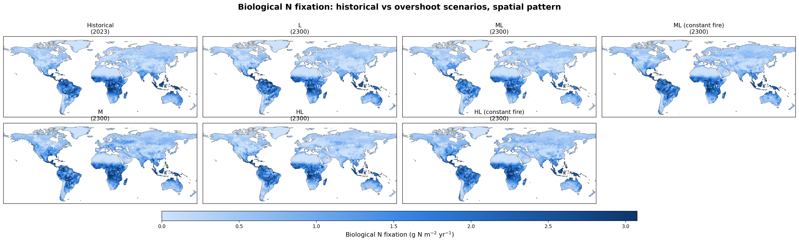

### Evapotranspiration

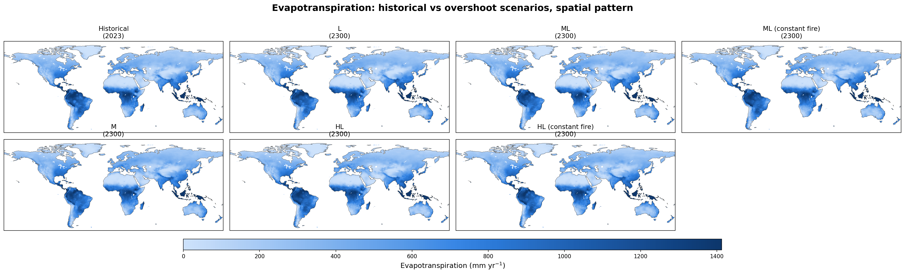
