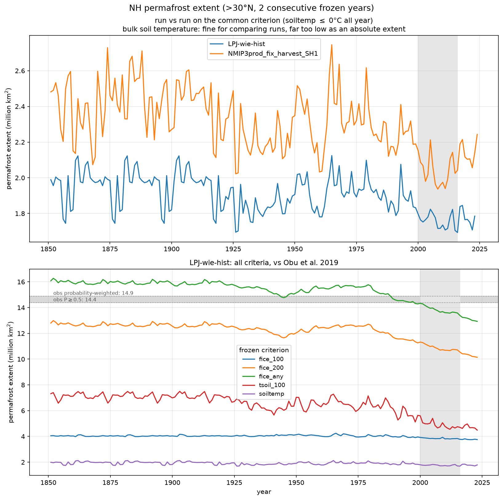
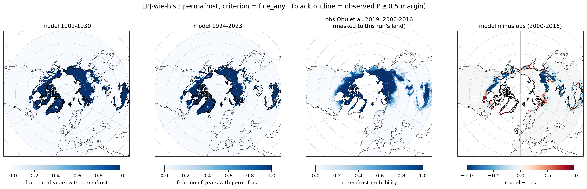
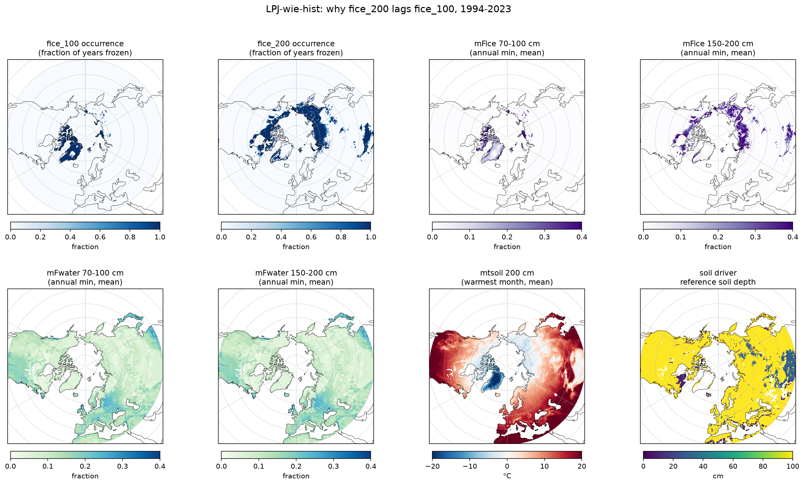
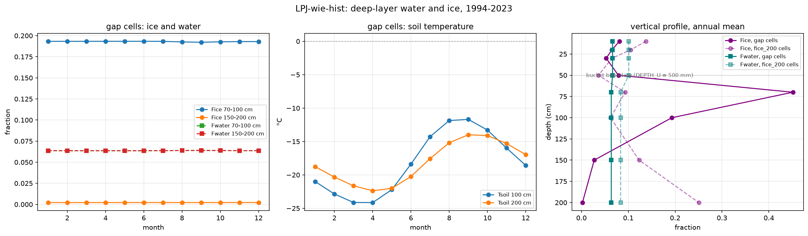
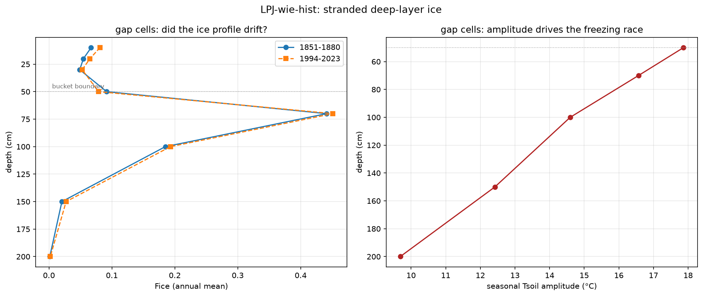
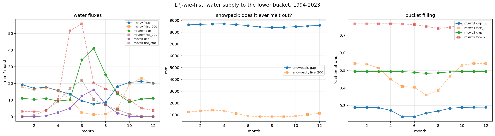

# Permafrost extent — and why `fice_200` is broken

**Run:** `LPJ-wie-hist` (WIEMIP overshoot historical, 1850–2023, 0.5°)
**LPJ commit:** `e2a0eaf632996ba33df2b0ff32e6d886fa30198d`
**Also shown:** `NMIP3prod_fix_harvest_SH1` (`nmip-fix-spitfire-fix-permafrost`)
**Analysis code:** `…/wiemip_results/overshoot/LPJ-wie-hist/code/`

A cell counts as permafrost in year Y if the ground stays frozen every month of
Y *and* Y−1 (the two-consecutive-year rule). "Frozen" is evaluated five ways to
expose the sensitivity to the criterion:

| criterion | definition |
|---|---|
| **`fice_any`** | any `mFice` layer 10–200 cm holds ice ≥0.01 all 12 months — **headline** |
| `fice_100` | layer 70–100 cm only |
| `fice_200` | layer 150–200 cm only |
| `tsoil_100` | `mtsoil_100` never exceeds 0 °C |
| `soiltemp` | bulk `msoiltemp` never exceeds 0 °C |

Benchmark is **Obu et al. (2019)** / ESA GlobPermafrost permafrost probability
(10 km, 2000–2016, [PANGAEA 888600](https://doi.org/10.1594/PANGAEA.888600),
CC-BY-3.0), binned onto the 0.5° grid and **masked to each run's own land
cells** — otherwise a run is charged for ~1.5 M km² of islands and coastline the
0.5° grid cannot resolve.

## Headline

**`fice_any` = 13.81 M km² (2000–2016) vs obs 14.38–14.90 — the model runs
4–7% low.** Extent declines **16.0 → 12.9 M km²** over 1850–2023, with almost
all the loss after 1980. Active layer deepens 113 → 124 cm.



| criterion | 2000–2016 | bias vs obs P≥0.5 |
|---|---|---|
| **`fice_any`** | **13.81** | **−0.57** |
| `fice_200` | 10.87 | −3.51 |
| `tsoil_100` | 4.89 | −9.49 |
| `fice_100` | 3.84 | −10.54 |
| `soiltemp` (LPJ-wie-hist) | 1.76 | — |
| `soiltemp` (NMIP SH1) | 2.04 | — |

Only `fice_any` is usable as an absolute extent. `fice_100` sits inside the
active layer and thaws every summer; `tsoil_100` and `soiltemp` are point/bulk
temperatures that exceed 0 °C in summer across the discontinuous zone.

**NMIP SH1 comparison:** that run wrote no permafrost outputs at all (no
`mFice_*`, `mtsoil_*`, `mthaw_depth` — not in NetCDF, not in the binaries), so
the only shared field is bulk `msoiltemp`. On it, NMIP sits **~15% above**
LPJ-wie-hist (2.04 vs 1.76 M km²) with a near-constant offset across the whole
record. Relative comparison only — both are ~12 M km² below obs because
`msoiltemp` is a poor permafrost diagnostic.

## Spatial pattern

Core Arctic matches obs well (bias panel near-white inside the observed margin).
Deficit is at southern and maritime margins — Scandinavia, W Siberia, SE Siberia,
Hudson Bay coast — where subgrid heterogeneity the obs resolves at 10 km cannot
exist in a 0.5° cell. One positive-bias block in Alaska/Yukon.



---

## `fice_200` is not measuring permafrost

`fice_200` is **3.5 M km² below** `fice_any` and spatially spotty, which is
backwards: a column frozen at 70–100 cm should be frozen at 150–200 cm too.
**3,911 cells (32% of all `fice_any` cells) are frozen by `fice_any` but missed
by `fice_200`.** In those cells the 150–200 cm layer is at **−12.9 °C** —
colder than the cells that pass (−2.8 °C). Temperature was never the constraint.



### The layer has water, but none of it can freeze

`Fwater` annual-min is **identical at 100 and 200 cm** (0.064 / 0.064). That is
`Fpwp`, the wilting-point water `initpermafrost.c:45` sets to the *same*
`soil->par->wat_hld` in every layer, which `permafrost.c:459` subtracts before
phase change and `permafrost.c:630` adds back after. Only water *above* wilting
point can freeze, so **Fice = total moisture − Fpwp**, which holds to ±0.001:

| | gap cells | `fice_200` cells |
|---|---|---|
| Fice+Fwater 200 cm | 0.066 | 0.316 |
| − Fpwp | 0.064 | 0.076 |
| ⇒ predicted Fice | **0.002** | 0.240 |
| observed Fice 200 cm | **0.002** | 0.241 |

### The bucket is nearly dry, and thin layers hoard it

Water reaches the permafrost column through exactly one line —
`waterbalance.c:557`, fed by LPJ's two buckets (`DEPTH_U` = 500 mm,
`DEPTH_L` = 1500 mm, `LIDX = IDX+4`):

```c
wtot_lo = soil->w[1] * whc[1] * DEPTH_L - ice_lo;   // ice_lo = Σ Fice[i]·Dz[i]
permafrost->wtot[i] = wtot_lo * Dz[i] / DEPTH_L;
Fwater[i] = wtot[i]/Dz[i] + Fpwp[i];                // bucket-uniform
```

`Dz[i]` cancels, so **every layer in a bucket gets the identical water
fraction** — water is *allocated*, never *transported*. 100 cm and 200 cm are
in the same bucket, so supply is equal by construction.

Since `Fwater − Fpwp ≈ 0` is observed, `wtot_lo ≈ 0`, so all the bucket's water
is already ice: **bucket water = `ice_lo` = 163 mm spread over 1500 mm of soil**
(mean volumetric content 0.109). There was never much to go around.

`Dz_soil = {100,100,100,200,200,300,500,500}` mm (`permafrost.c:104`):

| layer | Dz | Fice | ice (mm) | share of 163 mm |
|---|---|---|---|---|
| 50–70 cm | 200 mm | 0.451 | **90** | 55% |
| 70–100 cm | 300 mm | 0.193 | 58 | 36% |
| 100–150 cm | 500 mm | 0.027 | 14 | 8% |
| 150–200 cm | 500 mm | 0.002 | **1** | 0.6% |

Two effects compound:

1. **Ratchet.** `Fwater` is overwritten uniformly every day; `Fice` is a sticky
   per-layer accumulator nothing redistributes. The layer with the largest |ΔT|
   converts the most each day and *keeps* it. Seasonal `Tsoil` amplitude falls
   monotonically with depth — 16.6 °C at 70 cm vs 9.7 °C at 200 cm — so the
   topmost lower-bucket layer wins and ratchets to porosity saturation (0.451 ≈
   `soil->par->porosity`; `Fice` has no cap, only `Fair` clamps at 0).
2. **Thin layers are cheap to fill.** Reaching Fice = 0.45 costs 90 mm in a
   200 mm layer but **225 mm** in a 500 mm layer — more than the whole bucket
   holds. The deep layers cannot reach high ice fractions even in principle.

Had all four frozen equally, ice would settle uniformly at `w[1]·whc ≈ 0.108` —
above threshold everywhere, and `fice_200` would be true.

### Nothing ever unwinds it

The column **never thaws**: warmest month at any depth is −11.7 °C. `Fice` and
`Fwater` are constant to three decimals across all 12 months while `Tsoil`
swings 12 °C.



The allocation was **locked in during spin-up** and has barely moved in 174
years — `ice_lo` 155 → 163 mm, and the 150–200 cm layer 0.0013 → 0.0022 `Fice`.
At that rate it needs **~1,200 years** to cross the 0.01 threshold. So the whole
`fice_200` time series in these cells reports a fixed pre-1850 state, not
climate.



### These cells are glaciers

`msnowpack` in the gap cells is **8,400–8,700 mm SWE** — 8.5 m of permanent
snow that never melts out. LPJ has no glacier dynamics, so snow accumulates
without bound wherever accumulation exceeds melt.



| annual, mm/yr | gap | `fice_200` |
|---|---|---|
| snowfall | 189 | 151 |
| runoff | 197 | 199 |
| **runoff / snowfall** | **1.04** | 1.32 |
| **transpiration** | **2.0** | 70.5 |

Runoff ≈ snowfall and transpiration of 2 mm/yr: essentially everything that
falls leaves as runoff, and there is no vegetation. **`mswc2` is 0.49 in every
single month** — the lower bucket exchanges water with nothing. (Compare the
`fice_200` cells: `mswc2` dips to 0.74 in August, `mswc1` swings 0.36→0.54 — a
working hydrology.)

Consistent with the soil driver: **71% of these cells are flagged non-soil**
(`issoil` = 0, `ref_depth` = 0) in HWSD. Note `issoil` is read by nothing in
LPJ, and `ref_depth` is gated behind `#ifdef SOILDEPTH`, which **this build does
not define** — so neither excludes the cells. They run with a default soil
column under an ice sheet.

## Open

- **Glacier mask.** ~3,900 of 12,400 `fice_any` cells are permanent-snowpack
  columns arguably not permafrost by any criterion. A mask on the model's own
  state (`msnowpack` > 1000 mm year-round) is more defensible than `issoil`.
  Effect on the headline extent not yet quantified.
- **Candidate fix.** Weight the per-layer freeze by `Dz` so thin layers cannot
  monopolise `ice_lo`. Not filed against LPJ yet.
- **`Fpwp` comment/code mismatch.** `permafrost.c:456` says this water "does not
  freeze until the temperature drops below −10 °C", but there is **no
  temperature condition in the code** — the subtract/add-back is unconditional.
  The only `-10.0` references are commented-out Fortran (lines 278, 310).
- **`whc[1] ≈ 0.22`** was inferred by closing the budget, not read from the run
  (LPJ takes it from the USDA class; not in the outputs). It closes for both
  cell groups with one value.
- **No rainfall output**, so `msnowf` was used as the precipitation proxy —
  slight underestimate of total supply.
