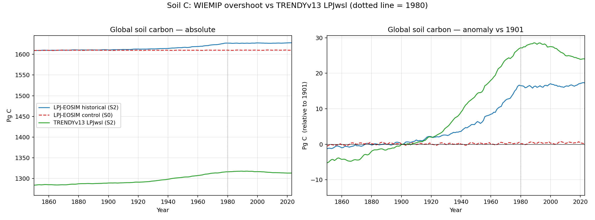
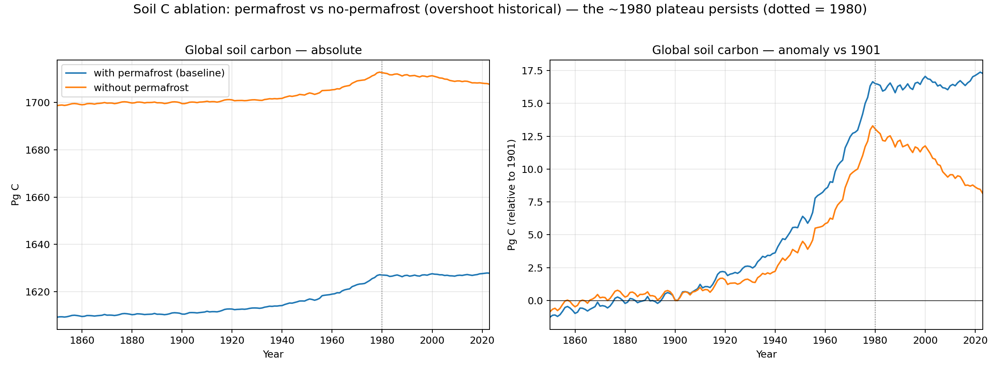
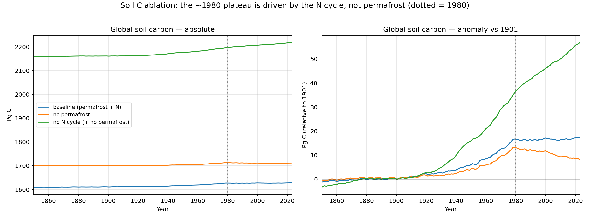
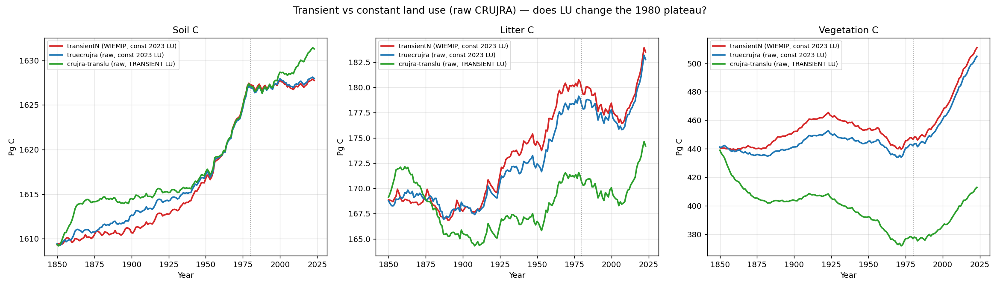
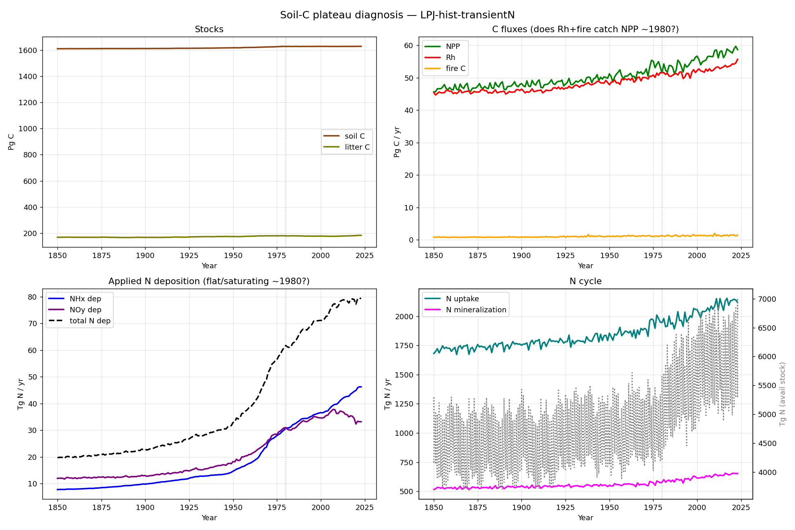
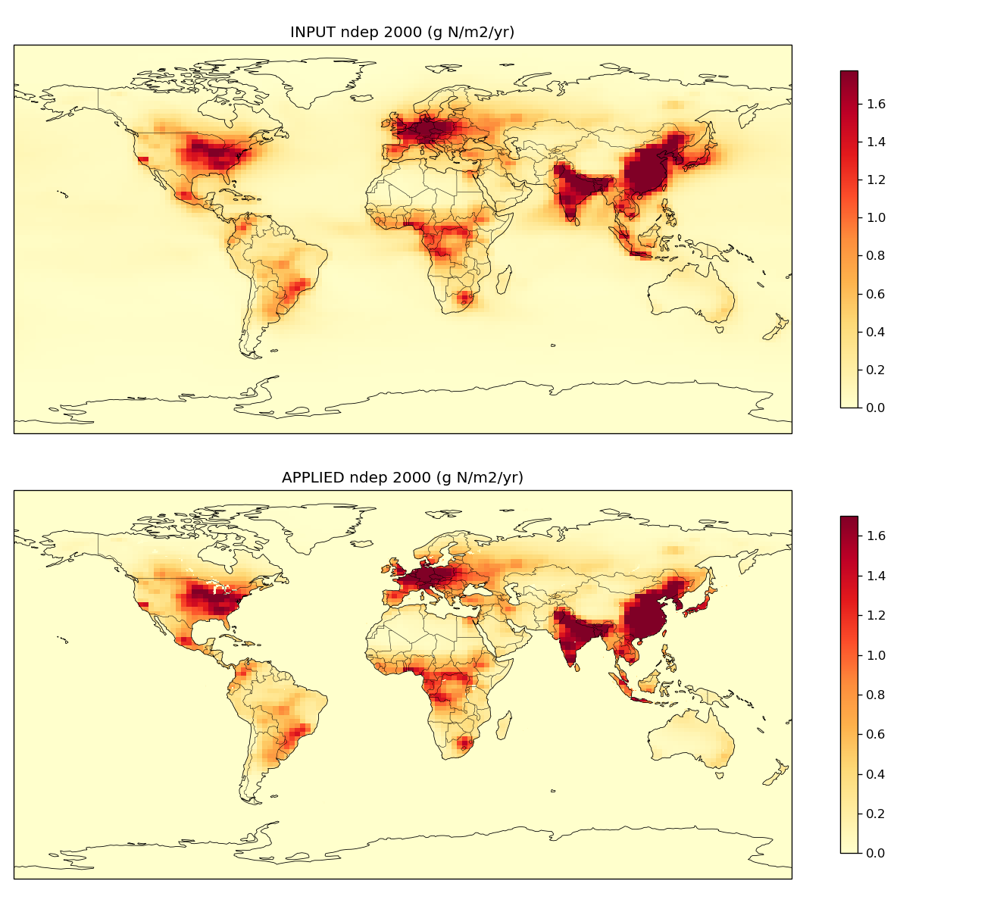
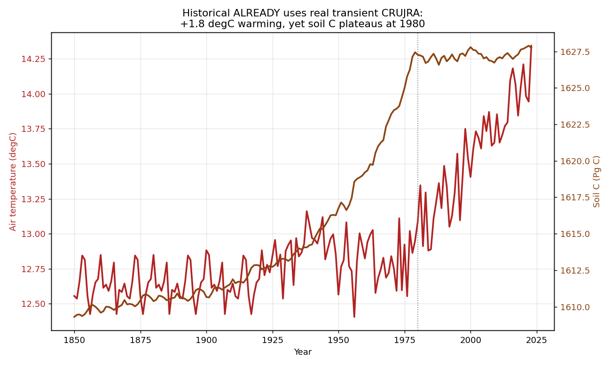
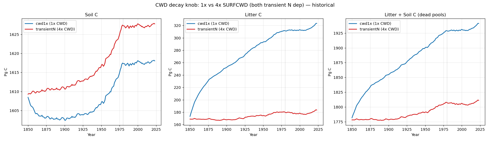
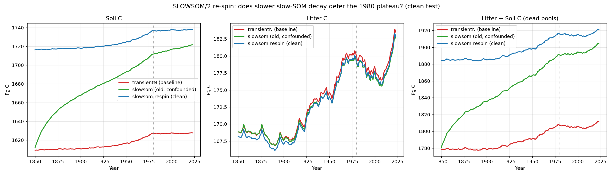
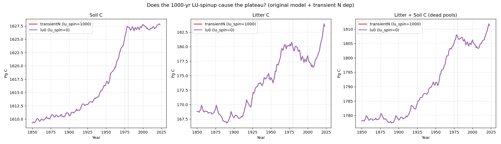

# Soil-C plateau — investigation recap

The overshoot historical soil-carbon sink rises strongly through the mid-20th
century and then **flattens around 1980**. This page collects the full set of
experiments run to work out *why* — and the answer: it is **genuine model
behaviour** (intrinsic soil-pool turnover under nitrogen limitation), not a bug
in the drivers, the spin-up, or the post-processing.

Every hypothesis below was tested by rerunning the model (or auditing the
drivers) and comparing global soil C. The headline carbon-pool results are shown
first, followed by a summary table of everything tested and the supporting
driver/flux diagnostics.

## Soil carbon — sanity check vs TRENDYv13 LPJwsl

Is the mid-century rise and **~1980 flattening** of the historical soil-carbon
sink realistic, or an artefact? Comparing against the **TRENDYv13 LPJwsl S2**
run (an independent LPJ-family model, cSoil integrated the same way) says it's
real: both models show soil C accumulating strongly through the mid-20th century
and then **plateauing around 1980** — LPJwsl actually peaks ~1990 and declines
slightly after, while LPJ-EOSIM holds roughly flat. The S0 control stays at its
spin-up equilibrium throughout. Absolute pools differ (LPJ-EOSIM ~1610–1627 Pg C
vs LPJwsl ~1284–1317 Pg C) as expected from different soil-carbon schemes, so the
right panel shows the anomaly relative to 1901 to compare trends directly.

The signal is the classic split: the **soil/litter sink saturates under warming**
(decomposition catches up with rising inputs) while the vegetation sink keeps
growing under CO₂ fertilization.

## Soil carbon — permafrost ablation

Is the ~1980 soil-carbon plateau a permafrost artefact? To test, the full chain
(spin-up → historical) was rerun with **PERMAFROST disabled** (`LPJ-noperma-*`,
otherwise identical flags). **It isn't permafrost**: the plateau is present with
*and* without permafrost, and is in fact **stronger without** it — the
no-permafrost soil C peaks ~1980 and then declines, while the permafrost run
holds roughly flat. Decadal Δ soil C (Pg C/decade): 1970s +4.0 / +3.5, 1980s
−0.1 / −0.9, 1990s +0.7 / −0.4, 2000s −0.7 / −2.2 (permafrost / no-permafrost).

So permafrost soil dynamics don't drive the plateau; if anything they buffer the
post-1980 loss. This is consistent with the TRENDYv13 LPJwsl comparison above —
the signal is warming-driven decomposition catching up with litter inputs.
Absolute soil C is higher without permafrost (~1700 vs ~1610 Pg C). (Historical
1850–2023 shown; the no-permafrost HL future was still running at plot time.)

## Soil carbon — N-cycle ablation (what drives the ~1980 plateau)

Rerunning spin-up → historical with the **nitrogen cycle disabled** (and
permafrost off) settles it: **the ~1980 plateau is an N-limitation effect, not
permafrost.** Baseline and no-permafrost soil C both flatten/peak ~1980, but with
the N cycle off soil C rises **monotonically** through 2023 (no knee). Decadal Δ
soil C (Pg C/decade), baseline / no-perma / no-N: 1970s +4.0 / +3.5 / +7.5, 1980s
−0.1 / −0.9 / **+4.9**, 2000s −0.7 / −2.2 / **+3.9**.

Interpretation: as warming accelerates decomposition and CO₂ raises productivity,
**nitrogen becomes limiting and caps the soil-carbon sink around 1980**. Remove N
limitation and carbon accumulates unconstrained (absolute soil C is also much
higher without the N cycle, ~2200 vs ~1610 Pg C).

## Soil carbon — robustness to climate dataset & land use

Two further swaps confirm the ~1980 plateau is **not** an artefact of the
WIEMIP-processed climate or of the fixed-2023 land use. Both alternative runs use
the **raw CRUJRA reanalysis** (1901–2024, tmin/tmax variables renamed to LPJ's
convention; the 1850–1900 head recycled), branching from the same spin-up:

- **`truecrujra`** — raw CRUJRA, land use still fixed at 2023 (`CONST_LU`).
- **`crujra-translu`** — raw CRUJRA **plus transient land use** (`TRANSIENT_LU`,
  following the LUH-GCB2025 trajectory 1850–2023).

**Soil C plateaus at ~1980 in all three** (≈1627 Pg C at 1980, within ~1 Pg of
each other). The raw reanalysis differs from WIEMIP-CRUJRA at every timestep
(global-mean air temperature differs by ~0.03 °C post-1901 and ±0.1 °C in the
recycled pre-1901 head), so this is a genuinely different climate realization —
and the plateau is unchanged.

The **vegetation-C panel proves the transient-LU run is actually doing something**:
cropland expansion pulls vegetation C *down* from ~404 to ~377 Pg C through 1980
(versus ~440–450 Pg C when LU is frozen at 2023), before CO₂ fertilization
recovers it. So land use strongly reshapes the vegetation pool — yet the **soil-C
plateau is untouched** (transient LU nudges 2023 soil C up only ~+3.5 Pg C).

Together with the permafrost and N-cycle ablations above, this pins the plateau on
**intrinsic soil-pool turnover** (heterotrophic respiration catching up with
litter inputs under N limitation), robust to the climate dataset, the land-use
treatment, and the forcing details.

## Summary — what we tested and what we found

| # | Hypothesis | Test | Verdict |
|---|------------|------|---------|
| 1 | Not real — model artefact | Compare to **TRENDYv13 LPJwsl S2** (independent model) | ❌ real — LPJwsl also plateaus ~1980 |
| 2 | Permafrost dynamics | Rerun spin-up→hist with **PERMAFROST off** | ❌ plateau present (stronger without) |
| 3 | N deposition frozen in time | Check applied ndep vs year | ❌ ndep rises monotonically through 1980 |
| 4 | N deposition wrong magnitude | Global-total ndep in Tg N/yr | ❌ ~77 Tg N/yr, correct (earlier scare was a g-vs-kg label bug) |
| 5 | N deposition spatially mis-registered (lat/lon flip) | Correlate input vs applied ndep fields | ❌ correlation 1.00; hotspots over N China Plain (correct) |
| 6 | Fire consuming the sink | Global fire C flux over time | ❌ ~1 Pg C/yr, flat, no 1980 spike |
| 7 | Coarse-woody-debris decay rate | **SURFCWD 4× → 1×** | ❌ lifts *litter* C hugely, soil plateau unchanged |
| 8 | Slow-SOM decay rate | **SLOWSOM halved, full re-spin** | ❌ raises soil-C *level* +110 Pg, same 1980 plateau |
| 9 | Land-use spin-up length | **lu-spinup 0 vs 1000 yr** | ❌ bit-identical |
| 10 | Recycled (not real) climate | Confirm runtime climate | ❌ already real CRUJRA (+1.8 °C); plateau reinforced by warming |
| 11 | WIEMIP-CRUJRA processing artefact | Rerun with **raw CRUJRA** reanalysis | ❌ identical plateau |
| 12 | Land-use change | **Transient LU** (LUH-GCB2025) | ❌ big vegetation-C change, soil plateau intact |
| ✅ | **Nitrogen limitation** | Rerun with **N cycle off** | ✅ soil C rises monotonically — no plateau |

**Bottom line:** the plateau is the classic first-order behaviour of the CENTURY
soil scheme — as warming accelerates decomposition and CO₂ raises productivity,
**heterotrophic respiration catches up with litter inputs and nitrogen becomes
limiting, capping the soil sink around 1980**. Vegetation carbon keeps growing
under CO₂ fertilization; the *dead* pools saturate. This is robust to the climate
dataset, land use, permafrost, spin-up length, and the decomposition-rate
constants (which move the *level*, not the *timing*).

## Fluxes, N deposition & N cycle (the core diagnostic)

For the "true" historical (`LPJ-hist-transientN`: WIEMIP-CRUJRA, transient N dep,
constant 2023 LU): NPP and Rh both rise, and **Rh catches NPP right at ~1980**
(51.6 vs 51.5 Pg C/yr) — the moment the dead pools stop accumulating. Applied N
deposition rises smoothly (23 → 77 Tg N/yr, no freeze), and fire is a small flat
term. So neither ndep timing nor fire explains the knee.

## N deposition is spatially correct (no lat/lon flip)

The applied N-deposition field matches the input file **cell-for-cell**
(spatial correlation 1.00; any lat-flip or lon-roll destroys it), with deposition
maxima over the industrial/agricultural hotspots (North China Plain, Indo-Gangetic
plain, Europe, eastern US). So ndep is not landing in the wrong places.

## It already uses real transient climate — warming reinforces the plateau

The historical run was never on recycled climatology: its runtime air temperature
warms **+1.8 °C** over 1850–2023 (real CRUJRA, with the mid-century dip). Soil C
plateaus *as the warming accelerates* — warming raises Rh, which offsets the rising
CO₂/N inputs. Real climate makes the plateau **more** likely, not less.

## Decomposition-rate knobs move the level, not the plateau

**Coarse-woody-debris decay (SURFCWD 4× → 1×):** slowing it lets the *litter* pool
accumulate hugely (litter C +150 Pg by 2023), but soil C is essentially unchanged
and still plateaus.

**Slow-SOM decay (SLOWSOM halved, full re-spin):** the clean re-spin (equilibrated
at the new rate) raises the soil-C *level* by ~110 Pg C but reproduces the **same
1980 plateau**. (An earlier transient-from-old-spin-up run showed an apparent
"deferral" — that was purely the slow pool drifting toward its new equilibrium, a
spin-up artefact, corrected by the re-spin.)

## The spin-up length is irrelevant

Running the transient with a 0-yr vs 1000-yr land-use spin-up gives **bit-identical**
soil C — the spin-up restart is already at equilibrium, so its length doesn't shape
the historical trajectory.

