# BVOC benchmark: isoprene and monoterpenes

**LPJ commit:** `9feb2f1b1769946033793f79b001812cc8c88733` (branch `bvoc-benchmark`; BVOC scheme aligned with LPJ-GUESS in `82529d5`). Both runs use this commit and the same `par/pft.par`.

| Run | Name | Extra flags |
|---|---|---|
| no-N | `LPJ_EOSIM_S3_CRUJRAv15_GLOBFIRM_BVOC` | `-DBVOC -DGLOBFIRM -DHYPERSLAB -DOUTPUT_BYPFT` |
| N run | `LPJ_EOSIM_S3_CRUJRAv15_GLOBFIRM_BVOC_NITROGEN` | as no-N, plus `-DNITROGEN -DNFERTILIZER -DLUH_NFERT -DM10DAYR -DRESP_OPT=6` |

Both are TRENDYv15 S3 configs on CRUJRAv15, 1700–2025, 0.5°. Analysis code is in
`/mnt/beegfs/scratch/tc229954e/bvoc_benchmark/code/`.

Isoprene and monoterpenes follow Arneth et al. (2007) and Schurgers et al. (2009):
emission is a PFT-specific fraction of photosynthesis (`pip`, `pmp` in
`par/pft.par`), scaled by leaf temperature, CO₂ inhibition (`370/CO₂`) and,
for isoprene, seasonality. The emitted carbon is subtracted from GPP each day.

## Headline

| Tg C/yr, 2005–2014 | no-N | N run | Benchmark | no-N / benchmark |
|---|---|---|---|---|
| Isoprene | **291** | **297** | OMI top-down 240 · MEGAN-MOHYCAN 310 | 1.22 · 0.96 |
| Monoterpenes | **32.3** | **32.5** | MEGAN-MOHYCAN 90 | 0.36 |

- **Isoprene is reasonable.** The total falls between the satellite top-down
  estimate and the bottom-up inventory. Spatial r = 0.71 vs OMI and 0.82 vs
  MEGAN. The peak month matches OMI in every region.
- **Monoterpenes are low**: about a third of MEGAN-MOHYCAN and below every
  published inventory (54–132 Tg C/yr). The total matches LPJ-GUESS
  (Schurgers et al. 2009: 29.6–31.8 Tg C/yr), whose scheme this follows. The
  gap is mostly tropical forest.
- **Isoprene falls 24% from the 1850s to the 2010s** (381 → 288 Tg C/yr), in
  line with published historical runs (−20% to −26%).
- **The carbon cost is small:** 0.32 Pg C/yr in the 2010s, 0.2% of GPP.
- **Nitrogen barely changes BVOC.** The N run has 11% less GPP, but isoprene
  is up 2% and monoterpenes are flat. See [Nitrogen run](#nitrogen-run).

## Global totals

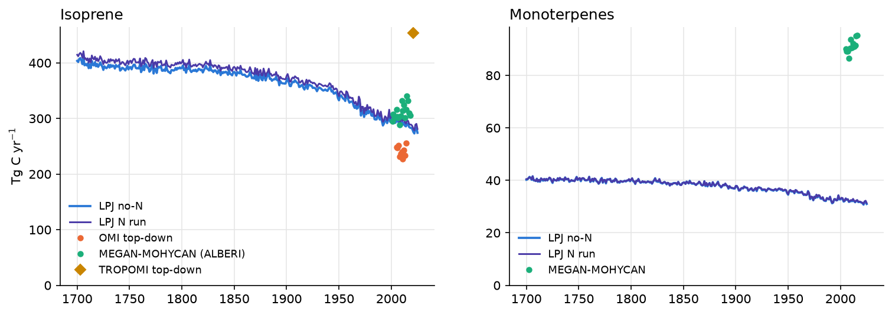

Benchmark gridded products were summed on the LPJ grid for each year they
cover. Literature values in Tg of species are converted to carbon
(isoprene ×0.881, monoterpenes ×0.882).

**Isoprene**

| Source | Tg C/yr | Period / notes |
|---|---|---|
| **LPJ-EOSIM no-N** | **291** | 2005–2014 |
| **LPJ-EOSIM N run** | **297** | 2005–2014 |
| LPJ, before GUESS alignment (`a64008b`) | 381 | different config (N, SPITFIRE, recycled 1850s climate) |
| OMI top-down (Bauwens et al. 2016) | 240 | 2005–2014 |
| TROPOMI top-down (Sfendla et al. 2025) | 453 | 2021 only |
| MEGAN-MOHYCAN / ALBERI (Opacka & Müller 2021) | 310 | 2005–2014 |
| CAMS-GLOB-BIO v3.0–3.1 (Sindelarova et al. 2022) | 264–388 | 2000–2019 |
| MEGAN (Guenther et al. 2006) | 440–660 | |
| MEGAN-MACC (Sindelarova et al. 2014) | ~532 | 1980–2010, derived from % of total |
| ORCHIDEE (Messina et al. 2016) | 465 | 2000–2009 |
| HadGEM2 (Pacifico et al. 2012) | 460 | present day |
| Lathière et al. 2010 | 413 | 2002 |

**Monoterpenes**

| Source | Tg C/yr | Period / notes |
|---|---|---|
| **LPJ-EOSIM no-N** | **32.3** | 2005–2014 |
| **LPJ-EOSIM N run** | **32.5** | 2005–2014 |
| LPJ, before GUESS alignment (`a64008b`) | 32 | different config |
| MEGAN-MOHYCAN (BIRA) | 90 | 2005–2014, sum of 7 species |
| CAMS-GLOB-BIO v3.0–3.1 | 54–68 | 2000–2019 |
| MEGAN-MACC | ~84 | derived from % of total |
| MEGAN2.1 (Guenther et al. 2012) | ~132 | derived from % of total |
| ORCHIDEE | 107.5 | 2000–2009 |
| LPJ-GUESS (Schurgers et al. 2009) | 29.6–31.8 | |

No satellite monoterpene product exists, so the spread between inventories is
the real uncertainty.

## Maps

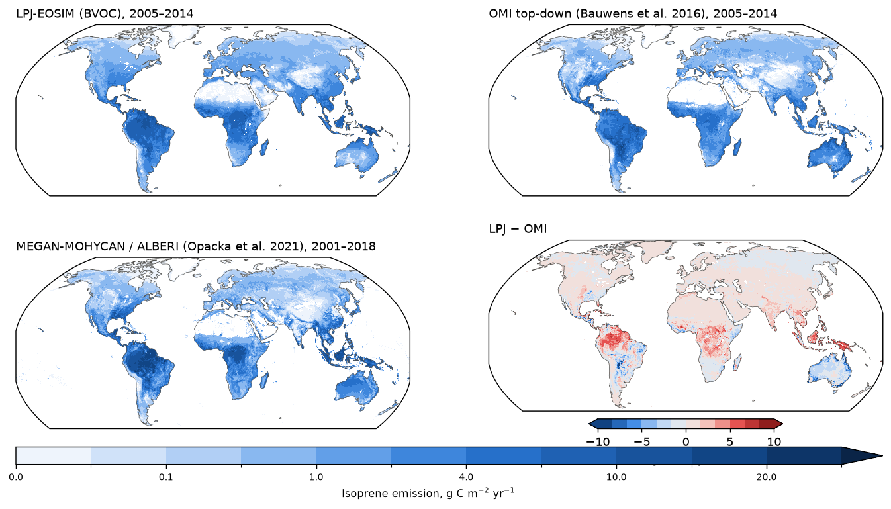

LPJ is higher than OMI over central Amazonia, the Congo basin and
Borneo/New Guinea, and lower over eastern Australia and the cerrado. Tropical
share of the global total: LPJ 75%, OMI 72%, MEGAN 78%.

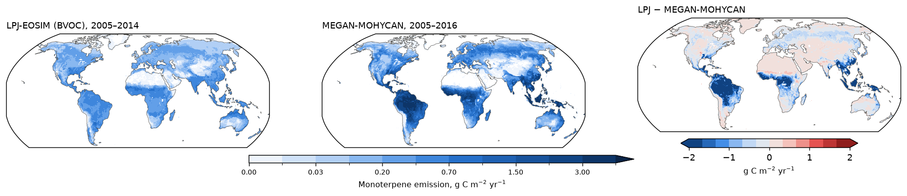

Tropical share: LPJ 58%, MEGAN 72%. Boreal and temperate conifer regions are
closer to MEGAN than tropical forests.

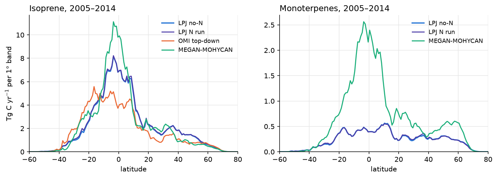

## Regions

Regions are lat/lon boxes (`REGIONS` in `code/process_lpj.py`).

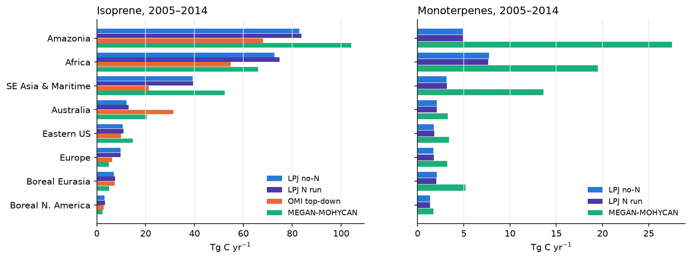

- Australia is 2.6× below OMI (12 vs 31 Tg C/yr).
- Europe is 1.5–2× high (9.7 vs 6.3 OMI, 4.9 MEGAN).
- Amazonia monoterpenes are 5.6× below MEGAN (4.9 vs 27.5).

### Regional maps

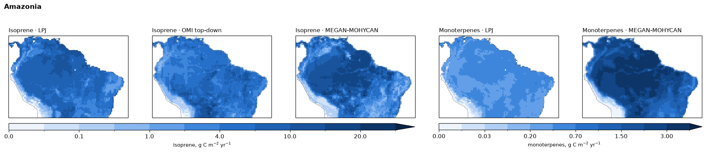

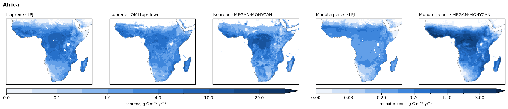

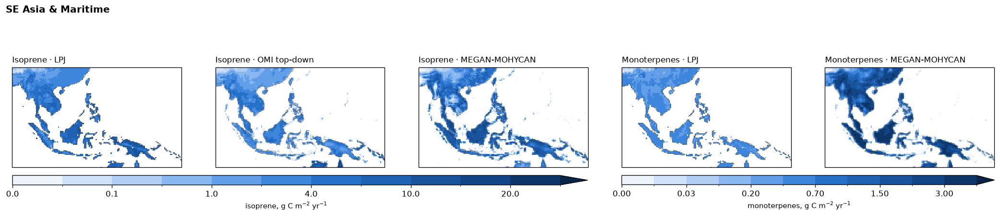

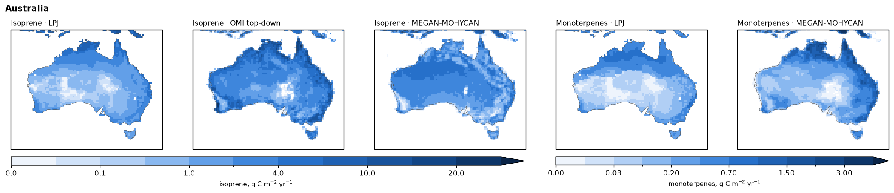

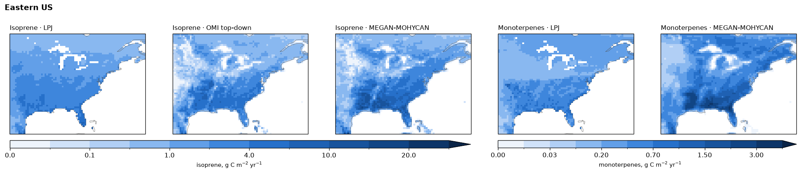

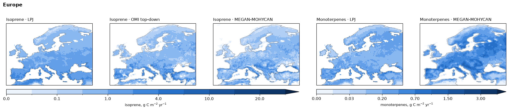

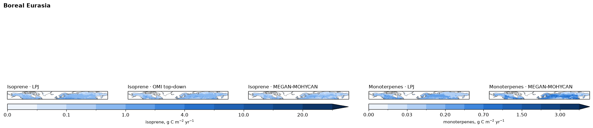

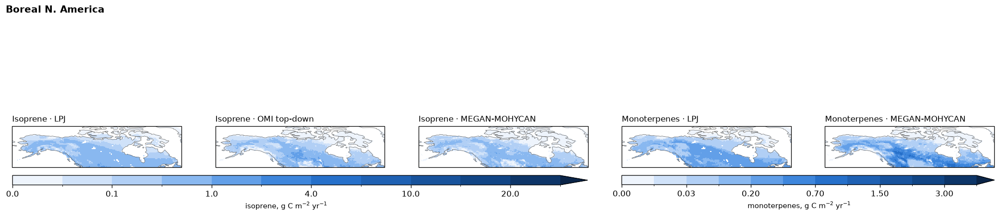

## Seasonal cycle (isoprene)

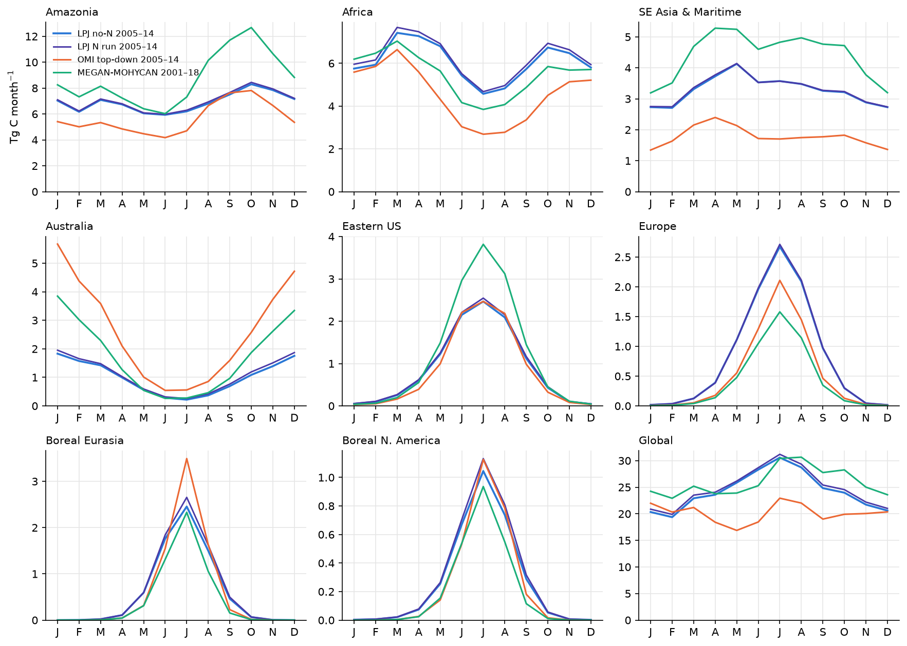

The peak month matches OMI in every region. Outside the tropics the summer
peak is flatter than in OMI (peak/mean 3.3 vs 4.0 in Europe, 4.2 vs 5.8 in
boreal Eurasia).

## 1850s → 2010s

| | 1850s | 2010s | Change |
|---|---|---|---|
| Isoprene (Tg C/yr) | 381 | 288 | −24% |
| Monoterpenes (Tg C/yr) | 39.1 | 32.0 | −18% |

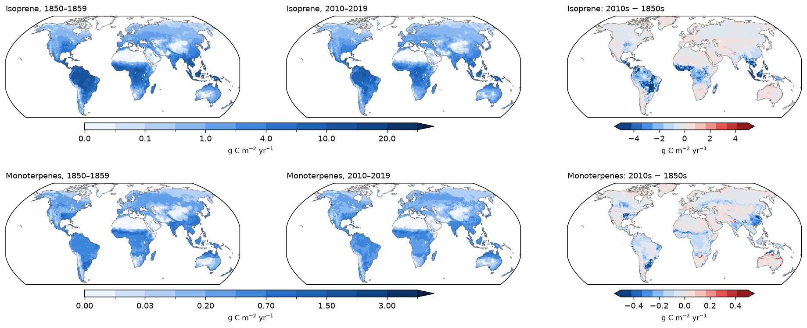

Published historical runs: −24% over 1901–2002 (Lathière et al. 2010), −20%
over 1880–2000 (Unger 2013), preindustrial 26% above present (Pacifico et al.
2012). Tropical declines come from land-use change and CO₂ inhibition.

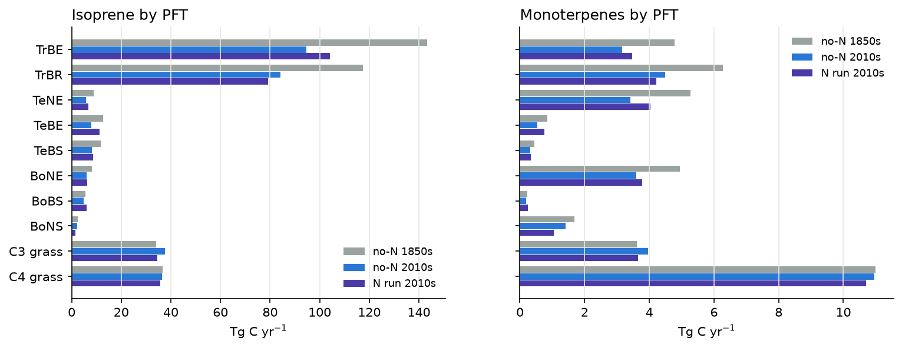

Tropical broadleaved trees (TrBE, TrBR) dominate isoprene. C4 grass is the
largest single monoterpene source.

## Nitrogen run

| 2010s unless noted | no-N | N run | Change |
|---|---|---|---|
| Isoprene, 2005–14 (Tg C/yr) | 291 | 297 | +2% |
| Monoterpenes, 2005–14 (Tg C/yr) | 32.3 | 32.5 | +0.5% |
| Isoprene spatial r vs OMI | 0.71 | 0.72 | |
| Isoprene 1850s → 2010s | −24% | −25% | |
| GPP (Pg C/yr) | 161.1 | 143.7 | −11% |
| NPP (Pg C/yr) | 69.3 | 66.3 | −4% |
| Ra (Pg C/yr) | 91.8 | 77.4 | −16% |
| Rh (Pg C/yr) | 63.6 | 60.7 | −5% |
| Vegetation C (Pg C) | 598 | 562 | −6% |
| Soil C (Pg C) | 1378 | 1409 | +2% |
| LAI | 3.32 | 2.94 | −11% |
| BVOC cost (% of GPP) | 0.20 | 0.23 | |

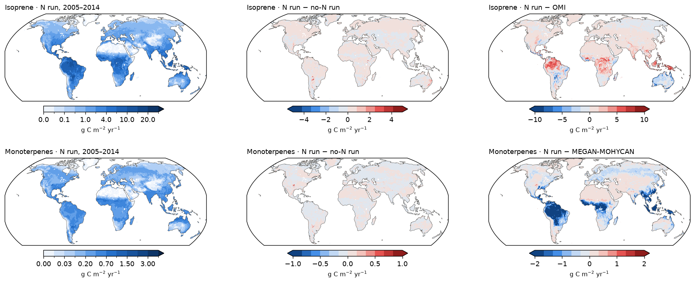

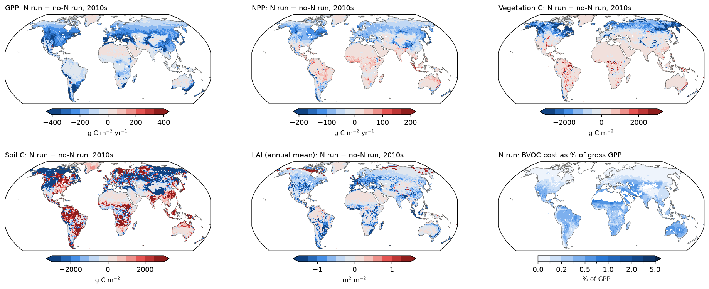

Emission in `bvoc.c` scales with light-limited electron transport (`Je`),
computed from fPAR, PAR, temperature and CO₂. N limitation caps Vcmax, which
limits the Rubisco-limited rate, not `Je`. BVOC therefore responds to N only
through LAI/fPAR and PFT mix. Most of the GPP loss is in temperate and boreal
regions, where emission is small.

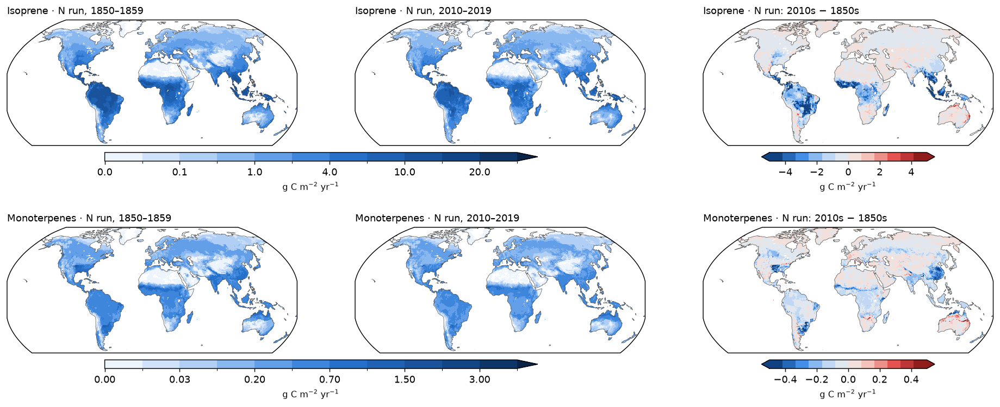

## Carbon cycle

The only carbon-cycle effect of `-DBVOC` is `gpp -= isopr + monotp` in
`update_daily.c`. `mgpp` is written after this deduction.

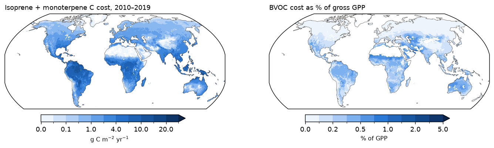

The cost is 0.42 Pg C/yr (0.31% of GPP) in the 1850s and 0.32 Pg C/yr (0.20%)
in the 2010s (no-N run; 0.23% in the N run). The fraction is highest in semi-arid grass and savanna, where
GPP is small.

No-N run:

| | 1850s | 2010s | Units |
|---|---|---|---|
| GPP | 137.2 | 161.1 | Pg C/yr |
| NPP | 55.2 | 69.3 | Pg C/yr |
| Ra | 81.9 | 91.8 | Pg C/yr |
| Rh | 52.0 | 63.6 | Pg C/yr |
| NBP | 0.36 | 2.37 | Pg C/yr |
| Vegetation C | 666 | 598 | Pg C |
| Soil C | 1322 | 1378 | Pg C |
| Litter C | 200 | 213 | Pg C |
| LAI | 2.39 | 3.32 | m² m⁻² (vegetated mean) |

!!! note
    There is no run of this commit with BVOC off, so these runs cannot isolate
    the effect of `-DBVOC` beyond its direct GPP deduction. The closest non-BVOC run
    (TRENDYv15 CRUJRAv15 S3) is a different LPJ commit ~100 commits away.

### Carbon maps: 1850s, 2010s, change (no-N run)

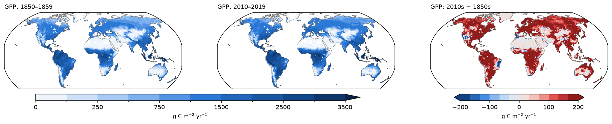

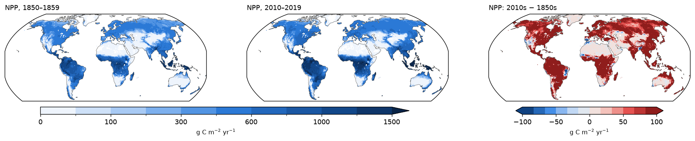

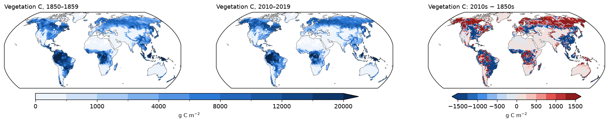

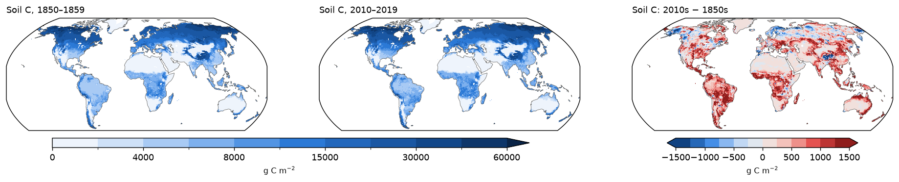

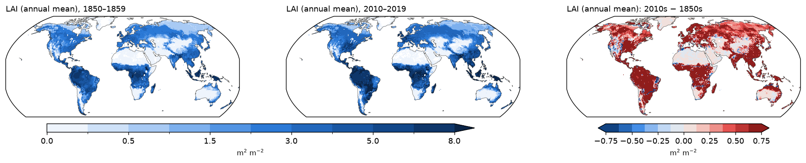

### Carbon maps: 1850s, 2010s, change (N run)

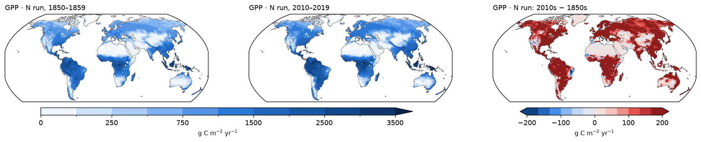

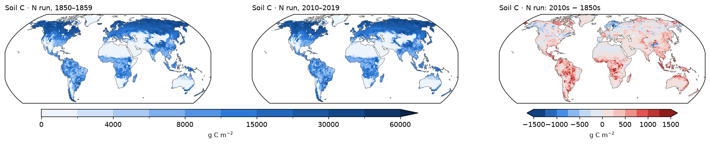

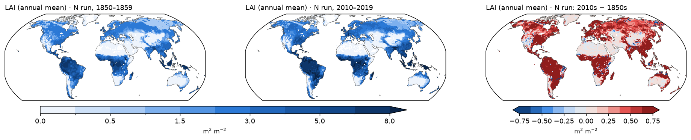

## Data and methods

- LPJ NetCDF values are kg C m⁻² month⁻¹. The file headers say
  `long_name: placeholder`.
- Benchmarks come from BIRA-IASB ([emissions.aeronomie.be](https://emissions.aeronomie.be)):
    - OMI top-down isoprene, 2005–2014 (Bauwens et al. 2016, ACP 16:10133).
      Summed on the LPJ grid, this gives the paper's 272 Tg isoprene for
      2005–2013.
    - TROPOMI top-down isoprene, 2021 (doi:10.18758/52E4U9EN), 2°×2.5°.
    - ALBERI MEGAN2.1-MOHYCAN isoprene, 2001–2018 (doi:10.18758/71021062).
    - MEGAN-MOHYCAN monoterpenes, 2005–2016.
- Processing is one slurm array task per variable (`process_lpj.py`,
  `process_obs.py`, `process_pft.py`), then `make_maps.py`, `make_data.py` and
  `make_site_plots.py`.
