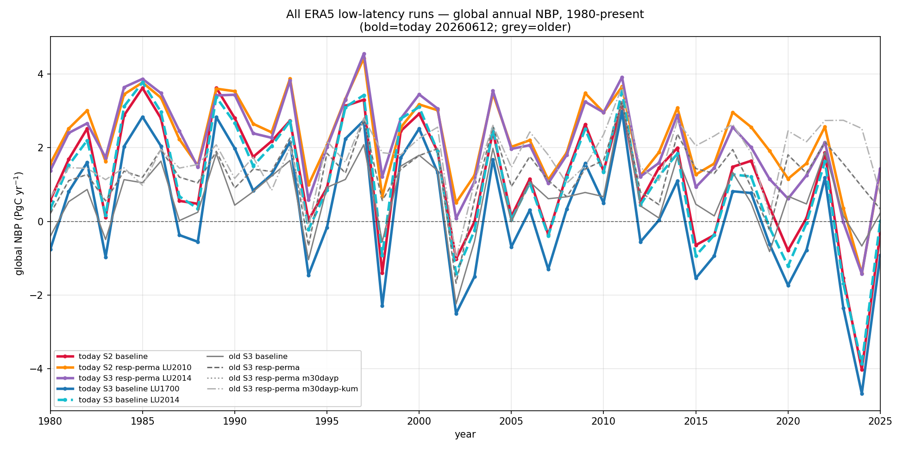
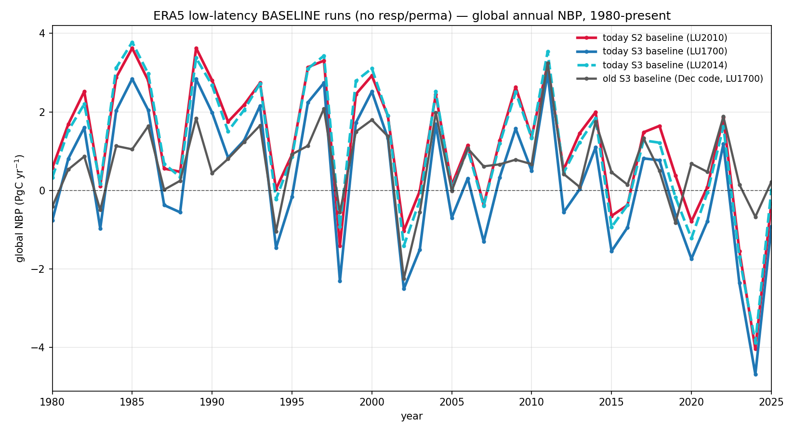
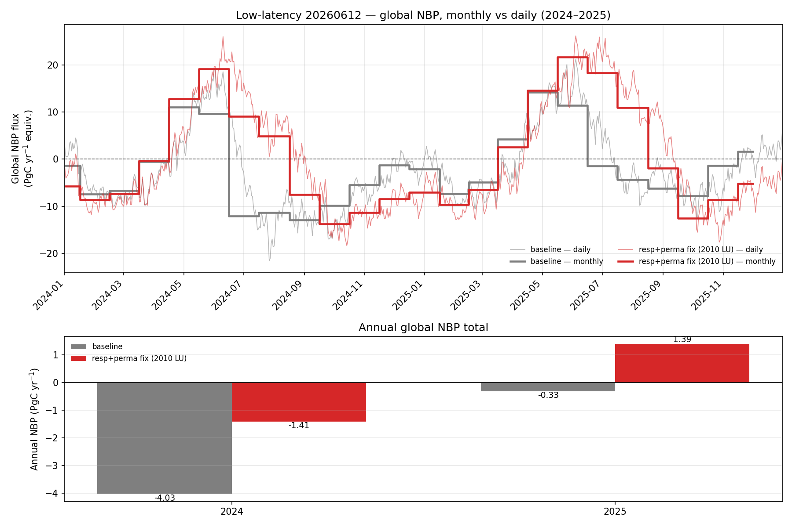
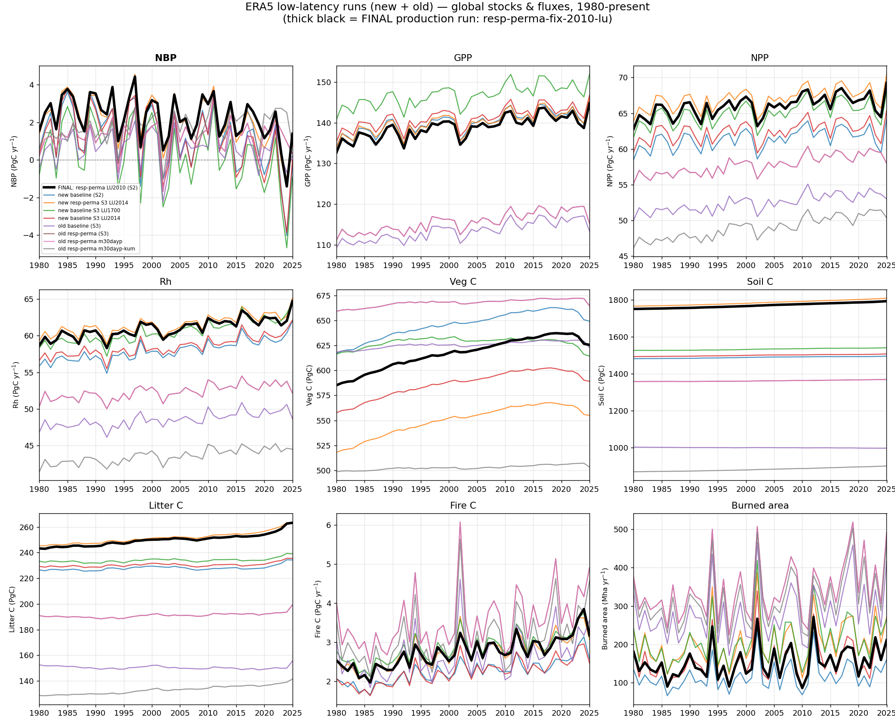
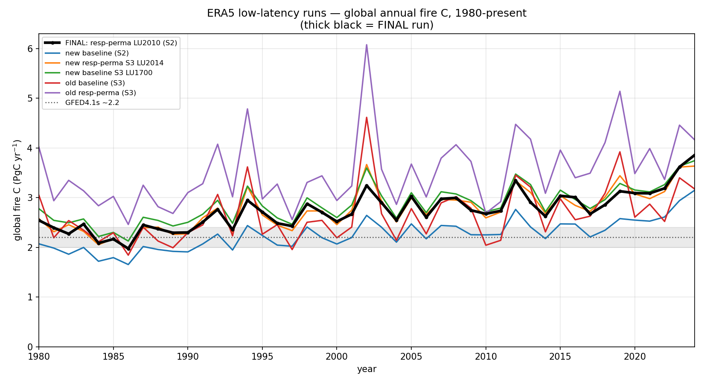
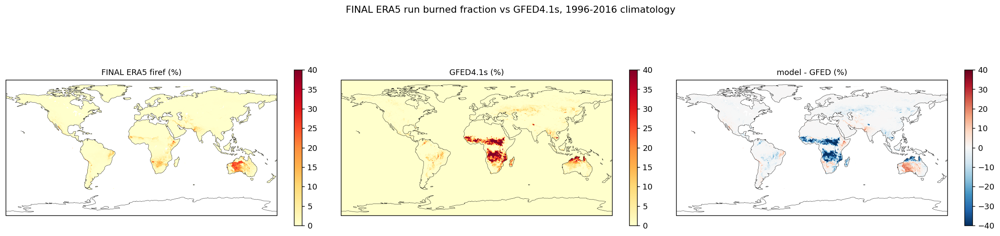

# ERA5 low-latency runs

LPJ-EOSIM driven by **ERA5** for the low-latency CO₂-budget effort. All runs:
1000-yr nat-veg spin-up → 398-yr land-use spin-up → 1700–2025 transient, ERA5
climate from 1960, 0.5° grid. The **final production run** is
`resp-perma-fix-2010-lu` (S2) — shown **thick black / highlighted** throughout.

## Net Biome Production (lead)

Global annual NBP across all ERA5 runs (new 20260612 + older). The runs split
into a low-sink **baseline** band and a higher-sink **resp/perma** band — the
`RESP_OPT=6 / M10DAYR / PERMAFROST` flags add ~1–1.5 PgC/yr, not the land-use
setting or a code regression.

**Mean NBP 1980–2025 (PgC/yr):**

| run | mean NBP |
|---|---|
| **FINAL: resp-perma LU2010 (S2)** | **2.26** |
| new resp-perma S3 LU2014 | 2.15 |
| old resp-perma m30dayp-kum (S3) | 1.73 |
| old resp-perma (S3) | 1.27 |
| new baseline S2 | 1.18 |
| new baseline S3 LU2014 | 1.11 |
| old baseline (S3) | 0.67 |
| new baseline S3 LU1700 | 0.29 |

Baselines only (no resp/perma) — the LU-start and code-vintage spread:

Monthly vs daily NBP for the final run, 2024–2025 (daily resolves the sub-monthly
structure; both integrate to the same annual total):

## All stocks & fluxes (new + old)

Global GPP/NPP/NBP/Rh (PgC/yr), Veg/Soil/Litter C (PgC), Fire C (PgC/yr) and
burned area (Mha/yr) for every ERA5 low-latency run, new and old. NBP is the
lead panel; the **final run is thick black**.

## Fire (focus)

### Global fire carbon emissions

ERA5 fire C runs a bit **above** the GFED4.1s reference (~2.2 PgC/yr) — higher
than the CRUJRA+SPITFIRE runs.

**Mean global fire C 1980–2024 (PgC/yr):**

| run | fire C (PgC/yr) |
|---|---|
| **FINAL: resp-perma LU2010 (S2)** | **2.74** |
| new baseline (S2) | 2.25 |
| new resp-perma S3 LU2014 | 2.75 |
| new baseline S3 LU1700 | 2.86 |
| old baseline (S3) | 2.64 |
| old resp-perma (S3) | 3.52 |
| GFED4.1s (obs) | ~2.2 |

### Burned fraction vs GFED4.1s (final run, 1996–2016 climatology)

Final-run `firef` | GFED4.1s | model − GFED (%):

