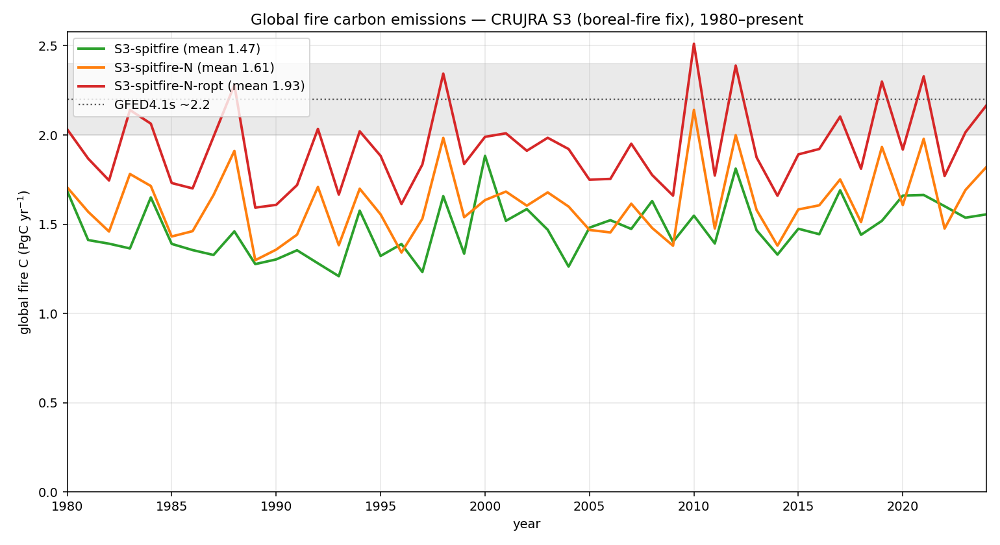
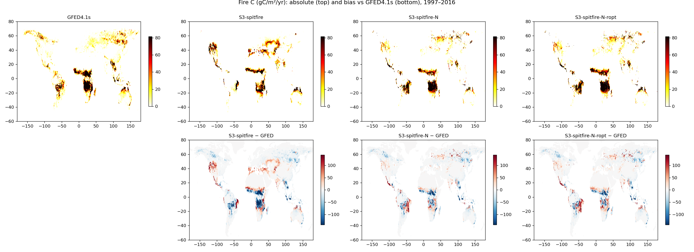
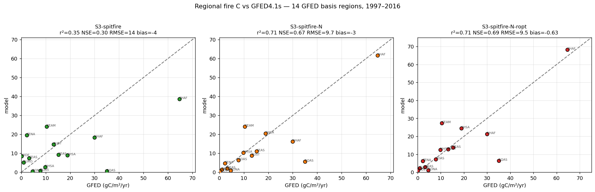

# SPITFIRE fire carbon — CRUJRA S3

Global fire carbon (`firec`) for the **CRUJRA S3** runs with the SPITFIRE fire
module, after the **boreal-fire fix** (boreal-tree `alpha_fuelp` raised to
1.5e-4 so high-latitude stands actually ignite). Three flag permutations are
shown — base SPITFIRE, with nitrogen (`+N`), and with nitrogen + resp-opt
(`+N+ropt`) — benchmarked against **GFED4.1s**.

Standard LPJ-EOSIM protocol: 1000-yr nat-veg spin-up, 398-yr land-use spin-up,
1700–2024 transient on a 0.5° grid.

## Global fire carbon, 1980–present

Annual global fire C. `+N+ropt` is closest to the GFED4.1s reference band
(~2.0–2.4 PgC/yr); the no-nitrogen run under-burns most.

| run | mean fire C (PgC/yr) |
|---|:--:|
| S3-spitfire | 1.47 |
| S3-spitfire-N | 1.61 |
| **S3-spitfire-N-ropt** | **1.93** |
| GFED4.1s | ~2.16 |

## Global maps vs GFED4.1s

Mean fire C (gC/m²/yr), 1997–2016. Top row: GFED4.1s and the three runs
(absolute). Bottom row: model − GFED bias. The runs reproduce the major
tropical savanna burning bands (Africa, South America, N. Australia); the
boreal fix restores high-latitude fire that was previously absent.

## Regional skill vs GFED4.1s

Area-weighted regional fire C over the 14 GFED basis regions (1997–2016), with
r² / NSE / RMSE / bias annotated. `+N+ropt` has the best magnitude and pattern
skill (r² 0.71, bias −0.6 PgC/yr); the no-N run under-burns broadly.

| run | global PgC/yr | r² | NSE | bias |
|---|:--:|:--:|:--:|:--:|
| S3-spitfire | 1.50 | 0.35 | 0.30 | −4.1 |
| S3-spitfire-N | 1.62 | 0.71 | 0.67 | −3.0 |
| **S3-spitfire-N-ropt** | **1.94** | **0.71** | **0.69** | **−0.6** |

