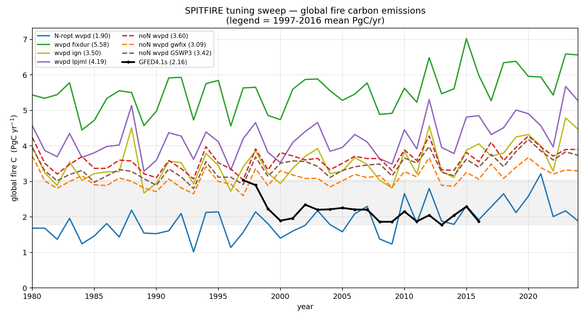
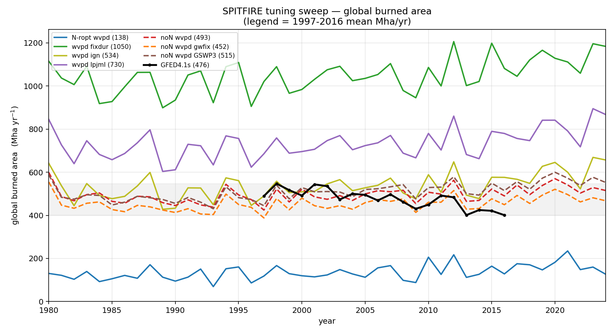
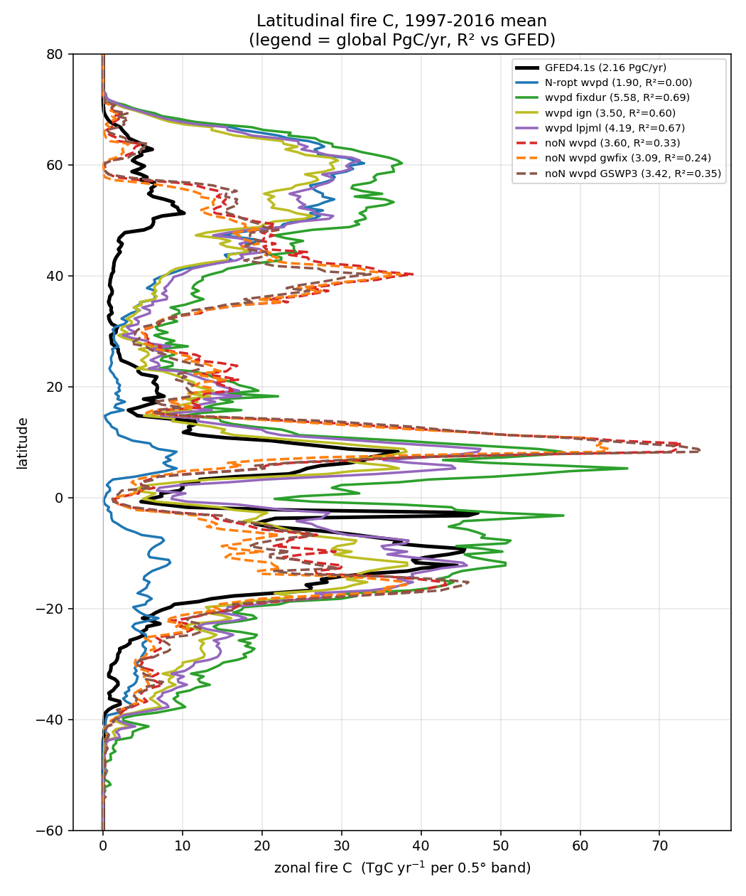
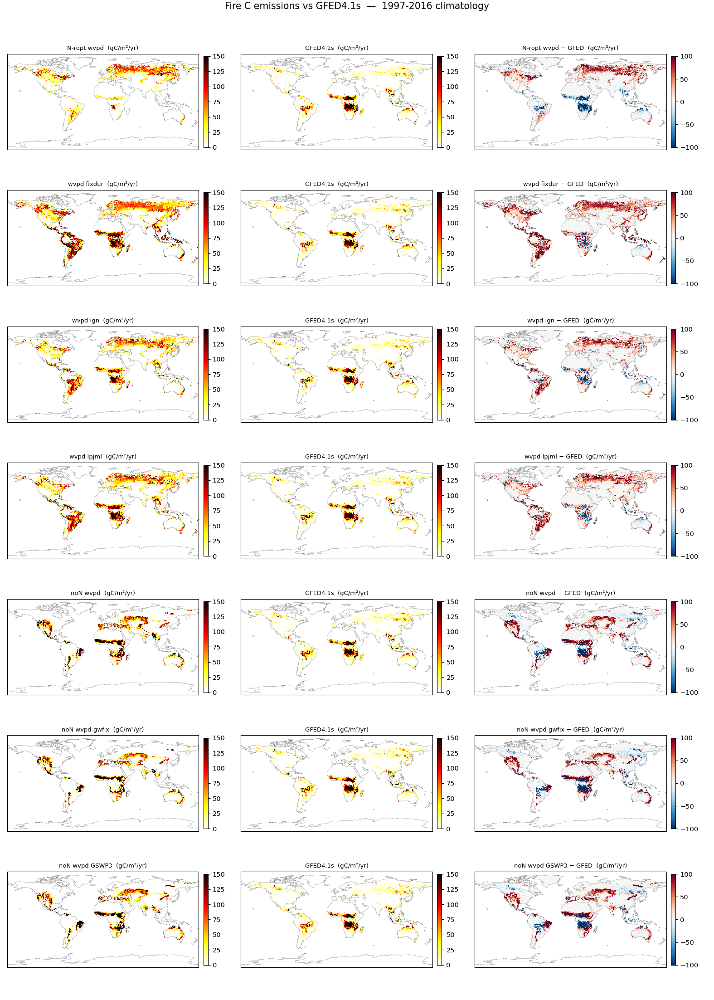
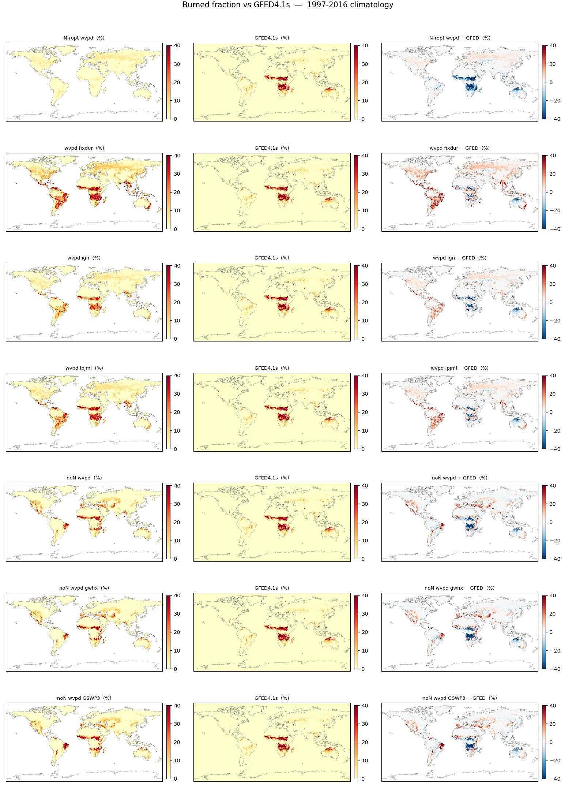
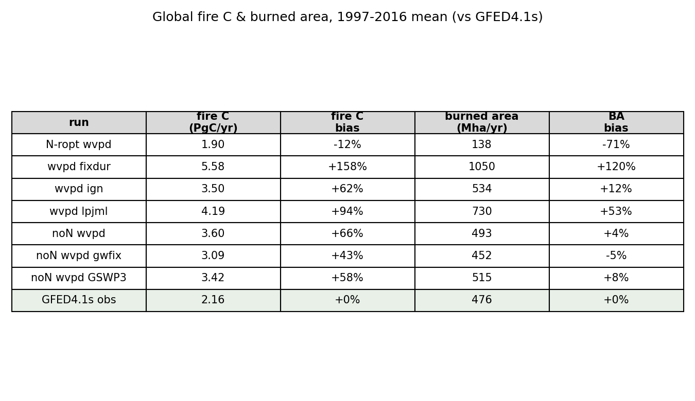

# SPITFIRE tuning sweep — fire diagnostics

Fire diagnostics for the SPITFIRE runs produced **after** the 20260617 snapshot
(the six runs on the [SPITFIRE integration page](spitfire.md)). These are
experimental global S3 runs exploring a **WVPD-based fire-danger reformulation**
(vapour-pressure-deficit fuel moisture) plus per-variant tweaks, all branched
from the `CRUJRA-S3-spitfire-N-ropt` baseline. All use the standard LPJ-EOSIM
protocol (1000-yr nat-veg spin-up; 398-yr land-use spin-up; 1700–2024 transient,
CRUJRA forcing on a 0.5° grid) unless noted.

!!! note "These are diagnostic runs, not a published configuration"
    Most of these variants **over-burn** relative to GFED4.1s — they are part of
    an ongoing tuning effort. The figures below are for tracking that effort.

## Runs and where they live

All under `/mnt/beegfs/scratch/tc229954e/spitfire_global/`:

| label | cluster path | N cycle | notes |
|---|---|:--:|---|
| `N-ropt wvpd`     | `20260619/CRUJRA-S3-spitfire-N-ropt-wvpd`           | ✓ | base WVPD variant |
| `wvpd fixdur`     | `20260619/CRUJRA-S3-spitfire-N-ropt-wvpd-fixdur`    | ✓ | fixed fire duration |
| `wvpd ign`        | `20260619/CRUJRA-S3-spitfire-N-ropt-wvpd-ign`       | ✓ | ignition treatment |
| `wvpd lpjml`      | `20260619/CRUJRA-S3-spitfire-N-ropt-wvpd-lpjml`     | ✓ | LPJmL-style fire params |
| `noN wvpd`        | `20260621/CRUJRA-S3-spitfire-noN-wvpd`              | – | nitrogen off |
| `noN wvpd gwfix`  | `20260621/CRUJRA-S3-spitfire-noN-wvpd-gwfix`        | – | sparse-FPC `/fpc_sum` fixes (`windspeed_fpc.c`, `area_burnt.c`) |
| `noN wvpd GSWP3`  | `20260622/CRUJRA-S3-spitfire-noN-wvpd-gswp3forcing` | – | fire-relevant forcing (humidity + wind) swapped CRUJRA → GSWP3-W5E5 |

A further variant, `20260619/CRUJRA-S3-spitfire-N-ropt-wvpd-calB`, is **excluded** —
that run is incomplete (only ~7 of 200 grid chunks finished, so it cannot be
merged to a global field).

All comparisons use **GFED4.1s** (1997–2016 overlap), area-weighted on the same
0.5° grid.

## Global fire carbon

Global annual fire C (PgC/yr), area-weighted from `firec` (kg C m⁻²). Legend
values are the 1997–2016 mean; the grey band spans GFED's annual range.

The spread is large: only `N-ropt wvpd` (1.90 PgC/yr) sits **below** GFED (2.16);
every other variant over-burns, from `noN wvpd gwfix` (+43%) up to `wvpd fixdur`
(+158%).

## Global burned area

Global annual burned area (Mha/yr), area-weighted from `firef` (areal fraction).

Burned area tells a similar story but the ordering differs from fire C: the
`noN` runs bracket GFED's ~476 Mha/yr closely (`noN wvpd gwfix` −5%,
`noN wvpd GSWP3` +8%, `noN wvpd` +4%), while `N-ropt wvpd` burns far too little
area (138 Mha/yr, −71%) yet still emits a near-GFED amount of carbon — i.e. very
high emissions per unit area burned.

## Latitudinal fire C

Zonal fire-C profile — the longitudinal sum of emissions per 0.5° latitude band
(TgC/yr), 1997–2016 mean. Legend gives the global total (PgC/yr) and R² of each
run's profile against GFED.

The over-burn is concentrated in the **tropics** (the 0–20° peaks) and the
**NH temperate/boreal** band. `N-ropt wvpd` matches the latitudinal *shape*
best; the GSWP3-forcing run is aimed at the NH-temperate over-burn specifically.

## Maps vs GFED4.1s

Per run: model climatology | GFED4.1s | model − GFED (1997–2016).

### Fire C emissions (gC m⁻² yr⁻¹)

### Burned fraction (%)

## Global summary

1997–2016 means and % deviation from GFED4.1s.

[Download the table as CSV](img/spitfire_sweep/global_summary.csv).

---

*Figures generated by `spitfire/plot_spitfire_sweep_fire.py` in the
`lpj-eosim-run-scripts` repo (GFED regridded onto the 0.5° grid via the
benchmark `gfed_global` helper).*
