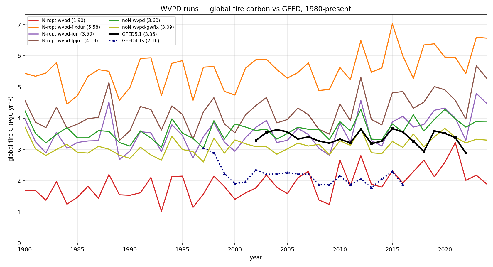
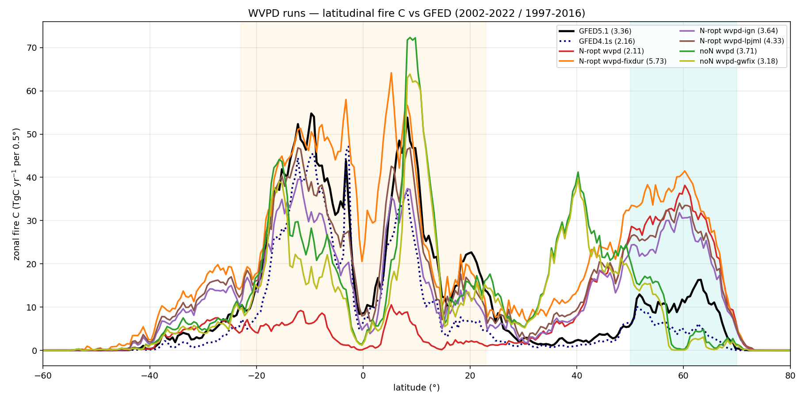
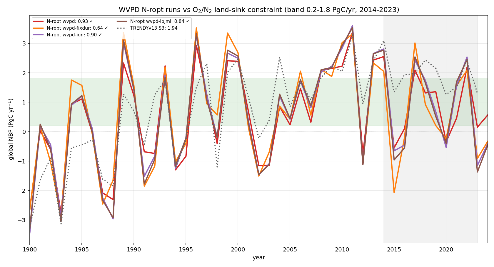

# SPITFIRE — WVPD fire-danger variants

Exploratory CRUJRA + SPITFIRE runs using the **WVPD** (water-vapour-pressure-deficit /
humidity-based) fire-danger index instead of the default Nesterov index, plus a few
formulation tweaks. These are development/sensitivity runs — this page focuses only on
**fire performance vs GFED** and the **NBP O₂/N₂ land-sink constraint** (no ILAMB).

Runs shown (all CRUJRA S3, 1700–2024):

| run | base | notes |
|---|---|---|
| `N-ropt wvpd`        | +N, RESP_OPT | WVPD fire-danger index |
| `N-ropt wvpd-fixdur` | +N, RESP_OPT | + fixed fire duration |
| `N-ropt wvpd-ign`    | +N, RESP_OPT | + ignition tweak |
| `N-ropt wvpd-lpjml`  | +N, RESP_OPT | LPJmL-faithful WVPD |
| `noN wvpd`           | noN          | WVPD, no nitrogen |
| `noN wvpd-gwfix`     | noN          | + groundwater fix |

References: **GFED5.1** (2002–2022, ~3.36 PgC/yr) and **GFED4.1s** (1997–2016, ~2.16 PgC/yr).

## Global fire carbon vs GFED

Global fire C (PgC/yr), 1980–present. The WVPD variants span a wide range — `wvpd` (base)
is low at **1.90** PgC/yr (1997–2016), while `wvpd-fixdur` is far too high (**5.58**);
`wvpd-ign` (3.50), `wvpd-lpjml` (4.19), `noN wvpd` (3.60) and `noN wvpd-gwfix` (3.09)
land near or above GFED5.1.

## Latitudinal fire carbon vs GFED

Zonal-mean fire C (TgC/yr per 0.5° latitude band) for the WVPD runs against GFED5.1
(black) and GFED4.1s (navy dotted), showing where each formulation puts its emissions.

## NBP vs the O₂/N₂ land-sink constraint

Global annual NBP for the WVPD `N-ropt` runs (the ones carrying nitrogen) against the
atmospheric O₂/N₂ land-sink band (0.2–1.8 PgC/yr mean over 2014–2023), with TRENDYv13 S3
for reference. **All four** WVPD N-ropt runs fall inside the band (2014–2023 means
0.64–0.93 PgC/yr).

