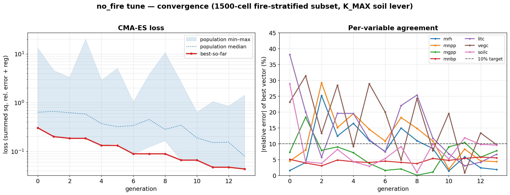
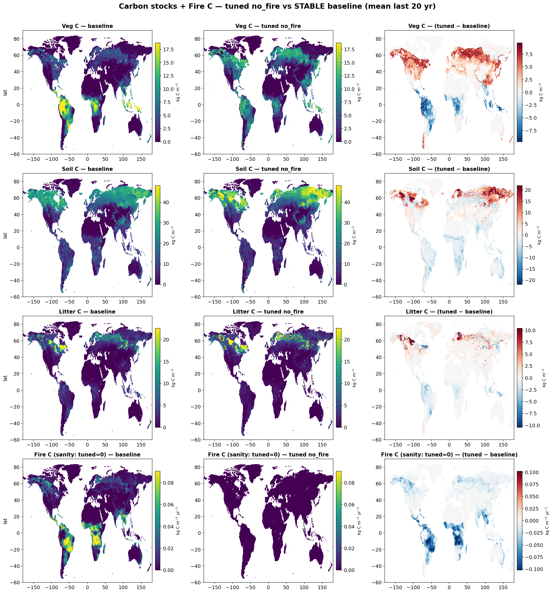
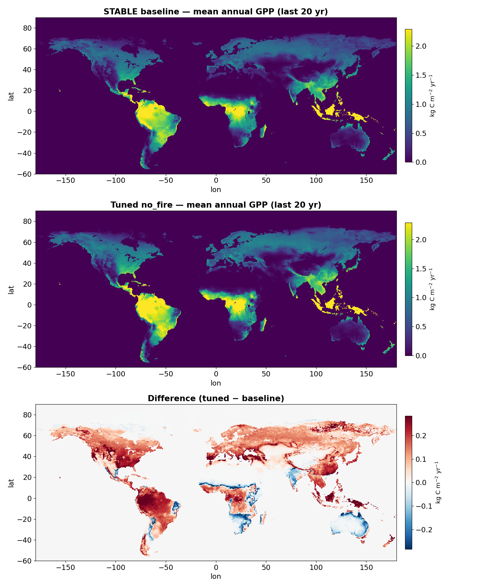

# Tuning a no-fire permutation to the STABLE baseline

**Goal.** Reproduce a fixed "everything-on" **STABLE** control run's global carbon stocks and
fluxes with a **reduced (no-fire)** model permutation, compensating for the removed process with
continuous parameter adjustments. First proof-of-concept of the re-tuning workflow.

The no-fire run turns fire **off** at runtime (`enable_fire_disturbance = 0`), otherwise built
identically to STABLE (NITROGEN, RESP_OPT=6, M10DAYR, CONSTANT_NDEP, constant pre-industrial CO₂
at 280 ppm). CMA-ES adjusts 12 parameters so the permutation matches the baseline.

## Method

- **Representative subset.** The optimizer scores a **1500-cell fire-stratified sample** (cells
  drawn with probability weighted toward the baseline fire footprint, with an area-proportional
  floor), so the subset is a faithful mini-globe — *not* the top carbon-contributor cells, which
  over-weight fire-free forests and broke generalization in the first attempt.
- **Soil-carbon lever.** Under NITROGEN, soil/litter decay is the hardcoded CENTURY `K_MAX` array,
  **not** the legacy `k_litter10/k_soilfast10` globals — so those were dead knobs and soil C was
  untunable. We exposed two runtime multipliers on `K_MAX` (`century_ksoil_scale` for slow+passive
  pools, `century_klitter_scale` for litter/active pools); these are what let soil C converge.
- **Optimizer.** CMA-ES (λ=16), minimizing summed squared relative error across the targets plus a
  small toward-defaults regularization. Convergence = **every target within 10%**.
- **Targets (7).** `mrh, mnpp, mgpp, mnbp, litc, vegc, soilc`. Fire C is not a target (≈0 with fire off).

## Convergence

CMA-ES converged at **generation 13** — all 7 targets within 10% (loss 0.30 → 0.043):

### Tuned parameters

| parameter | units | default | tuned | change |
|---|---|--:|--:|--:|
| `century_ksoil_scale` (slow+passive SOM decay) | ×K_MAX | 1.00 | 1.505 | +51% |
| `century_klitter_scale` (litter/active SOM decay) | ×K_MAX | 1.00 | 1.185 | +18% |
| `alphaa` (canopy GPP) | fraction | 0.50 | 0.569 | +14% |
| `respcoeff` (autotrophic resp.) | – | 1.00 | 0.663 | −34% |
| `lmro_ratio` (leaf:root) | – | 1.00 | 1.182 | +18% |
| `longivity` (leaf lifespan) | years | 2.00 | 1.101 | −45% |
| `mort_max` | 1/yr | 0.030 | 0.053 | +77% |
| `k_mort` | – | 0.50 | 0.453 | −9% |
| `k_est` (establishment) | indiv/m² | 0.12 | 0.142 | +18% |
| `ligcfrac_leaf` | fraction | 0.20 | 0.157 | −21% |
| `ligcfrac_wood` | fraction | 0.30 | 0.314 | +5% |
| `f_nitri_max` | 1/day | 0.10 | 0.104 | +4% |

Faster SOM/litter turnover sheds the no-fire soil-C excess; higher GPP + lower autotrophic
respiration restore the matured-canopy NPP deficit; shorter leaf lifespan and higher mortality
keep biomass in check. All values stayed within their physical bounds.

## Global validation

The tuned parameters were applied to a **full global** no-fire run vs the STABLE baseline. **This
time subset convergence carried over to the globe** — the carbon stocks match (the first attempt,
carbon-weighted and without the soil lever, gave Veg C +67% / Litter C +82%):

| variable | global agreement |
|---|--:|
| Soil C | −0.2% |
| Litter C | +0.9% |
| Veg C | +9.6% |
| NBP | −0.76 vs −0.82 PgC yr⁻¹ |
| GPP / NPP / Rh | +10 / +10 / +16% |
| Fire C | 0 (fire off) |

Maps (mean of the last 20 yr), baseline | tuned | difference — stock differences sit mostly in
high latitudes (small area, hence the near-baseline area-weighted totals), and **Fire C is zero
everywhere in the tuned run**, as it must be:

The residual is a **+10–16% productivity-flux overshoot** (GPP/NPP/Rh): the fire-stratified
subset is mildly NPP-enriched, so matching it slightly overshoots global fluxes. The stocks — the
thing that failed before — now generalize.
