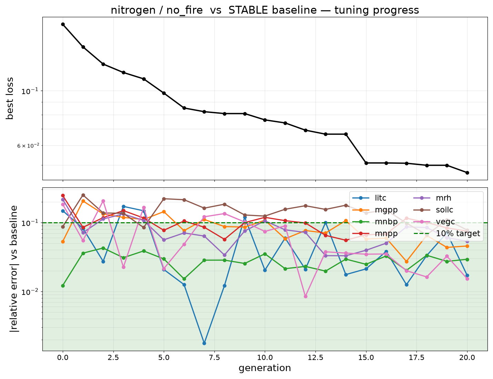
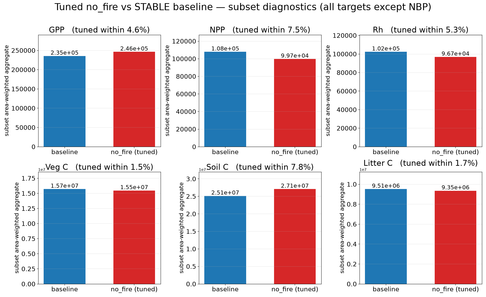
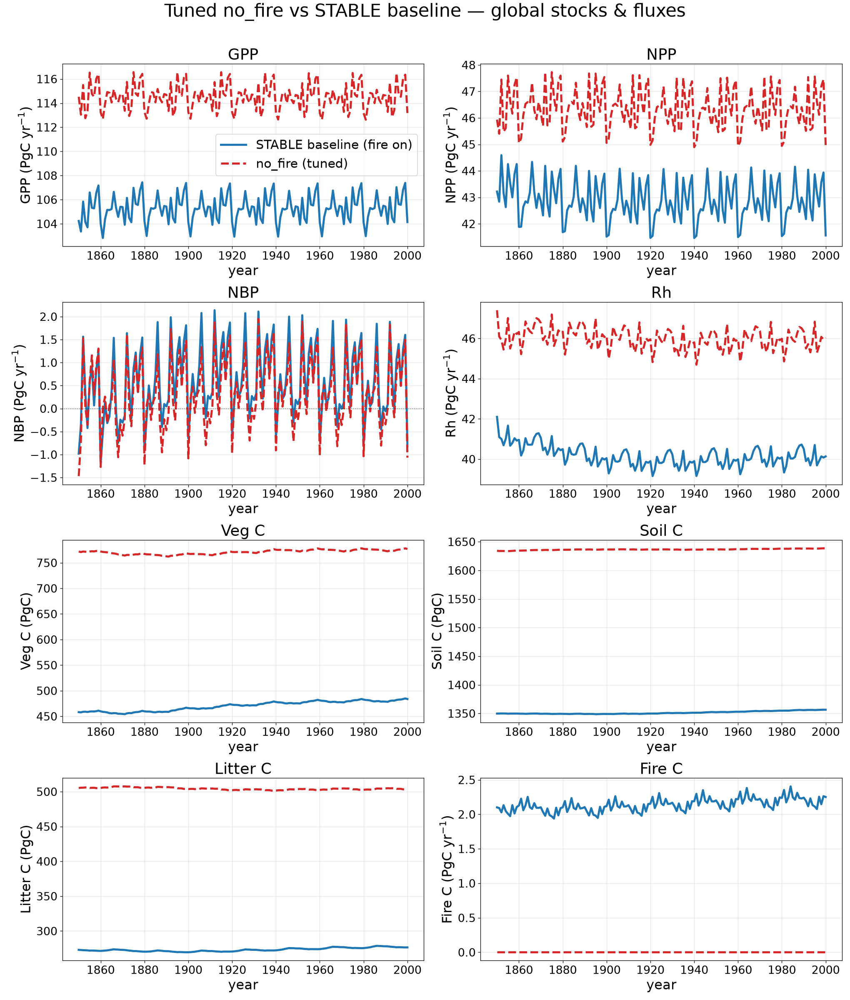

# Tuning a no-fire permutation to the STABLE baseline

**Goal.** Reproduce a fixed "everything-on" **STABLE** control run's global carbon stocks
and fluxes with a **reduced (no-fire)** model permutation, by compensating for the removed
process with continuous parameter adjustments. This is the first proof-of-concept of the
[lpj-eosim-tuning](https://github.com/LPJ-EOSIM) re-tuning workflow.

The no-fire run turns fire **off** at runtime (`enable_fire_disturbance = 0`) and is otherwise
built identically to the STABLE baseline (NITROGEN, RESP_OPT=6, M10DAYR, CONSTANT_NDEP,
NOWDHARVEST, RECYCLE_CLIMATE, constant pre-industrial CO₂ at 280 ppm). CMA-ES then adjusts
12 continuous parameters so the permutation's stocks/fluxes match the baseline.

## Method

- **Representative subset.** Rather than a full global run per evaluation, the optimizer scores
  a ~500-cell subset whose area-weighted aggregate tracks the global totals, with drivers
  preformatted onto a compact grid for near-zero I/O latency. One compiled binary per
  permutation serves every parameter vector via a runtime `-p` override file.
- **Optimizer.** CMA-ES (λ=16), minimizing the summed squared relative error across the target
  variables plus a small toward-defaults regularization. Convergence = **every target within
  10%** of the baseline.
- **Targets (7).** `mrh, mnpp, mgpp, mnbp, litc, vegc, soilc`. Fire C (`firec`) is **not** a
  target — it is ~0 by construction with fire off, so matching it to the fire-on baseline is
  meaningless; the fire-loss compensation instead shows up in NBP and the carbon stocks.
- **Parameters (12).** Soil/litter turnover + mortality/establishment
  (`k_litter10, k_soilfast10, mort_max, k_mort, longivity, respcoeff, k_est, ligcfrac_leaf,
  ligcfrac_wood, f_nitri_max`) **plus productivity levers** `alphaa` (canopy-level GPP) and
  `lmro_ratio` (leaf:root allocation). The productivity levers proved essential: with fire off
  the canopy matures and NPP drops ~25%, which the turnover/mortality knobs alone cannot recover.

## Subset convergence

CMA-ES converged at **generation 20** — all 7 targets within 10% of the STABLE baseline
(worst +7.8%, most under 5%):

| variable | agreement |
|---|---|
| Veg C   | −1.5% |
| Litter C| −1.7% |
| NBP     | +2.9% |
| GPP     | +4.6% |
| Rh      | −5.3% |
| NPP     | −7.5% |
| Soil C  | +7.8% |

Baseline vs tuned, per variable (subset area-weighted aggregates; NBP omitted):

### Tuned parameters

| parameter | units | default | tuned | change |
|---|---|--:|--:|--:|
| `alphaa` (canopy GPP)        | fraction      | 0.50    | 0.561   | +12% |
| `lmro_ratio` (leaf:root)     | –             | 1.00    | 0.997   | ~0%  |
| `k_litter10` (litter decomp) | 1/day         | 8.22e-4 | 1.28e-3 | +55% |
| `k_soilfast10` (fast SOM)    | 1/day         | 8.22e-5 | 4.42e-5 | −46% |
| `mort_max`                   | 1/year        | 0.030   | 0.0225  | −25% |
| `k_mort`                     | –             | 0.50    | 0.288   | −42% |
| `longivity` (leaf)           | years         | 2.0     | 0.504   | −75% |
| `respcoeff` (autotroph. resp)| –             | 1.00    | 0.600   | −40% |
| `k_est` (establishment)      | indiv/m²      | 0.12    | 0.197   | +64% |
| `ligcfrac_leaf`              | fraction      | 0.20    | 0.104   | −48% |
| `ligcfrac_wood`              | fraction      | 0.30    | 0.389   | +30% |
| `f_nitri_max`                | 1/day         | 0.10    | 0.053   | −47% |

The compensation is intuitive: **productivity up** (`alphaa` ↑, `respcoeff` ↓ → less autotrophic
respiration) to recover the mature-canopy NPP deficit, with **faster litter turnover**
(`k_litter10` ↑, leaf `longivity` ↓) and **slower fast-SOM decomposition** balancing the
litter/soil/veg carbon stocks. All values stayed within their physical bounds.

## Global validation

The converged parameters were applied to a **full global** no-fire run and compared against the
STABLE baseline. **The subset agreement does _not_ carry over to the global totals:** Veg C
(+67%) and Litter C (+82%) sit far above baseline, with GPP/NPP/Rh ~10–15% high; Fire C is ~0
(fire off, as intended).

The cause is **subset representativeness**: the subset was chosen as the top area-weighted
carbon-contributor cells, which over-weights high-biomass forests where removing fire changes
little, and under-weights the fire-prone (savanna/boreal) cells where the no-fire carbon excess
actually accumulates. CMA-ES therefore matched the subset to <10% while the global Veg/Litter C
went largely uncompensated. The fix for production is to **select/weight the subset by the
no_fire − baseline perturbation** (where the process removal bites), not by total carbon, and
re-tune — so a subset match implies a global match. This is the deferred subset→global predictor
check from the plan, and the global run caught the generalization gap.
