# TRENDYv15 — global stocks & fluxes vs v14 / v13 / v12

Global annual totals for the four TRENDYv15 LPJ-EOSIM simulations (**S0, S1,
S2, S3**, 1700–2025) compared against the three previous TRENDY vintages.

Every field is aggregated as `Σ (value × grid-cell area)` on the native 0.5°
grid (spherical cell areas, ocean/fill masked out), then reduced to one value
per calendar year: **fluxes are summed** over the year (PgC yr⁻¹) and **stocks
are averaged** over the year (PgC). Monthly variables (`mgpp`, `mnpp`, `mnbp`,
`mnee`, `mreco`, `mra`, `mrh`) and annual variables (`vegc`, `litc`, `soilc`,
`cProduct`, `firec`, `flux_estab`, `flux_luc`, deforestation products) therefore
end up on the same annual axis.

In every figure below: **TRENDYv15 black**, **v14 blue**, **v13 green**,
**v12 red**; the faint line is the raw annual series and the bold line an
11-year centred running mean. Panels are S0/S1/S2/S3.

!!! note "Where the comparison data comes from"

    All four vintages are read from the *native* LPJ output files
    (`kg C m⁻²` per output interval), not the CF-renamed TRENDY submission
    files, so variable definitions line up one-to-one:

    | Vintage | Source |
    |---|---|
    | TRENDYv15 | `trendy/v15/simulations/{S}/ncdf_outputs/LPJ_EOSIM_{S}_*.nc` |
    | TRENDYv14 | `driver_data/TRENDY/TRENDYv14/permafrost_ropt/{S}/ncdf_outputs/LPJ_EOSIM_{S}_*.nc` |
    | TRENDYv13 | `driver_data/TRENDY/TRENDYv13/{S}-isotope-milan/ncdf_outputs/TRENDYv13_{S}_*.nc` |
    | TRENDYv12 | `driver_data/TRENDY/TRENDYv12/{S}/ncdf_outputs/LPJ_v2.0_*.nc` (CF names: `gpp`, `npp`, `nbp`, `cVeg`, `cLitter`, `cSoil`, `ra`, `rh`, `fFire`, `fEstab`) |

    The `g C m-2` unit attributes on the TRENDYv13 files are **mislabelled** —
    the stored values are `kg C m⁻²`, confirmed by comparing global magnitudes
    against v12/v14/v15. No rescaling was applied.

## Per-scenario overview

All fifteen variables on one sheet, one sheet per scenario.

### S0 — constant CO₂, constant climate, constant land use

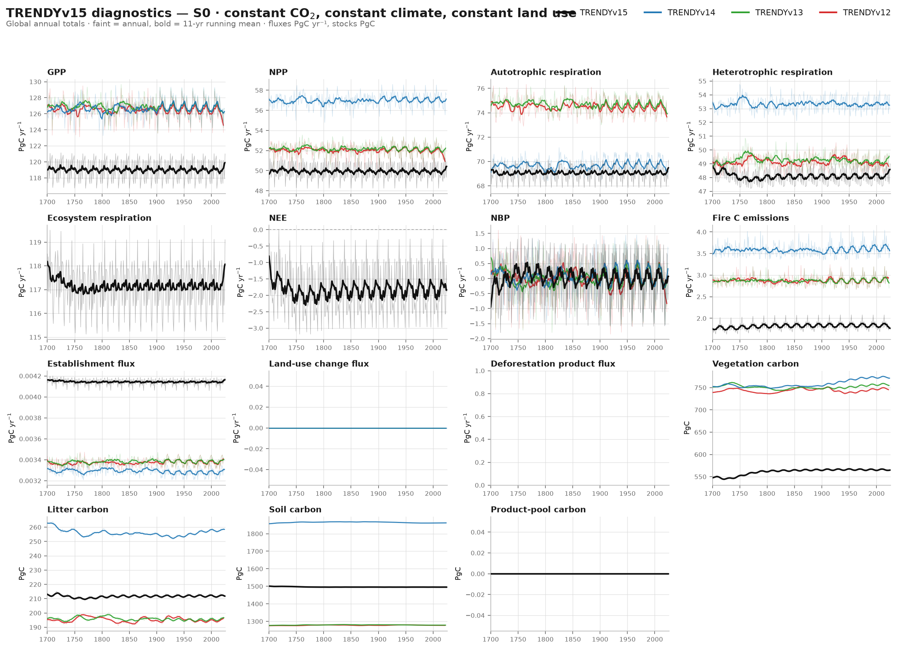

### S1 — varying CO₂, constant climate, constant land use

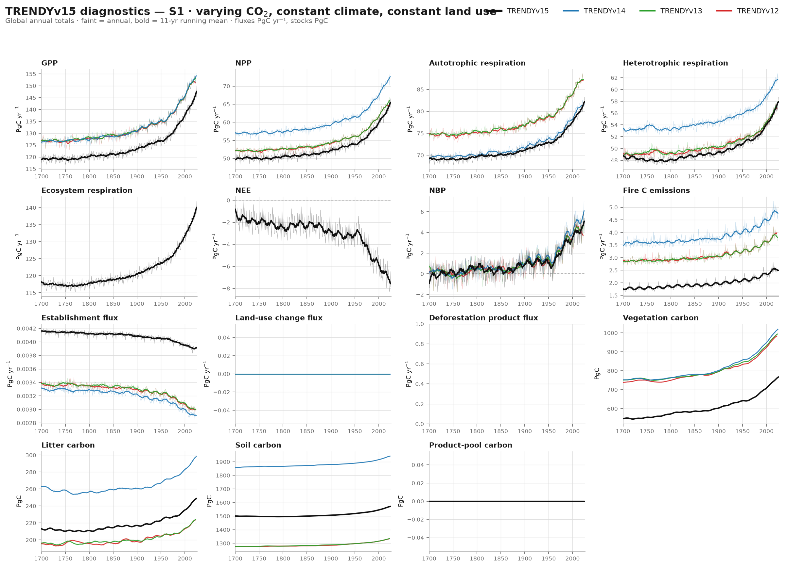

### S2 — varying CO₂, varying climate, constant land use

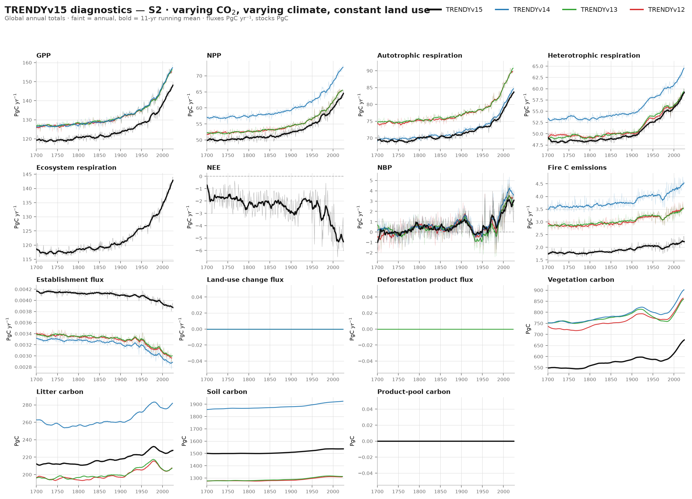

### S3 — varying CO₂, varying climate, varying land use

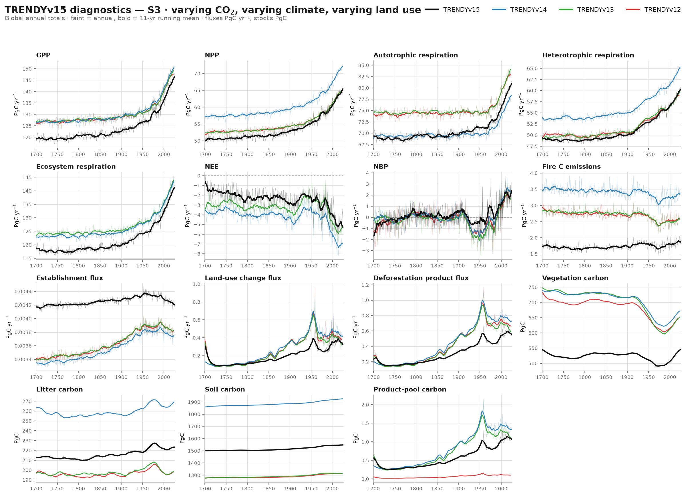

## Headline numbers

Mean over the final decade of each series (v15 → 2025, v14 → 2024,
v13 → 2023, v12 → 2022). Fluxes PgC yr⁻¹, stocks PgC.

| Variable | Scen. | v15 | v14 | v13 | v12 |
|---|---|---|---|---|---|
| GPP | S3 | **144.8** | 149.1 | 147.7 | 147.0 |
| NPP | S3 | **64.5** | 71.4 | 64.5 | 64.4 |
| Ra | S3 | **80.3** | 77.7 | 83.2 | 82.6 |
| Rh | S3 | **59.7** | 64.4 | 58.9 | 58.7 |
| Reco | S3 | **140.0** | 142.0 | 142.0 | — |
| NEE | S3 | **−4.77** | −7.04 | −5.65 | — |
| NBP | S3 | **1.78** | 2.34 | 1.94 | 1.91 |
| Fire C | S3 | **1.89** | 3.37 | 2.55 | 2.56 |
| LUC flux | S3 | **0.35** | 0.42 | 0.35 | 0.39 |
| Deforest. product flux | S3 | **0.57** | 0.73 | 0.62 | 0.68 |
| VegC | S3 | **540** | 668 | 646 | 645 |
| LitC | S3 | **223** | 267 | 197 | 197 |
| SoilC | S3 | **1547** | 1925 | 1314 | 1311 |
| Product pool | S3 | **1.10** | 1.34 | 1.16 | 0.10 |

The full table for every variable × scenario × vintage is in
`plots/figures/summary_table.md` alongside the code.

## What changed in v15

- **Productivity is down, but selectively.** GPP is the clearest shift: v15 sits
  **4–8 PgC yr⁻¹ below all three earlier vintages** in every scenario, and the
  offset is present from 1700 onward, so it is a baseline change rather than a
  trend change. NPP, by contrast, lands essentially **on top of v13/v12**
  (64.5 vs 64.5/64.4 PgC yr⁻¹ in S3) — it is **v14** that is the outlier high
  (71.4). Autotrophic respiration moves the same way as NPP: v15 tracks v14
  (~78–80) and both sit below v13/v12 (~83). Net effect: v15 has a **lower GPP
  with a higher carbon-use efficiency** than the v13/v12 line.
- **Fire emissions are roughly halved relative to v14.** v15 burns
  1.8–2.5 PgC yr⁻¹ against 3.4–4.9 in v14 and 2.5–3.9 in v13/v12 — the single
  largest fractional change in the set, and consistent across all four
  scenarios and the whole record.
- **Vegetation carbon is substantially lower.** 540 PgC in S3 against 645–668
  in the earlier vintages (−16 to −19 %), with the same offset in S0–S2. The
  post-1950 dip-and-recovery shape is preserved.
- **Soil carbon sits between the two earlier regimes.** v13 and v12 are
  effectively identical (~1310 PgC); v14's permafrost configuration pushed this
  to ~1925; v15 lands at ~1547. Litter carbon behaves the same way (v15 223
  between v13/v12's 197 and v14's 267).
- **The land-carbon sink is slightly weaker.** S3 NBP is 1.78 PgC yr⁻¹ vs
  2.34 (v14) / 1.94 (v13) / 1.91 (v12); S3 NEE is −4.77 vs −7.04 (v14) / −5.65
  (v13). The interannual variability and the ~1930s and post-1950 features line
  up well across vintages — the difference is level, not phase.
- **Land-use terms are close to their predecessors.** S3 LUC flux (0.35) matches
  v13 exactly and is a little below v14/v12; the deforestation product flux
  (0.57) and product pool (1.10) are ~20 % below v14 and 5–8 % below v13.
- **Establishment flux is up ~10 %** (0.0042 vs 0.0037–0.0038 PgC yr⁻¹ in S3),
  though the absolute magnitude is negligible in the carbon budget.

## Individual variables

### Gross primary production

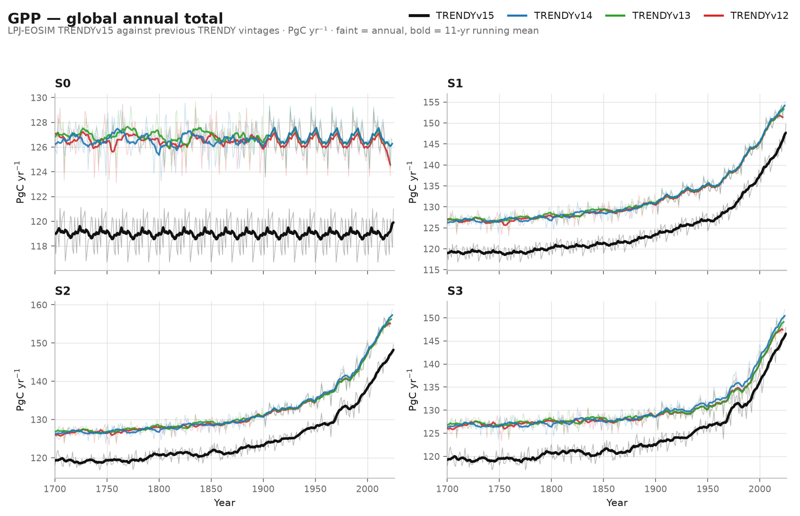

### Net primary production

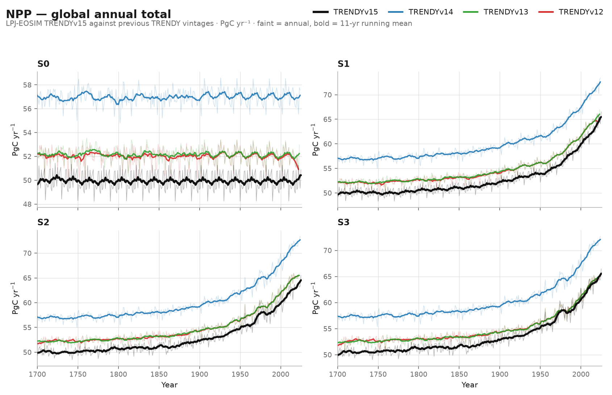

### Autotrophic respiration

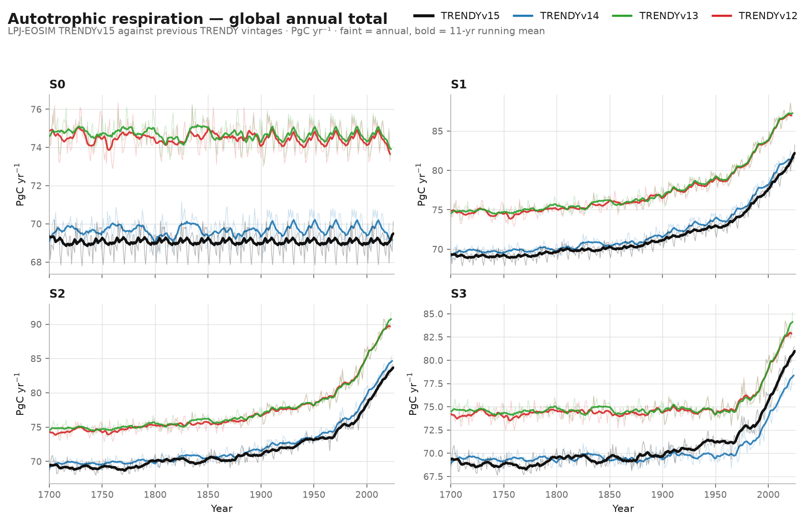

### Heterotrophic respiration

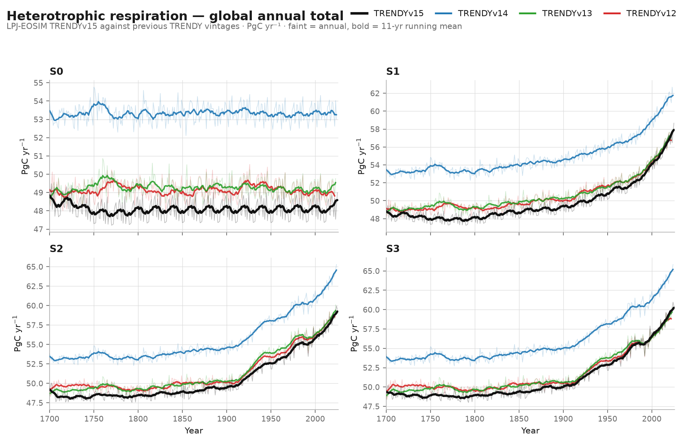

### Ecosystem respiration

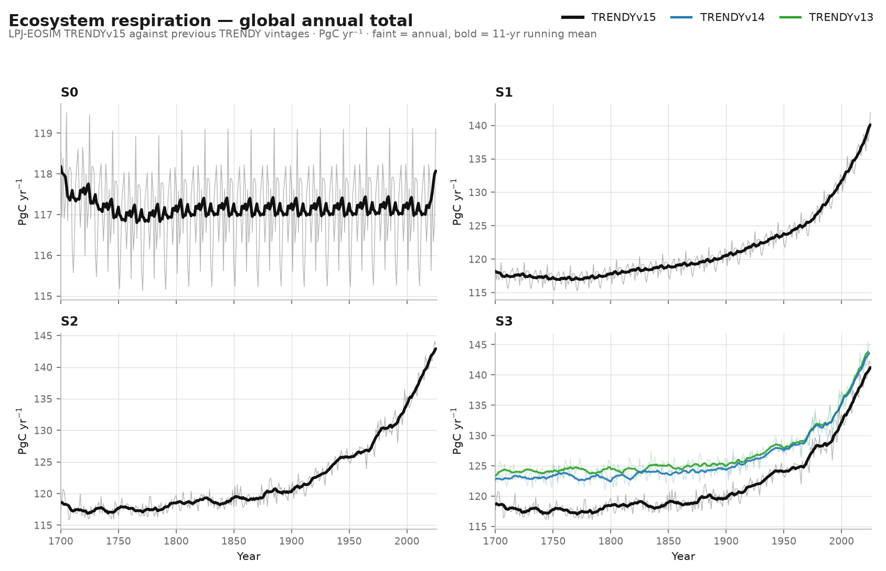

### Net ecosystem exchange

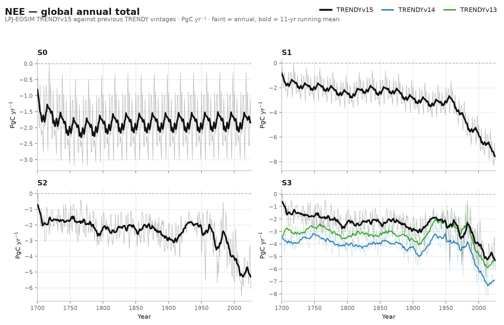

### Net biome production

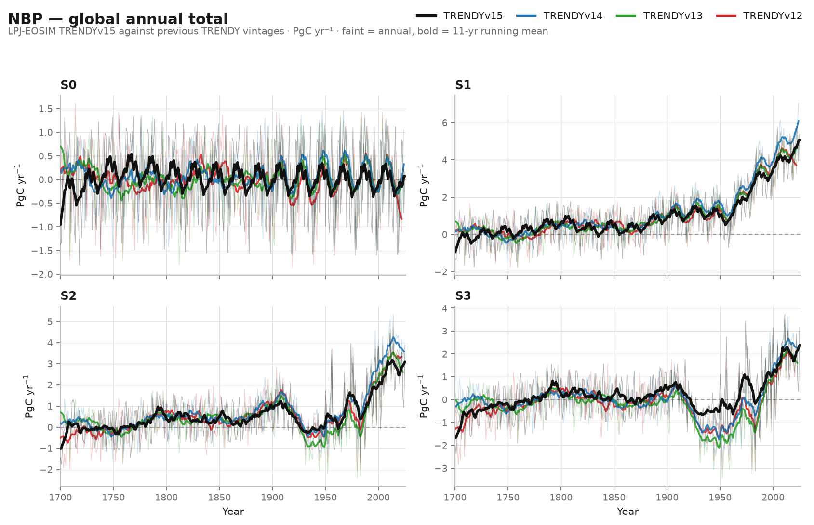

### Fire carbon emissions

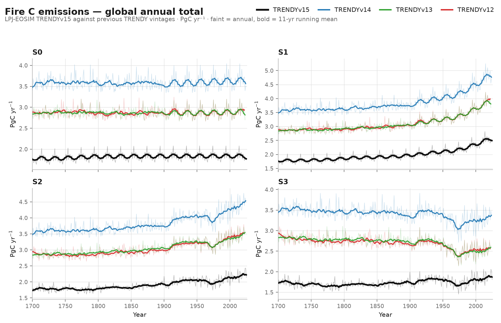

### Establishment flux

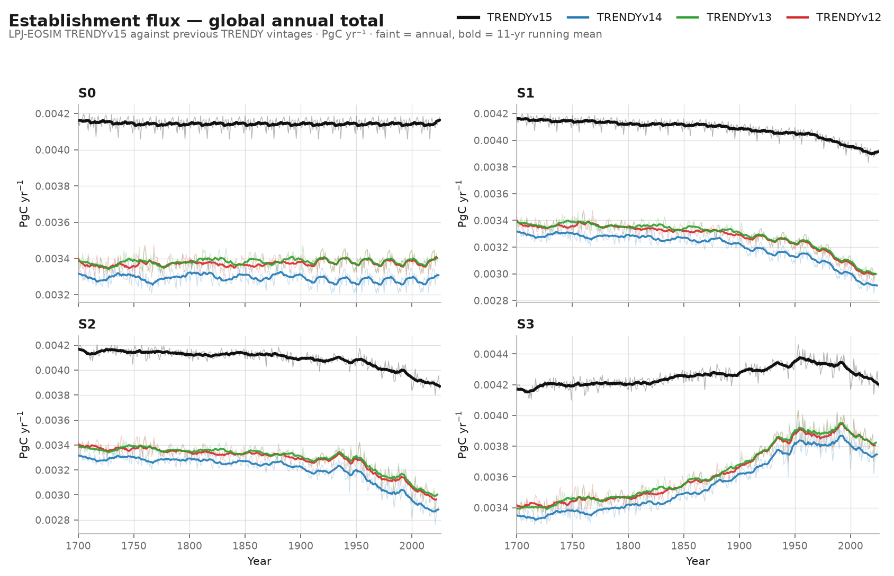

### Land-use change flux

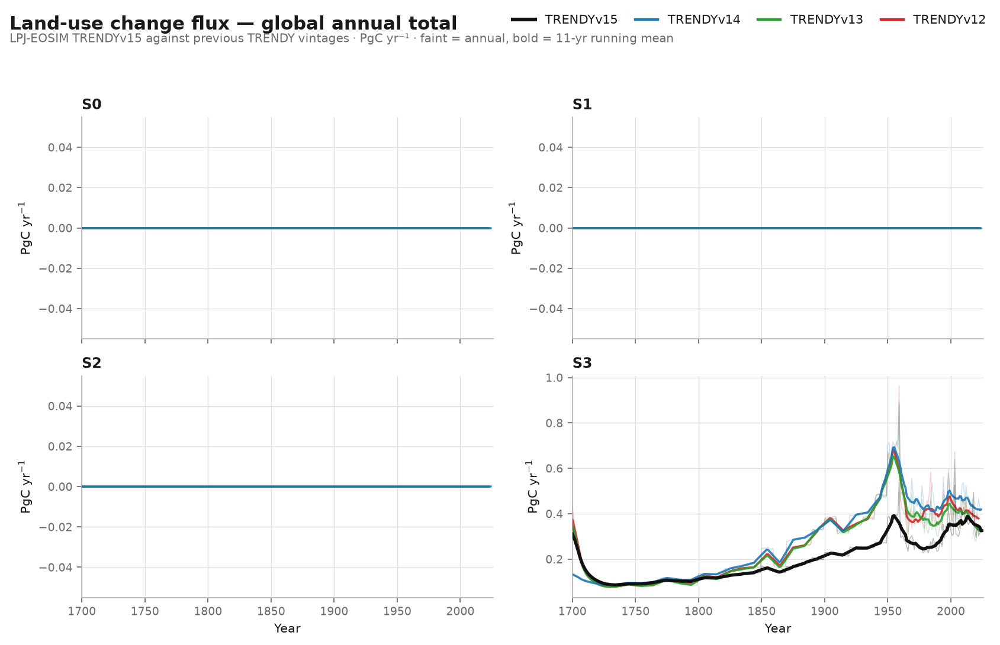

### Deforestation product flux

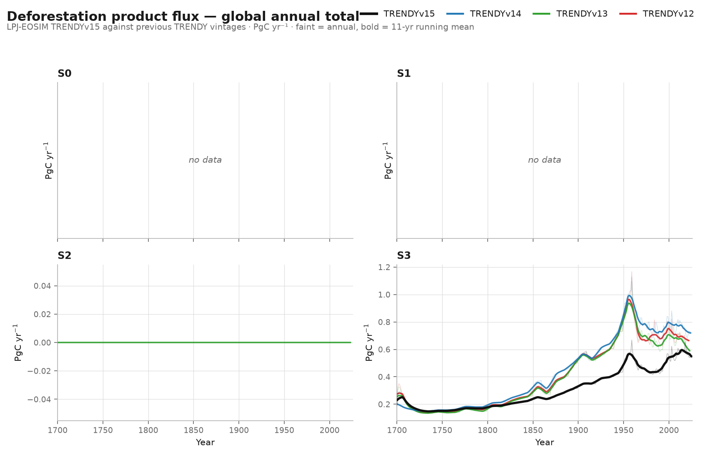

### Vegetation carbon

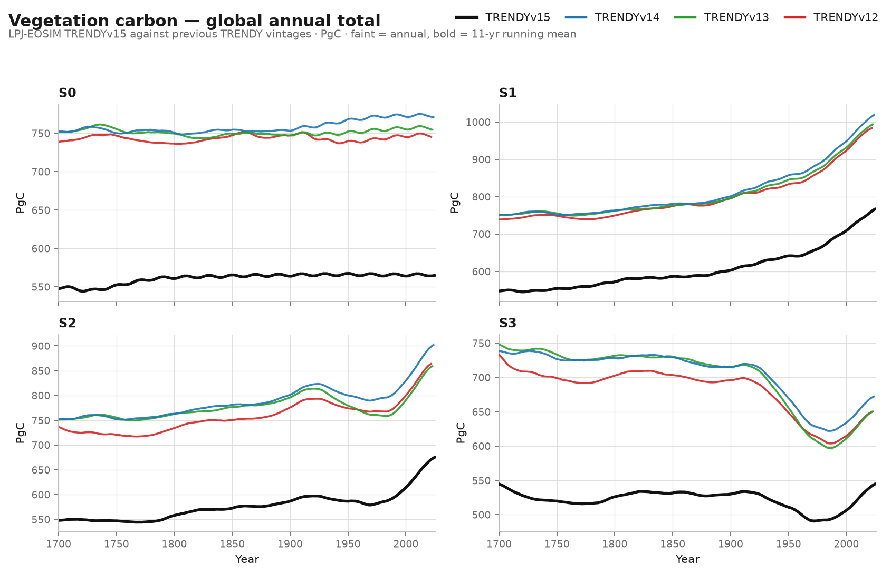

### Litter carbon

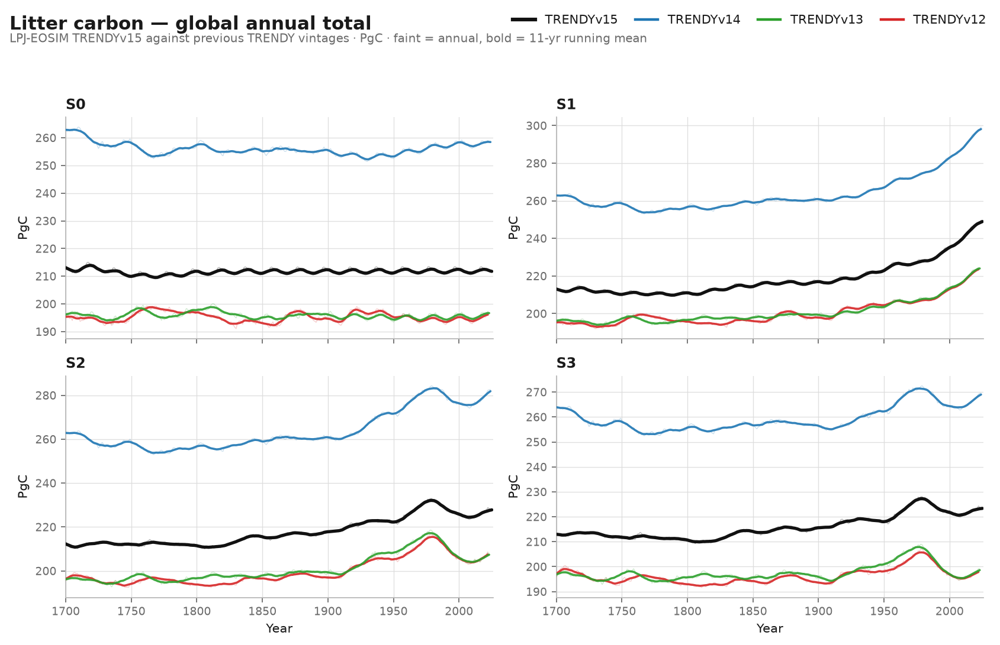

### Soil carbon

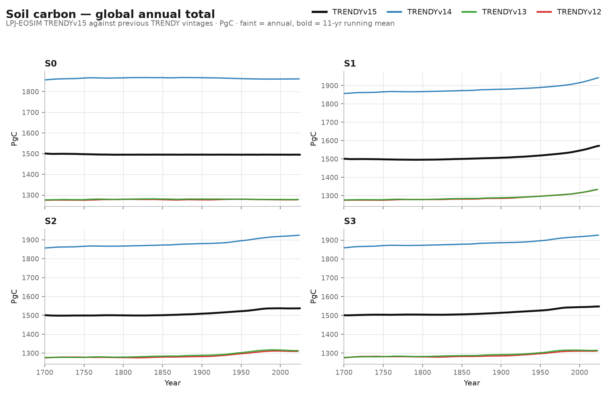

### Product-pool carbon

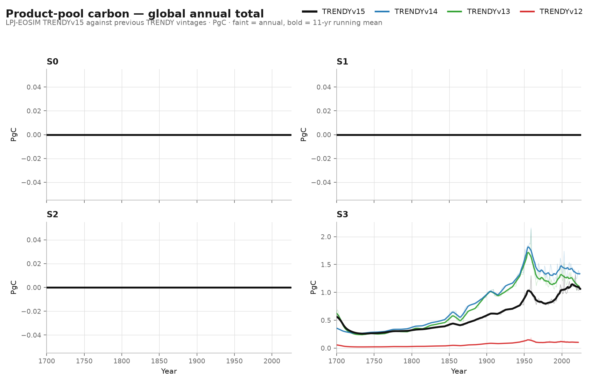

## Caveats & coverage gaps

- **`flux_luc` and the deforestation products were not written for TRENDYv15
  S0–S2.** v14/v13/v12 do have these files for the constant-land-use scenarios
  (where they are zero or near-zero by construction), so those panels show
  older vintages only. Worth re-running the netCDF merge for v15 S0–S2 if the
  comparison matters.
- **`mreco` and `mnee` only exist for S3** in v14 and v13, and not at all in
  v12; TRENDYv15 has them for all four scenarios. The S0/S1/S2 Reco and NEE
  panels are therefore v15-only.
- **TRENDYv13 S0 NBP** is the GFED-fire variant (`TRENDYv13_S0_mnbp_gfed.nc`) —
  the plain `mnbp` was never written for that scenario. Expect a small offset
  relative to the other S0 curves.
- **TRENDYv12 product pool (0.10 PgC vs ~1.1–1.3 elsewhere)** is an order of
  magnitude below every other vintage. The v12 archive stores `cProduct` as a
  monthly field tagged `kg C m-2 month-1`, so it is likely a product *influx*
  rather than the standing pool. Treat the red curve on that panel as not
  directly comparable.
- Series lengths differ: v15 runs to **2025**, v14 to 2024, v13 to 2023, v12 to
  2022. The pre-1901 portion of every run is driven by recycled climate, which
  is what produces the ~20-year sawtooth visible in the S0 panels.

## Reproducing

Code and intermediate series live in
`/mnt/beegfs/scratch/tc229954e/trendy/v15/simulations/plots/`:

| File | Purpose |
|---|---|
| `config.py` | Per-vintage file layout, variable list, flux/stock classification |
| `aggregate.py` | Global yearly aggregation; one process per (vintage, scenario, variable) |
| `plot_diagnostics.py` | Figures and the summary table |
| `run_aggregate.sbatch` | Slurm wrapper (1 node, 32 cores) |
| `series/*.csv` | One `year,value` series per (vintage, scenario, variable) |
| `figures/` | The PNGs on this page + `summary_table.md` |

```bash
cd /mnt/beegfs/scratch/tc229954e/trendy/v15/simulations/plots
sbatch run_aggregate.sbatch    # 240 tasks, ~10 min on 32 cores
```

The aggregation streams each netCDF in 120-timestep blocks, so the 4 GB monthly
files never load whole. The last run produced **203 series with 0 errors**; the
37 skipped combinations are the coverage gaps listed above.
