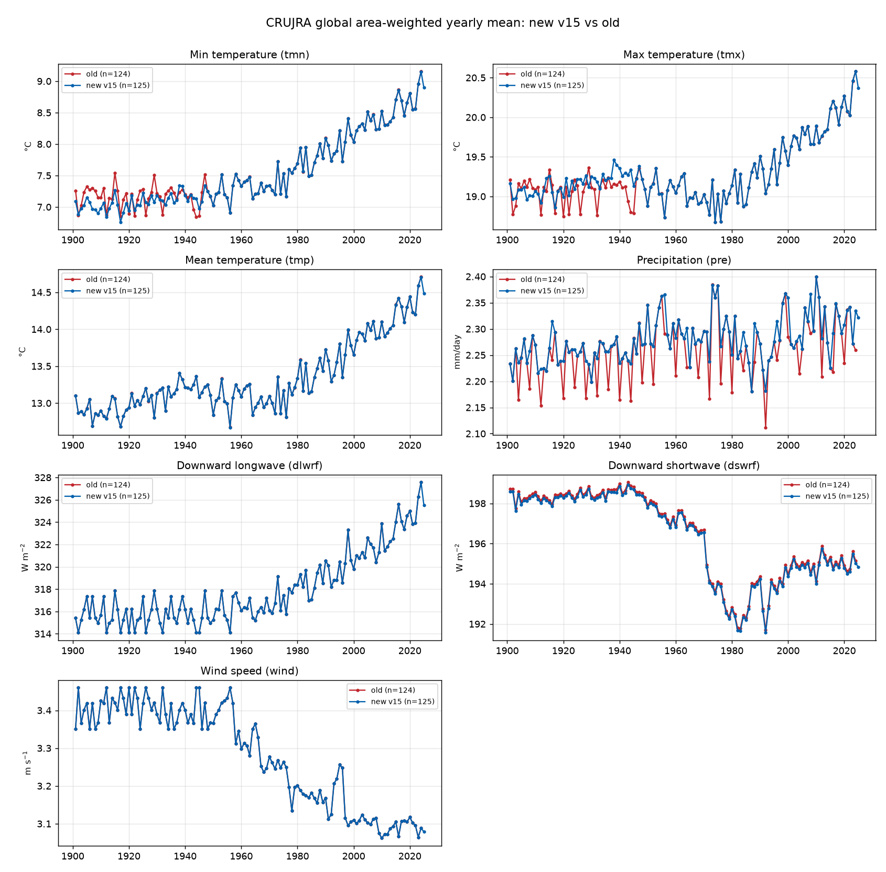

# TRENDYv15 — CRUJRA Driver Data

New **CRUJRAv15** climate forcing (CRU-TS v4.10 + JRA-3Q, 0.5°, daily,
**1901–2025**), reformatted for LPJ-EOSIM. This page compares the new build
against the previous (**v14-vintage**) CRUJRA build.

The seven LPJ forcing variables were built from the raw 6-hourly TRENDYv15
fields: `tmin`/`tmax` (daily min/max), `tmp` (daily mean), `pre` (daily sum),
`dlwrf` and `tswrf`→`dswrf` (daily mean), and `wind` (daily-mean speed from the
`ugrd`/`vgrd` components).

## Global yearly means: new v15 vs old

Area-weighted global yearly means (land-only, `cdo -yearmean -fldmean`) for each
variable. **New v15 (blue)** vs the **previous build (red)**; the old record runs
1901–2024, the new one extends to 2025.

### Notes

- **tmin, tmp, dlwrf, dswrf, wind** — new v15 reproduces the previous build
  closely and extends coverage through 2025. `dswrf` shows the expected global
  dimming/brightening (1960s–80s dip); `wind` shows the long-term stilling
  trend.
- **pre** — the new build fixes a timestamp-handling bug in the previous
  version. CRUJRA precip is stamped at the **start** of each 6-hour window, so a
  plain daily sum is correct; the old build applied a `-shifttime,-1sec` (only
  appropriate for *end*-stamped accumulations), which spilled the first record
  into a phantom partial day and misaligned every day by 6 h. New v15 aggregates
  each day's four periods correctly.
- **tmax** — the old build shows an anomalous early-period (≈1901–1945) wobble;
  the new v15 series is well-behaved and consistent with `tmin`/`tmp`.
