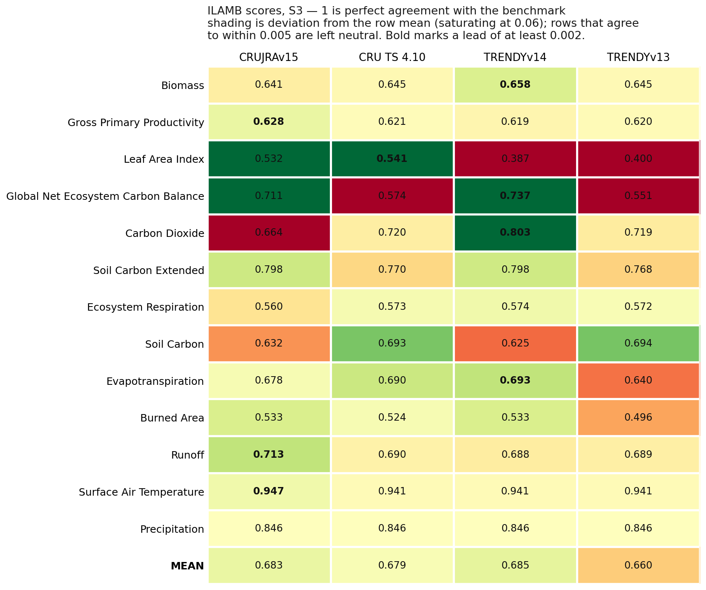

# TRENDYv15 — ILAMB benchmarking (S3)

[**Open the full ILAMB site →**](../results/ilamb-trendyv15-s3/index.html)

Four S3 runs benchmarked against observations: LPJ-EOSIM driven by **CRUJRAv15**
and by **CRU TS 4.10** — both rebuilt on the phase-continuous spinup — against
**TRENDYv14** and **TRENDYv13**.

S3 is the only scenario used here. It is the only one with CO₂, climate and land
use all varying, so it is the only one meaningfully comparable against
observations; benchmarking S0 would mean scoring a run with constant CO₂ and
recycled climate against the real world.

Thirteen variables over 26 benchmark datasets. Scores run 0–1, where 1 is perfect
agreement, combining bias, RMSE, spatial distribution and — for monthly data —
seasonal-cycle phase.

## What the scores say

The overall means are **TRENDYv14 0.685, CRUJRAv15 0.683, CRU TS 4.10 0.679,
TRENDYv13 0.660**. The top three are separated by 0.006, which is not a
meaningful ranking — v14 and the two rebuilt runs should be read as equivalent
overall, with all three clearly ahead of v13.

The differences worth attention are in individual variables:

- **Leaf Area Index is the largest gain**: 0.532 and 0.541 for the two rebuilt
  runs against 0.387 and 0.400 for v14 and v13, roughly +0.14. It appears under
  both drivers, so it reflects a change in the model rather than in the forcing.
- **Carbon Dioxide is the largest deficit**: 0.664 for CRUJRAv15 against 0.803
  for v14. CRU TS scores 0.720 on the same model code, so this one is
  driver-sensitive rather than structural.
- **Soil Carbon** splits by driver — 0.632 (CRUJRA) against 0.693 (CRU TS) —
  consistent with the soil-carbon differences seen in the stocks-and-fluxes
  comparison.
- The **driver swap costs almost nothing overall** (0.683 against 0.679).

Shading in the scorecard is deviation from each row's mean on a fixed ±0.06
scale, and rows whose models agree to within 0.005 are left neutral. That matters
for reading it: Precipitation scores 0.846 for all four, and a per-row rescaling
would have made an exactly zero spread look like a large difference.

## A caveat on Biomass

`ilamb.cfg` in the pipeline looks for `biomass`/`vegc`, while `format_ilamb.sh`
renames the variable to `cVeg`. The two were changed out of step, so the Biomass
confrontation silently scored nothing for any model, despite carrying a weight of
5. This run used a local config copy setting
`alternate_vars = "vegc,cVeg"`, which restores it.

**The fix has not been made upstream**, so other ILAMB runs going through the
shared config are still losing Biomass. It was the only variable affected here.

## Reproducing

Runs are driven by `code/run_ilamb_accum.py` in the simulations tree, which calls
the pipeline's `submit_ilamb_job` and `format_ilamb.sh`, with the patched config
at `code/ilamb_cfg/ilamb_accum.cfg`.

The NetCDF that ILAMB writes alongside its figures (176 MB) is not committed —
only the HTML and figures needed to browse the results.
