# TRENDYv15 — stocks & fluxes by scenario

## S0 — constant CO₂, climate, land use

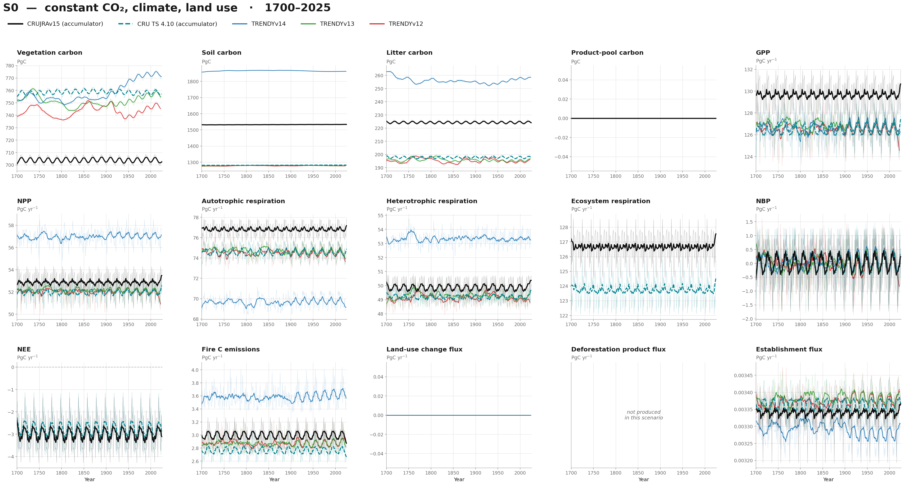

### S0 — 1980–2025

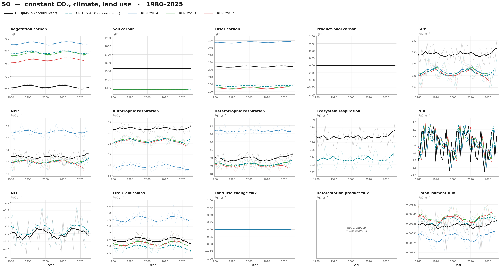

## S1 — varying CO₂

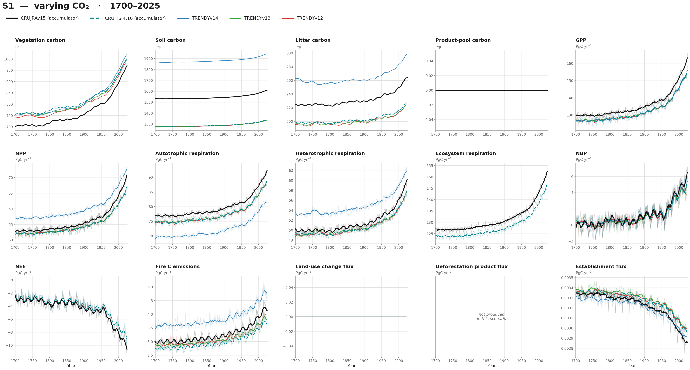

### S1 — 1980–2025

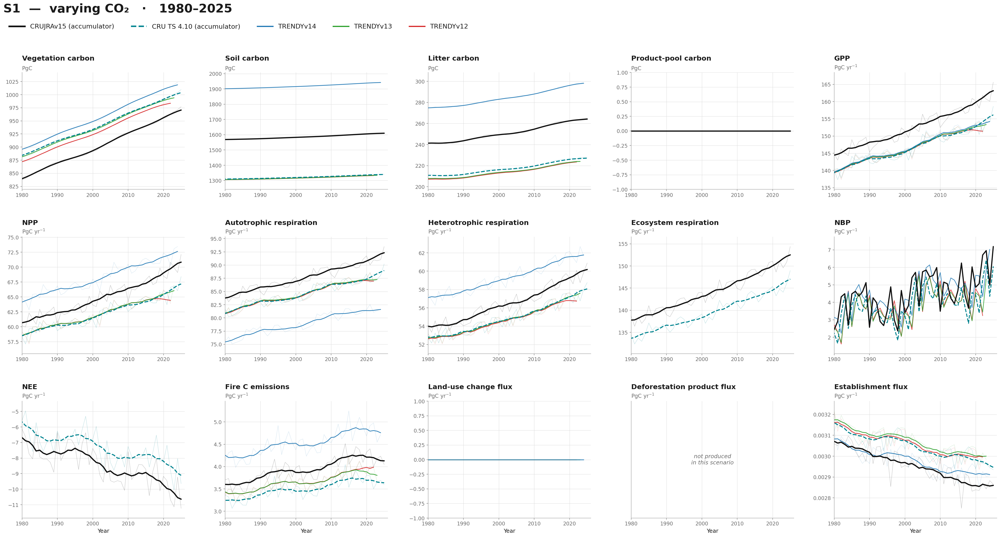

## S2 — varying CO₂ + climate

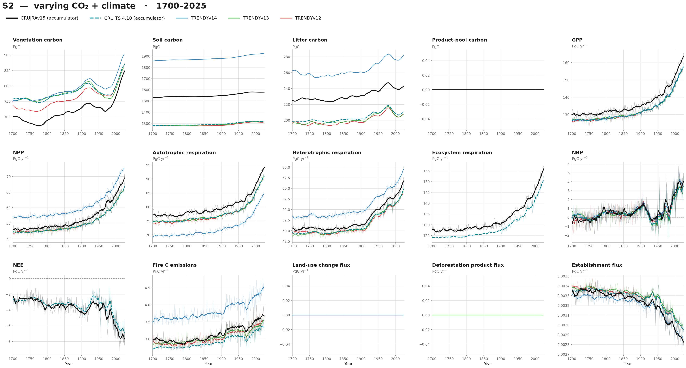

### S2 — 1980–2025

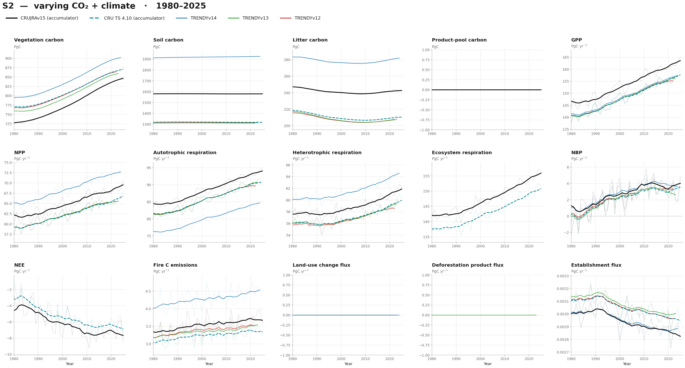

## S3 — varying CO₂ + climate + land use

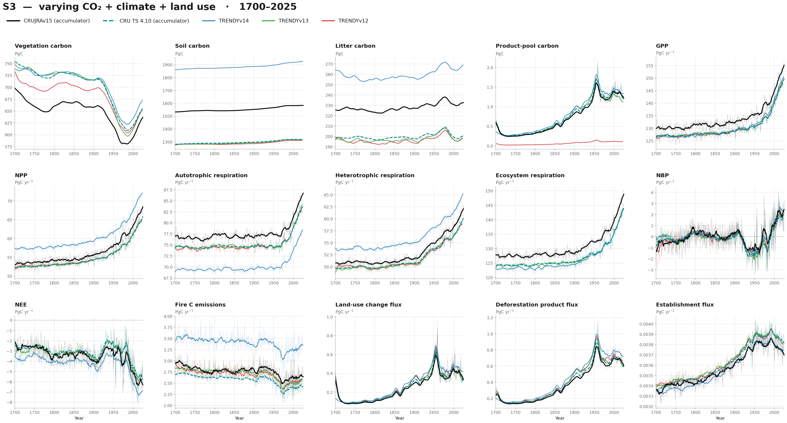

### S3 — 1980–2025

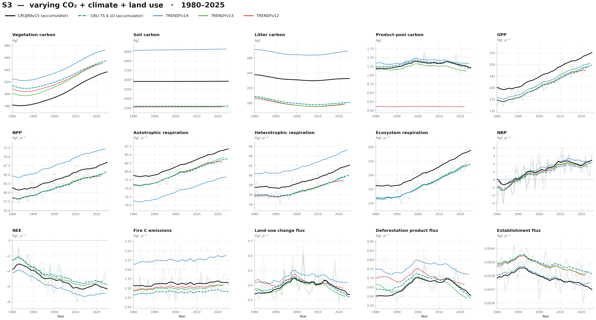

## S4 — constant CO₂ + climate, varying land use

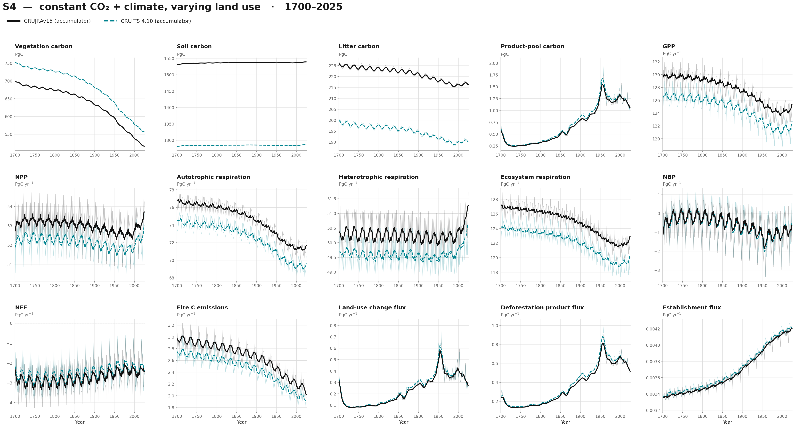

### S4 — 1980–2025

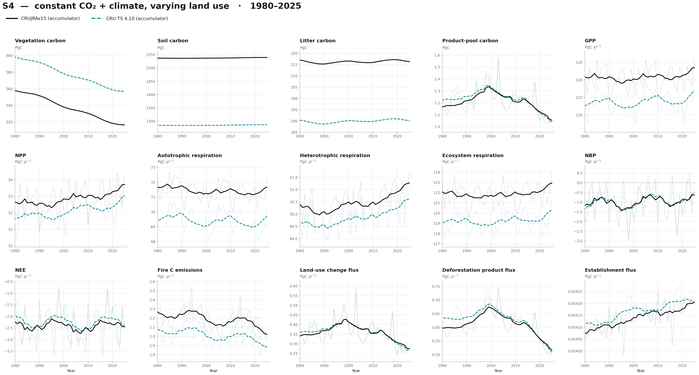

## S5 — varying CO₂, constant climate

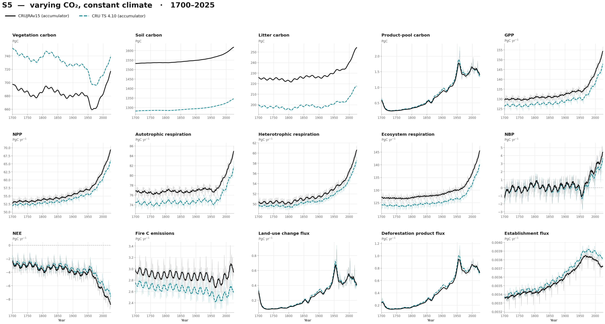

### S5 — 1980–2025

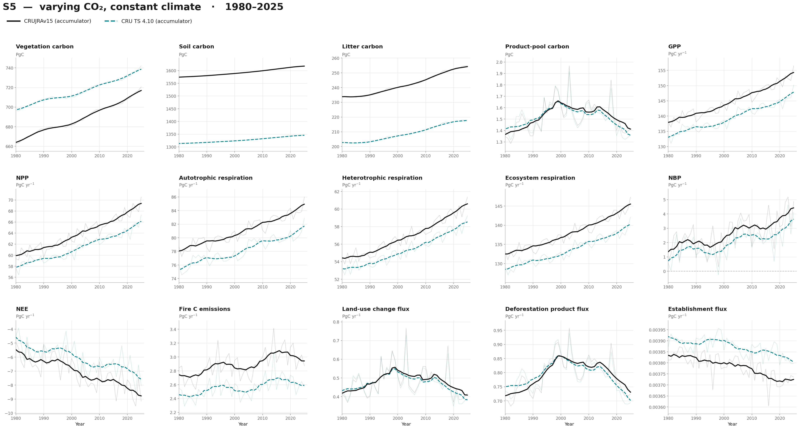

## S6 — constant CO₂, varying climate

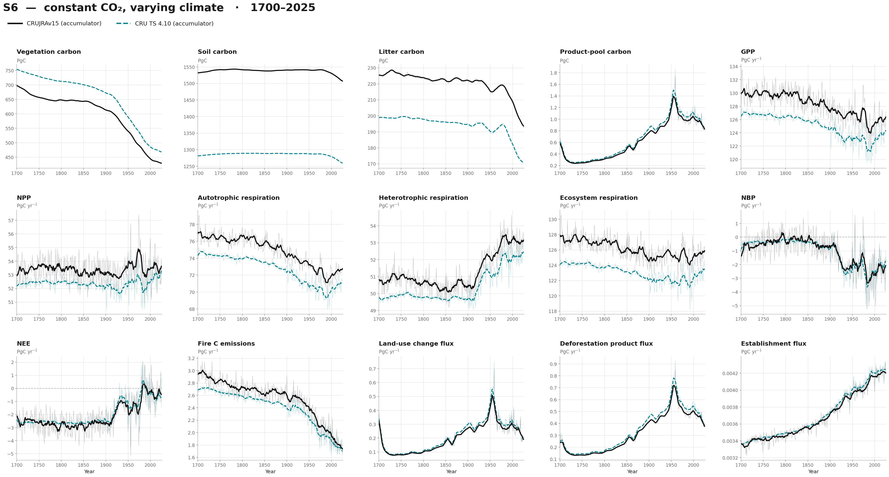

### S6 — 1980–2025

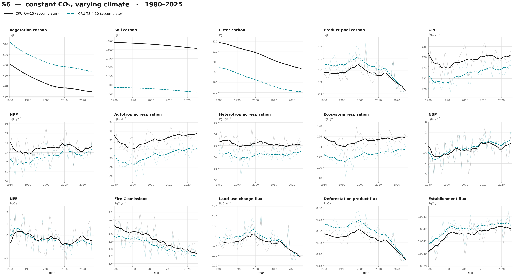
