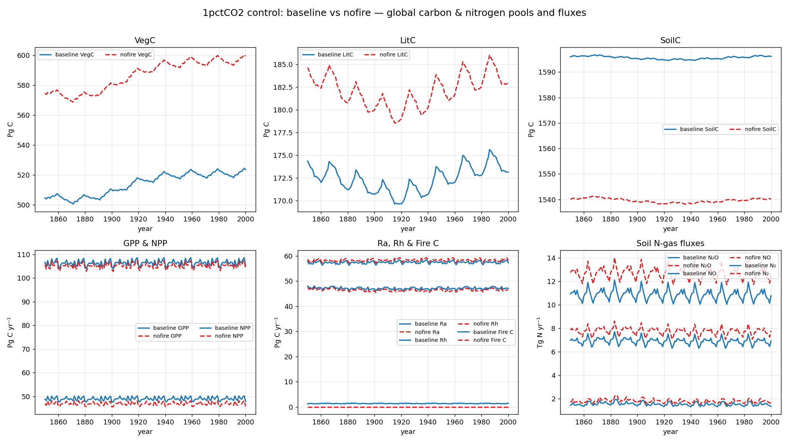

# 1pctCO2 control: baseline vs nofire — carbon & nitrogen pools and fluxes

Global totals from the **base-ctrl** (full physics, with SPITFIRE) and
**nofire-ctrl** (SPITFIRE removed) 1pctCO2 control runs (0.5°, 1850–2000),
overlaid one variable per panel. The nofire run is *untuned* — it is the
baseline flag set with fire disabled, so the differences below are the raw
effect of removing fire before any re-tuning.

- **Carbon pools** — VegC, LitC, SoilC — are end-of-year stocks in **Pg C**.
- **Carbon fluxes** — GPP, NPP, Ra, Rh, fire C — are annual totals in
  **Pg C yr⁻¹** (monthly outputs summed per year; fire C is native annual).
  Fire C exists only for the baseline; nofire has no SPITFIRE, so its fire C is
  zero by construction.
- **Soil nitrogen-gas fluxes** — N₂O, NO, N₂ — are annual totals in
  **Tg N yr⁻¹**. (The NO/N₂ source files are labelled `g C m⁻²` in the model
  output, but are nitrogen emissions.)

All totals are gridcell value × area, summed globally.

Approximate global totals over the run (first year 1850 → last year 2000):

| Variable | Type | Unit | Baseline (1850 → 2000) | Nofire (1850 → 2000) |
|----------|------|------|-----------------------:|---------------------:|
| VegC  | C pool  | Pg C       | 505 → 524   | 575 → 599   |
| LitC  | C pool  | Pg C       | 174 → 173   | 185 → 183   |
| SoilC | C pool  | Pg C       | 1596 → 1596 | 1540 → 1540 |
| GPP   | C flux  | Pg C yr⁻¹  | 107 → 105   | 105 → 104   |
| NPP   | C flux  | Pg C yr⁻¹  | 49 → 48     | 47 → 46     |
| Ra    | C flux  | Pg C yr⁻¹  | 58 → 57     | 59 → 58     |
| Rh    | C flux  | Pg C yr⁻¹  | 48 → 47     | 48 → 46     |
| Fire C| C flux  | Pg C yr⁻¹  | 1.2 → 1.4   | 0 (no fire) |
| N₂O   | N flux  | Tg N yr⁻¹  | 7.0 → 6.9   | 7.8 → 7.8   |
| NO    | N flux  | Tg N yr⁻¹  | 10.9 → 10.8 | 12.7 → 12.6 |
| N₂    | N flux  | Tg N yr⁻¹  | 1.5 → 1.4   | 1.7 → 1.6   |

## What removing fire does

- **More live and litter carbon.** Without fire combusting biomass, **VegC is
  ~70 Pg C higher** (≈575 vs 505 Pg C) and **LitC ~10 Pg C higher**. Both runs
  share the same upward VegC drift, so the offset is the fire effect on top of
  the common spin-up transient.
- **Less soil carbon.** **SoilC is ~55 Pg C lower** in nofire (≈1540 vs
  1596 Pg C) — consistent with the loss of the pyrogenic/charcoal-like routing
  and altered litter inputs when fire is off.
- **Productivity slightly lower, respiration similar.** GPP and NPP are a couple
  of Pg C yr⁻¹ lower without fire; Ra/Rh are close between the two runs.
- **Higher soil nitrogen-gas emissions.** N₂O, NO and N₂ are all modestly
  higher without fire (e.g. N₂O ≈7.8 vs 7.0 Tg N yr⁻¹), reflecting more soil N
  available for nitrification/denitrification when fire is not removing
  nitrogen.

!!! note "Untuned, and not fully equilibrated"
    These are control runs, so pools/fluxes should be near-stationary, but both
    show the same upward **VegC drift** and **elevated first-year Rh** seen in
    the baseline page — an incomplete-spin-up / initialisation transient rather
    than a forced signal. The nofire run is also **untuned**; the model-tuning
    suite will be used to re-tune the no-fire factorial back toward the
    baseline's stocks and fluxes.
