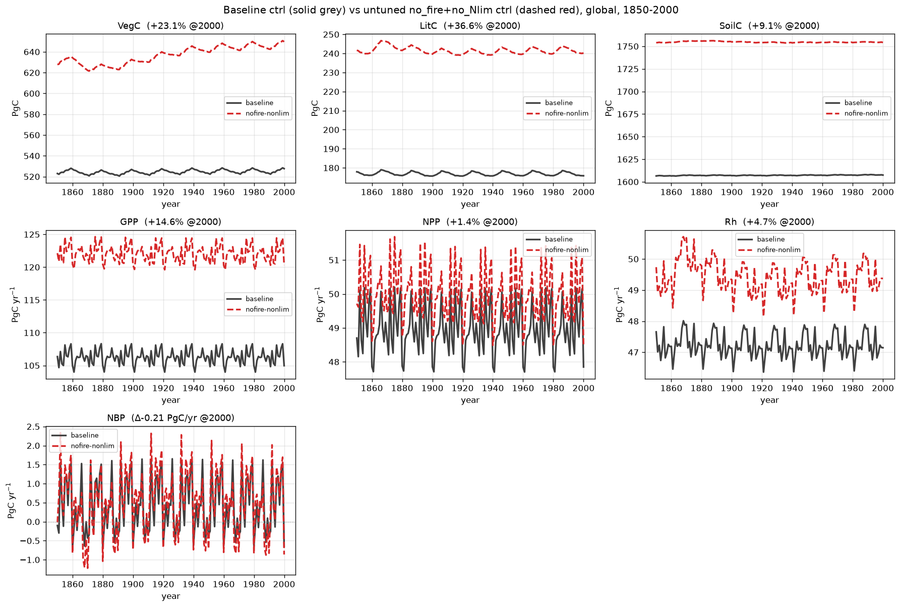

# 1pctCO2: baseline vs no_fire + no N-limitation (untuned) — carbon pools and fluxes

Global totals from the 1pctCO2 **baseline** control and the **no_fire + no
N-limitation** factorial permutation, control stage only (S0: constant mean CO₂,
fixed recycled 1850–1869 climate; 0.5°, 1850–2000, one variable per panel).

This permutation removes **two** processes at once relative to the baseline:
fire (SPITFIRE compiled out) **and** nitrogen limitation (`NONLIM` — the N cycle
still runs but no longer down-regulates productivity). It is shown here
**untuned** — the raw divergence from the baseline that the model-tuning suite
then targets. In the figure, **solid grey = baseline**, **dashed red =
nofire-nonlim**.

Units: carbon **pools** VegC/LitC/SoilC are end-of-year stocks in **Pg C**;
carbon **fluxes** GPP/NPP/Rh are annual totals in **Pg C yr⁻¹**; **NBP** =
NPP − Rh + flux_estab − fire C, annual, in **Pg C yr⁻¹**. All totals are
gridcell value × area, summed globally.

Global totals at year 2000:

| Variable | Unit | baseline | nofire-nonlim | Δ |
|----------|------|---------:|--------------:|----:|
| VegC  | Pg C      | 528  | 650  | **+23%** |
| LitC  | Pg C      | 176  | 240  | **+37%** |
| SoilC | Pg C      | 1607 | 1754 | **+9%**  |
| GPP   | Pg C yr⁻¹ | 105  | 120  | **+15%** |
| NPP   | Pg C yr⁻¹ | 47.9 | 48.5 | +1%   |
| Rh    | Pg C yr⁻¹ | 47.2 | 49.4 | +5%   |
| NBP   | Pg C yr⁻¹ | −0.65| −0.86| (≈0)  |

## What it shows

- **Productivity runs high (GPP +15%).** Removing N-limitation lets the canopy
  photosynthesize without the nitrogen down-regulation, lifting GPP even in the
  control with constant CO₂.
- **Carbon stocks build up across the board.** VegC (+23%) and LitC (+37%) rise
  with the extra production, and with fire removed there is no combustion export
  to draw the pools back down. **SoilC is +9%** — the slowly-equilibrating pool
  that is hardest to move and the main tuning target.
- **NPP barely moves while GPP jumps.** The extra gross production is largely
  offset by higher autotrophic respiration, so NPP is +1% — the divergence shows
  up mostly in GPP and in the accumulating stocks rather than in net production.
- **NBP stays near zero.** As a constant-CO₂ control both runs are near carbon
  balance; the small offset is within the spin-up drift.

!!! note "Untuned — re-tuning in progress"
    These are the **raw** no_fire+no_Nlim divergences. The model-tuning suite is
    being used to re-tune this permutation back toward the baseline, using a
    **divergence + area-weighted 1500-cell subset** (auto-balanced so the
    subset's per-variable error tracks the global error to ≈2.4 pp — in
    particular keeping the +9% SoilC gap visible to the optimizer). The tuned
    result will be reported separately, alongside the [tuned no_fire
    stages page](1pct_baseline_vs_tuned_nofire_stages.md).
