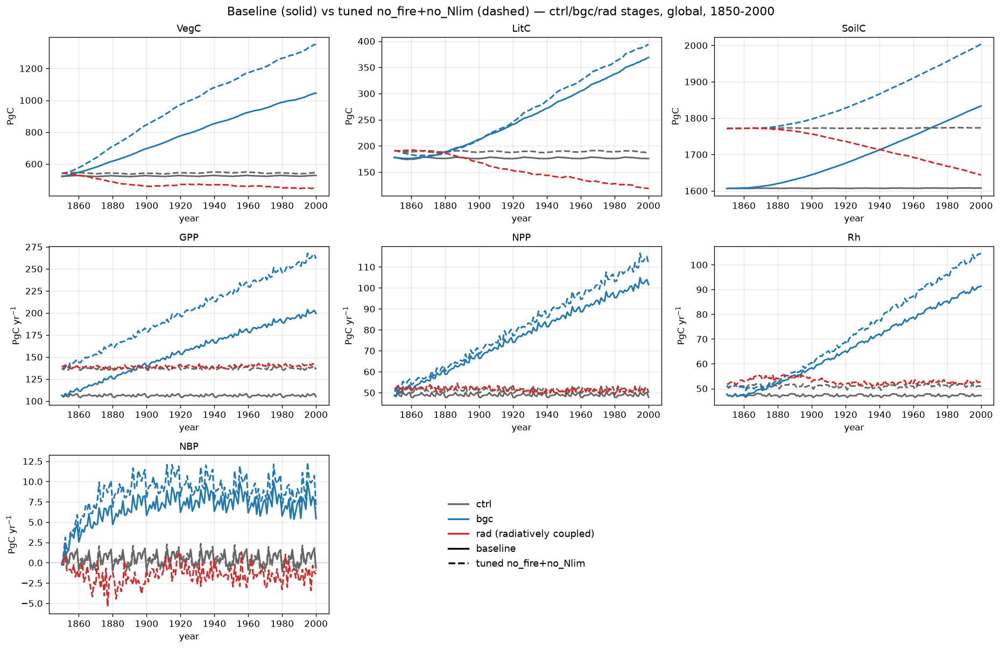

# 1pctCO2: baseline vs tuned no_fire+no_Nlim (ctrl/bgc/rad) — carbon pools and fluxes

Global totals from the 1pctCO2 **baseline** and the **tuned no_fire+no_Nlim**
permutation (SPITFIRE compiled out **and** N-limitation disabled, `NONLIM`), by
coupling stage (0.5°, 1850–2000, one variable per panel). This is the
no-N-limitation companion to the [baseline vs tuned no_fire
page](1pct_baseline_vs_tuned_nofire_stages.md); the parameter vector was re-tuned
with CMA-ES against the lu1000-v3 baseline on a divergence-weighted cell subset
(warm-started from the no_fire vector, `f_nitri_max` retained).

- **ctrl (S0)** — constant (mean) CO₂, fixed recycled 1850–1869 climate. The
  control: pools/fluxes should be near-stationary.
- **bgc (S1)** — rising 1pctCO₂ pathway, fixed recycled climate. The
  **biogeochemically-coupled** run, isolating **CO₂ fertilization**.
- **rad (radiatively coupled)** — transient UKESM climate with **constant** (mean)
  CO₂ (`CO2MEAN`). The C4MIP complement to bgc: the carbon cycle sees fixed CO₂
  while the climate warms. Baseline has **no rad counterpart**, so it is shown
  for the tuned no_fire+no_Nlim run only.

In the figure, **stage is colour** (ctrl grey, bgc blue, rad red) and **run is
linestyle** (baseline solid, tuned no_fire+no_Nlim dashed).

Units: carbon **pools** VegC/LitC/SoilC are end-of-year stocks in **Pg C**;
carbon **fluxes** GPP/NPP/Rh are annual totals in **Pg C yr⁻¹** (monthly outputs
summed per year); **NBP** = NPP − Rh + flux_estab (fire C is zero by
construction), annual, in **Pg C yr⁻¹** (positive = net land sink). All totals
are gridcell value × area, summed globally.

Approximate global totals, first year 1850 → last year 2000:

| Variable | Unit | base ctrl | base bgc | nl ctrl | nl bgc | nl rad |
|----------|------|----------:|---------:|--------:|-------:|-------:|
| VegC  | Pg C      | 523→528   | 523→1045 | 544→544   | 544→1352 | 544→446 |
| LitC  | Pg C      | 178→176   | 178→369  | 190→188   | 190→394  | 190→119 |
| SoilC | Pg C      | 1607→1607 | 1607→1834| 1773→1773 | 1773→2003| 1773→1644|
| GPP   | Pg C yr⁻¹ | 106→105   | 106→199  | 138→138   | 138→263  | 138→138 |
| NPP   | Pg C yr⁻¹ | 49→48     | 49→102   | 51→51     | 51→113   | 51→51   |
| Rh    | Pg C yr⁻¹ | 48→47     | 48→91    | 51→51     | 51→104   | 52→52   |
| NBP   | Pg C yr⁻¹ | −0.1→−0.7 | −0.1→+5.4| ≈0→≈0     | ≈0→+9    | ≈0→−1   |

## What the stages show

- **Removing N-limitation raises the control baseline.** Even after re-tuning,
  the no_fire+no_Nlim control sits **above** the target: SoilC +10%
  (1607→1773), VegC +3%, LitC +7%, and GPP +29% (106→138 Pg C yr⁻¹). With the N
  cycle no longer down-regulating productivity, GPP runs high; the tune (warm
  started from no_fire, `f_nitri_max` kept) pulls the stocks partway back but
  cannot fully close the offset the way the N-limited no_fire tune did (SoilC
  +1.7%). ctrl remains near-stationary in time, as it should.
- **CO₂ fertilization is even stronger without N-limitation (bgc).** With rising
  CO₂ and fixed climate the tuned no_fire+no_Nlim roughly **triples** VegC
  (544→1352) and doubles GPP (138→263) — a larger fertilization response than
  either the baseline (523→1045) or the N-limited no_fire, because unconstrained
  N no longer caps the CO₂ response. NBP reaches ≈+9 Pg C yr⁻¹, a large sink.
- **Radiatively coupled = a carbon source (rad).** Under warming climate with
  **constant** CO₂, there is no fertilization to offset the climate response:
  VegC falls (544→446), SoilC declines (1773→1644, warmer soils respire faster),
  and NBP goes **negative** (≈−1 Pg C yr⁻¹). This is the expected C4MIP
  radiatively-coupled behaviour and the mirror image of the bgc sink.

!!! note "Removing N-limitation vs tuning to the control"
    Disabling N-limitation lifts productivity well above the N-limited target, so
    the re-tuned control match (±10%) is looser than the no_fire tune's (±5% /
    SoilC +1.7%). The bgc and rad panels then separate cleanly into the
    biogeochemical (sink) and radiative (source) responses.
