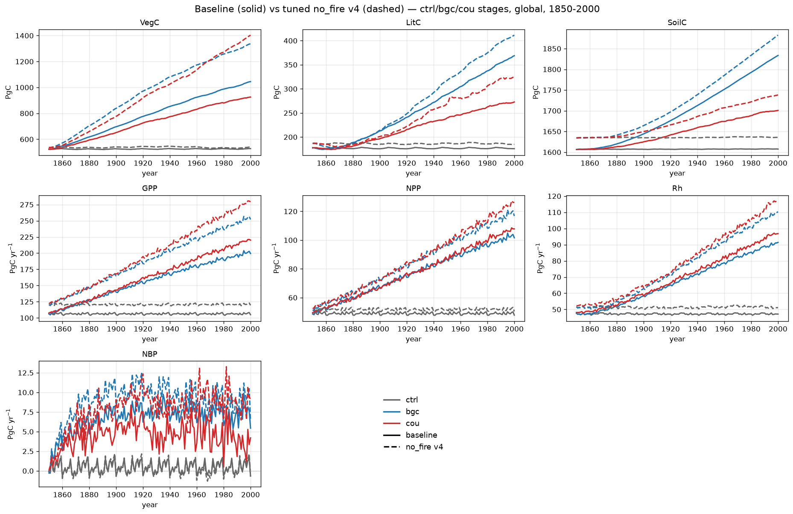

# 1pctCO2: baseline vs tuned no_fire (S0/S1/S2) — carbon pools and fluxes

Global totals from the 1pctCO2 **baseline** and the **tuned no_fire (v4)**
permutation, broken out by coupling stage (0.5°, 1850–2000, one variable per
panel). This is the companion to the [baseline-stages-vs-nofire
page](1pct_baseline_vs_nofire.md), but the no_fire run here is the **re-tuned**
factorial (CMA-ES against the lu1000-v3 baseline) and is carried through **all
three** coupling stages, not just the control.

- **ctrl (S0)** — constant (mean) CO₂, fixed recycled 1850–1869 climate. The
  control: pools/fluxes should be near-stationary.
- **bgc (S1)** — rising 1pctCO₂ pathway, fixed recycled climate. The
  **biogeochemically-coupled** run, isolating the **CO₂-fertilization** response.
- **cou (S2, UKESM)** — rising CO₂ **and** transient UKESM climate. The **fully
  coupled** run: CO₂ fertilization plus climate change.

The no_fire build has SPITFIRE compiled out (no fire C by construction) and
applies the tuned parameter vector (see [Tuning a no-fire permutation to the
baseline](../results/tuned_nofire.md)). In the figure, **stage is colour**
(ctrl grey, bgc blue, cou red) and **run is linestyle** (baseline solid,
tuned no_fire dashed).

Units: carbon **pools** VegC/LitC/SoilC are end-of-year stocks in **Pg C**;
carbon **fluxes** GPP/NPP/Rh are annual totals in **Pg C yr⁻¹** (monthly outputs
summed per year); **NBP** = NPP − Rh + flux_estab − fire C, annual, in
**Pg C yr⁻¹** (positive = net land sink). All totals are gridcell value × area,
summed globally.

Approximate global totals, first year 1850 → last year 2000:

| Variable | Unit | base ctrl | base bgc | base cou | no_fire ctrl | no_fire bgc | no_fire cou |
|----------|------|----------:|---------:|---------:|-------------:|------------:|------------:|
| VegC  | Pg C      | 523→528   | 523→1045 | 524→926  | 536→539   | 536→1337 | 537→1404 |
| LitC  | Pg C      | 178→176   | 178→369  | 177→273  | 187→185   | 187→411  | 186→325  |
| SoilC | Pg C      | 1607→1607 | 1607→1834| 1606→1701| 1634→1635 | 1634→1883| 1634→1738|
| GPP   | Pg C yr⁻¹ | 106→105   | 106→199  | 108→220  | 120→120   | 120→252  | 122→279  |
| NPP   | Pg C yr⁻¹ | 49→48     | 49→102   | 50→108   | 51→50     | 51→117   | 52→126   |
| Rh    | Pg C yr⁻¹ | 48→47     | 48→91    | 48→97    | 52→51     | 52→110   | 52→117   |
| NBP   | Pg C yr⁻¹ | −0.10→−0.65 | −0.10→+5.44 | −0.02→+4.21 | −0.35→−0.72 | −0.35→+6.41 | +0.05→+9.22 |

## What the stages show

- **The tune holds in the control (ctrl).** Against the S0 baseline the tuned
  no_fire sits within ~5% on every carbon stock for the whole 1850–2000 run, not
  just the endpoint: SoilC +1.7% (1607→1635), VegC +2% (528→539), LitC +5%. This
  is the campaign result — the re-tune brought SoilC from +15% (untuned) to
  +1.7% and put all stocks inside ±5%. The one residual is **GPP +14%**
  (105 → 120 Pg C yr⁻¹): productivity runs high but is shed through respiration
  (Rh +8%), so the stocks stay on target.
- **CO₂ fertilization is large for both (bgc).** With rising CO₂ and fixed
  climate, baseline VegC roughly doubles (523→1045) and GPP nearly doubles
  (106→199). The tuned no_fire fertilizes **more strongly** — VegC 536→1337,
  GPP 120→252 — because its already-elevated control GPP (+14%) **compounds**
  under the rising-CO₂ pathway.
- **The ctrl-tuned match does *not* transfer to the forced stages.** Although
  the two runs agree to ~5% in ctrl, by 2000 the tuned no_fire is **~30% higher
  VegC and ~25% higher GPP** under bgc and cou. Tuning a parameter set to the
  *control* state does not guarantee agreement once CO₂/climate force the
  system — the GPP offset amplifies. A forcing-aware target (or matching a
  coupled stage) would be needed to close this.
- **Climate damps the baseline but not the no_fire (cou vs bgc).** Adding
  transient UKESM climate pulls the **baseline** down (VegC 1045→926, the
  expected climate offset to fertilization), but the **no_fire** run is *higher*
  under cou than bgc (1337→1404): with fire losses removed and productivity
  elevated, the extra carbon keeps accumulating rather than being damped.
- **NBP: the no_fire is a much larger coupled sink.** End-of-run NBP reaches
  +6.4 (bgc) and +9.2 (cou) Pg C yr⁻¹ for no_fire vs +5.4 / +4.2 for baseline —
  consistent with its larger biomass growth and absent fire export.

!!! note "Tuned to the control only"
    The no_fire parameters were optimised against the **S0 control** stocks and
    fluxes. The close ctrl agreement therefore does **not** propagate to the
    biogeochemically- or fully-coupled stages, where the +14% control-GPP offset
    grows into a large divergence. The bgc/cou panels are shown to expose this,
    not as a tuned match.
