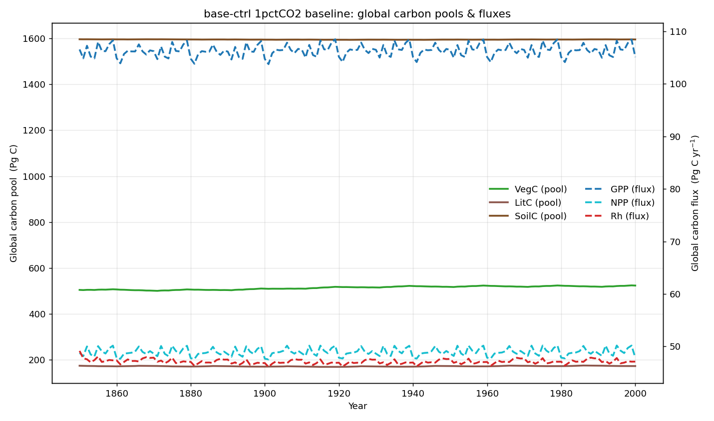

# base-ctrl 1pctCO2 baseline: carbon & nitrogen pools and fluxes

Global totals from the **base-ctrl** 1pctCO2 baseline run (0.5°, 1850–2000),
one subplot per variable.

- **Carbon pools** — VegC, LitC, SoilC — are end-of-year stocks in **Pg C**.
- **Carbon fluxes** — GPP, NPP, Ra, Rh, fire C — are annual totals in
  **Pg C yr⁻¹** (monthly outputs summed per year; fire C is native annual).
- **Soil nitrogen-gas fluxes** — N₂O, NO, N₂ — are annual totals in
  **Tg N yr⁻¹**. (The NO/N₂ source files are labelled `g c m⁻²` in the model
  output, but are nitrogen emissions.)

All totals are gridcell value × area, summed globally.

Approximate global totals over the run (first → last year):

| Variable | Type | Unit | First (1850) | Last (2000) |
|----------|------|------|-------------:|------------:|
| VegC  | C pool  | Pg C        | 505  | 524  |
| LitC  | C pool  | Pg C        | 174  | 173  |
| SoilC | C pool  | Pg C        | 1596 | 1595 |
| GPP   | C flux  | Pg C yr⁻¹   | 107  | 105  |
| NPP   | C flux  | Pg C yr⁻¹   | 49   | 48   |
| Ra    | C flux  | Pg C yr⁻¹   | 58   | 57   |
| Rh    | C flux  | Pg C yr⁻¹   | 49   | 47   |
| Fire C| C flux  | Pg C yr⁻¹   | 1.2  | 1.4  |
| N₂O   | N flux  | Tg N yr⁻¹   | 7.2  | 6.9  |
| NO    | N flux  | Tg N yr⁻¹   | 11.2 | 10.8 |
| N₂    | N flux  | Tg N yr⁻¹   | 1.5  | 1.4  |

!!! note "Not fully equilibrated"
    This is a control run, so pools/fluxes should be near-stationary, but
    **VegC drifts upward (~505 → 524 Pg C)** over the period and **Rh shows an
    elevated first year** — both look like incomplete spin-up / an
    initialisation transient rather than forced signals.
