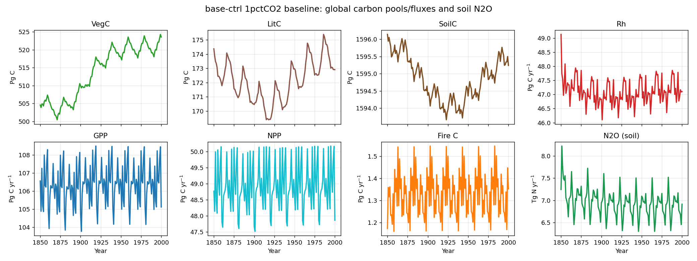

# base-ctrl 1pctCO2 baseline: carbon & N₂O summary

Global totals from the **base-ctrl** 1pctCO2 baseline run (0.5°, 1850–2000),
one subplot per variable: VegC, LitC, SoilC, Rh, GPP, NPP, fire C, N₂O.

- **Carbon pools** — VegC, LitC, SoilC — are end-of-year stocks in **Pg C**.
- **Carbon fluxes** — Rh, GPP, NPP, fire C — are annual totals in
  **Pg C yr⁻¹** (monthly outputs summed per year; fire C is native annual).
- **Soil N₂O flux** is an annual total in **Tg N yr⁻¹**.

Fluxes use the **monthly** model outputs (`m*`), not the daily (`d*`) files.
All totals are gridcell value × area, summed globally.

Approximate global totals over the run (first → last year):

| Variable | Type | Unit | First (1850) | Last (2000) |
|----------|------|------|-------------:|------------:|
| VegC   | C pool | Pg C      | 505  | 524  |
| LitC   | C pool | Pg C      | 174  | 173  |
| SoilC  | C pool | Pg C      | 1596 | 1595 |
| Rh     | C flux | Pg C yr⁻¹ | 49   | 47   |
| GPP    | C flux | Pg C yr⁻¹ | 107  | 105  |
| NPP    | C flux | Pg C yr⁻¹ | 49   | 48   |
| Fire C | C flux | Pg C yr⁻¹ | 1.2  | 1.4  |
| N₂O    | N flux | Tg N yr⁻¹ | 7.2  | 6.9  |

!!! note "Not fully equilibrated"
    This is a control run, so pools/fluxes should be near-stationary, but
    **VegC drifts upward (~505 → 524 Pg C)** over the period — this looks like
    an incomplete spin-up / initialisation transient rather than a forced
    signal.
