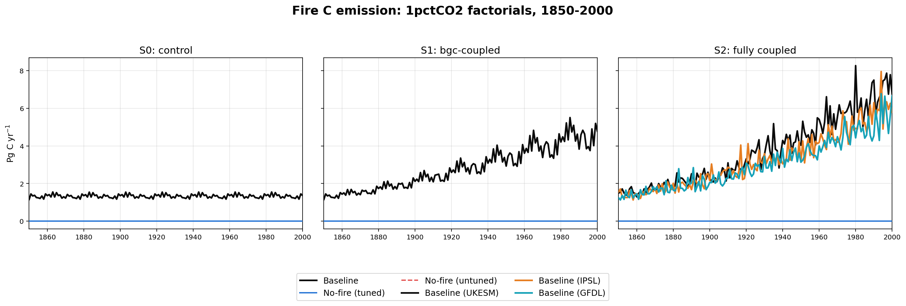
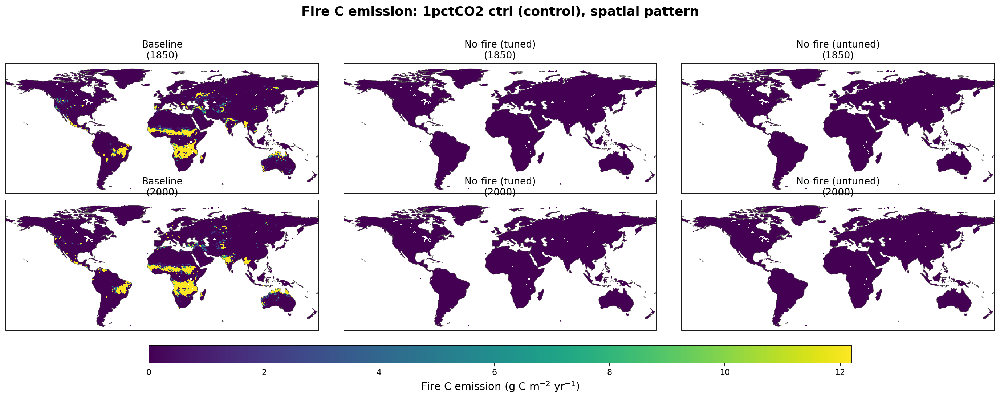
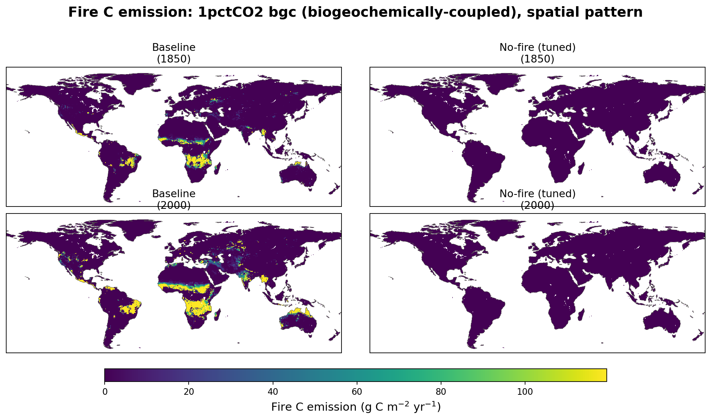
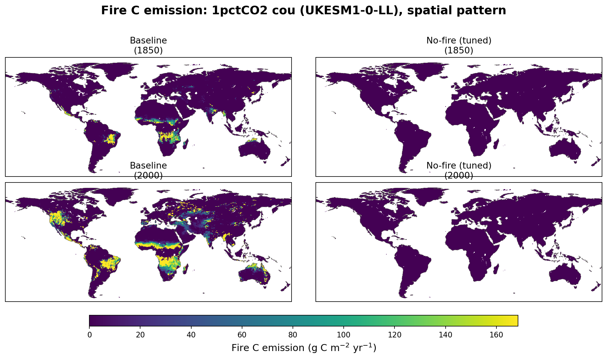
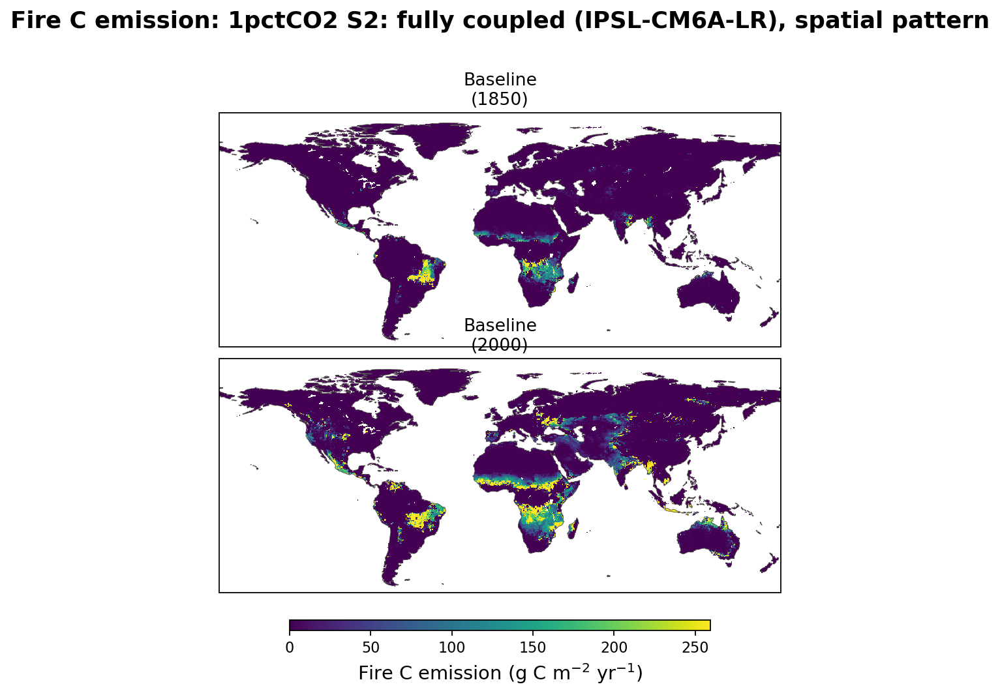
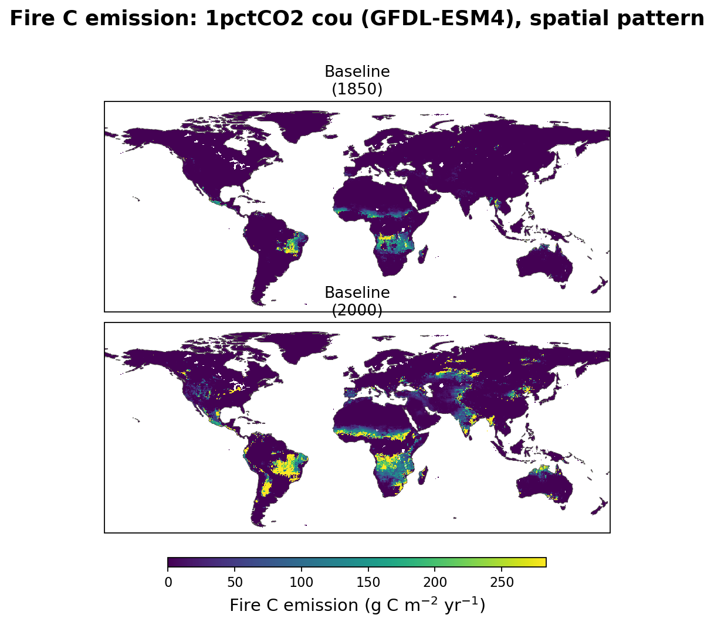

# Fire carbon emission: 1pctCO2

Line plot: subplots = stage (S0 control, S1 bgc-coupled, S2 fully
coupled), lines = factorial (baseline, no-fire tuned, no-fire untuned).
The S2 panel merges all three ESM drivers (UKESM1-0-LL, IPSL-CM6A-LR,
GFDL-ESM4) into one axes: baseline's UKESM-driven line keeps its usual
color, and its IPSL/GFDL-driven lines (orange / teal) are its only
other appearances there, since no-fire was only run with UKESM.
No-fire (untuned) only appears in the S0 panel (its only stage).

## Spatial pattern, 1850 vs 2000

Shared color scale per stage figure; NBP uses a diverging scale (blue = net
sink, red = net source), all other variables use a sequential scale.

### S0: control

### S1: bgc-coupled

### S2: fully coupled (UKESM1-0-LL)

### S2: fully coupled (IPSL-CM6A-LR)

Baseline only — no-fire has no IPSL-driven stage.

### S2: fully coupled (GFDL-ESM4)

Baseline only — no-fire has no GFDL-driven stage.

