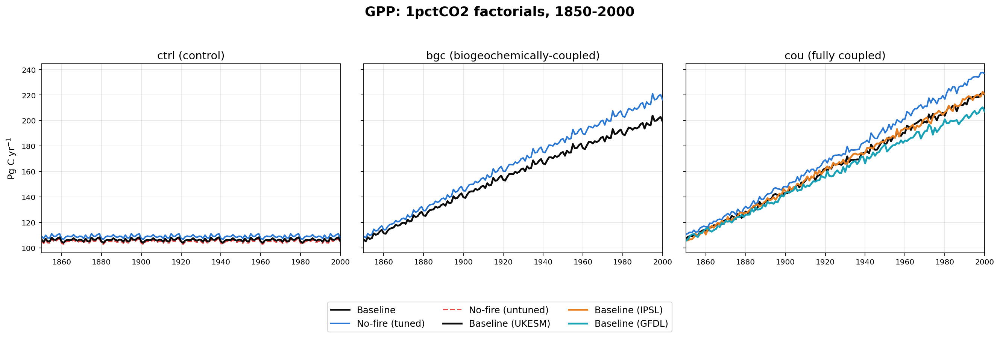
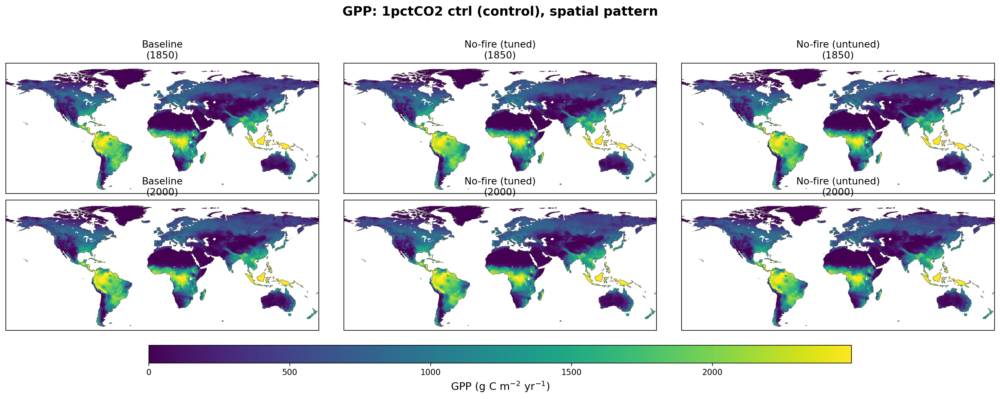
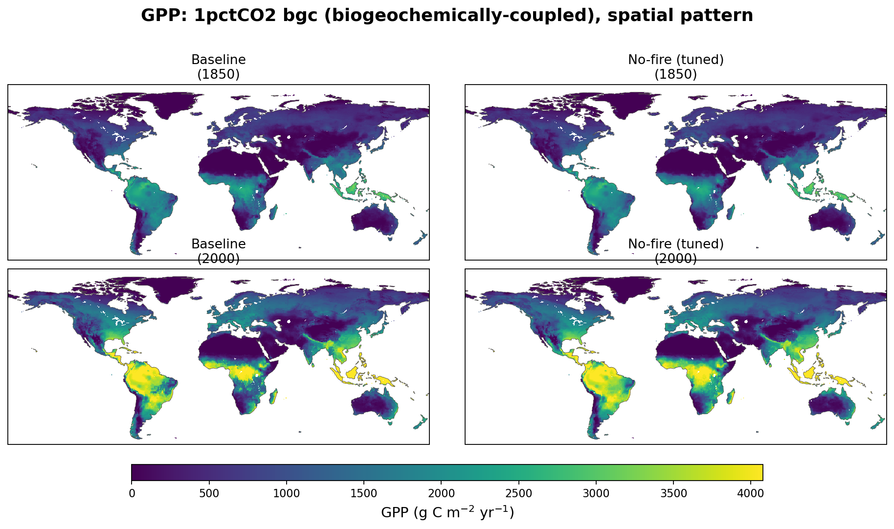
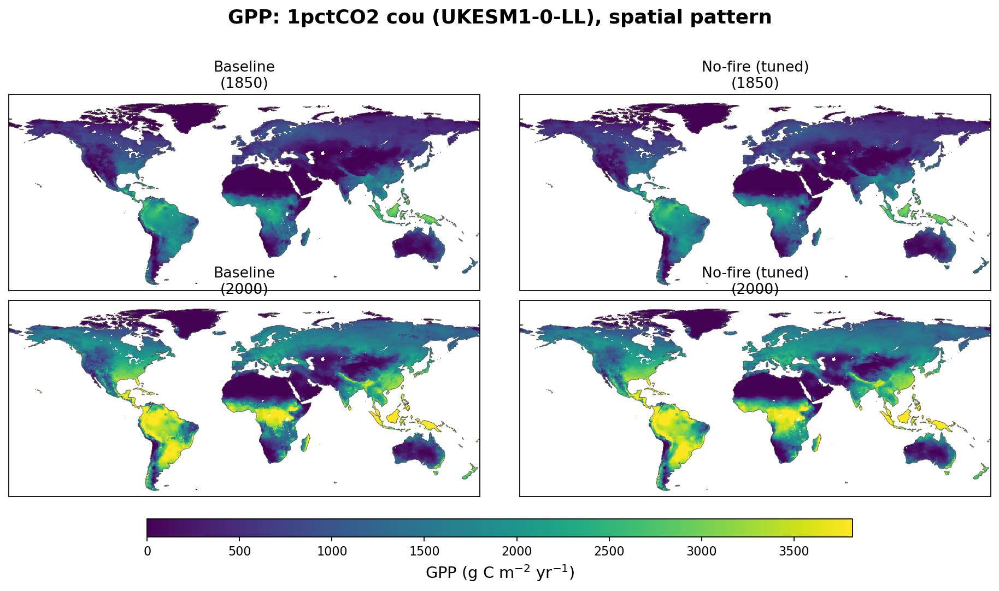
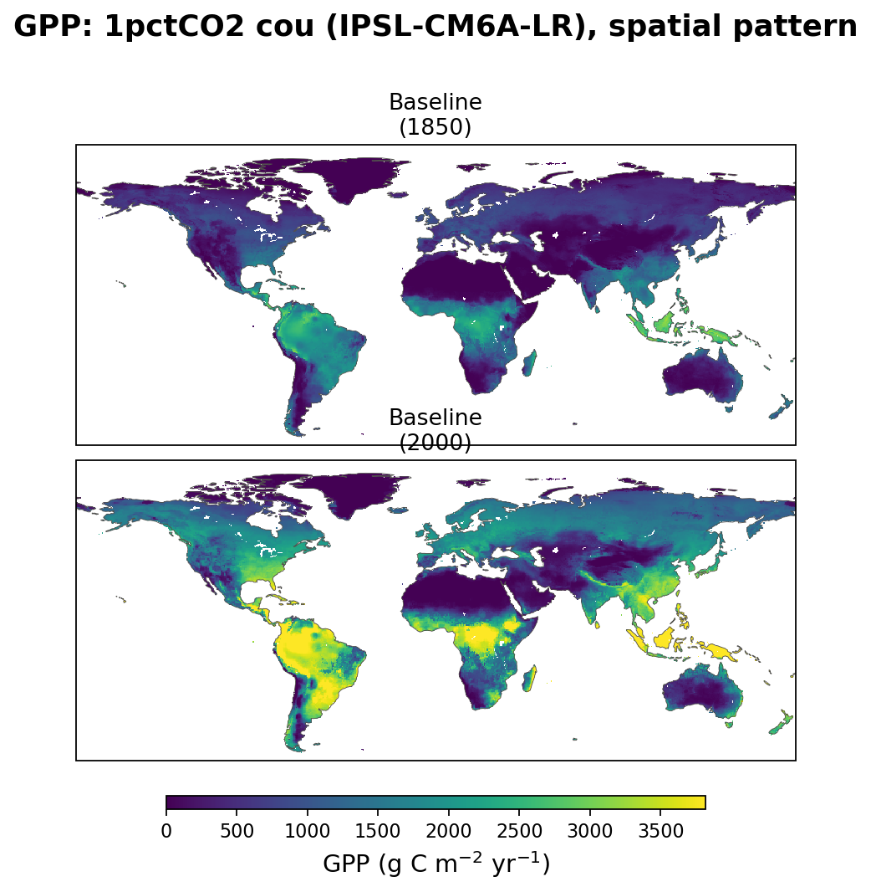
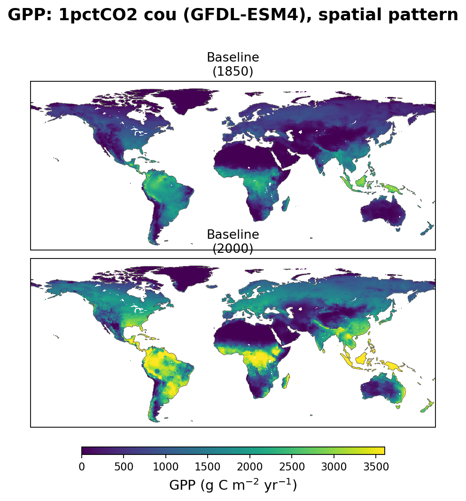

# GPP: 1pctCO2

Line plot: subplots = stage (ctrl, bgc, cou), lines = factorial (baseline, no-fire tuned, no-fire untuned).
The cou panel merges all three ESM drivers (UKESM1-0-LL, IPSL-CM6A-LR,
GFDL-ESM4) into one axes: baseline's UKESM-driven line keeps its usual
color, and its IPSL/GFDL-driven lines (orange / teal) are its only
other appearances there, since no-fire was only run with UKESM.
No-fire (untuned) only appears in the ctrl panel (its only stage).

## Spatial pattern, 1850 vs 2000

Shared color scale per stage figure; NBP uses a diverging scale (blue = net
sink, red = net source), all other variables use a sequential scale.

### ctrl (control)

### bgc (biogeochemically-coupled)

### cou (UKESM1-0-LL)

### cou (IPSL-CM6A-LR)

Baseline only — no-fire has no IPSL-driven stage.

### cou (GFDL-ESM4)

Baseline only — no-fire has no GFDL-driven stage.

