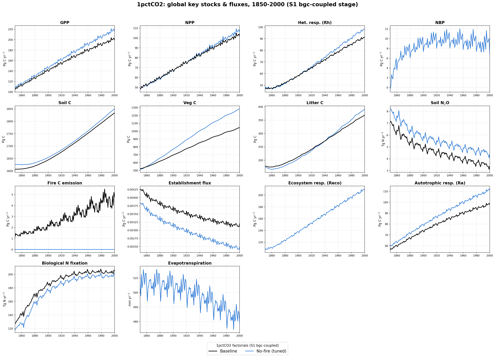

# 1pctCO2 benchmarking: overview

Global, area-weighted annual totals and spatial patterns for the WIEMIP
1pctCO2 experiment, comparing three factorials across all three protocol
stages:

- **Baseline** — the reference parameterization (fire on, N-limited).
- **No-fire (tuned)** — `nofire_simplified_v3`, SPITFIRE disabled and
  re-tuned to match baseline behavior where possible.
- **No-fire (untuned)** — SPITFIRE disabled, default/untuned parameters; a
  ctrl-only ablation reference (no bgc/cou-ukesm stage exists for this run).

Stages: **S0 (ctrl)** — fixed climate and land use, rising CO₂ only;
**S1 (bgc)** — biogeochemically-coupled (CO₂ fertilization under fixed
climate); **S2** — fully coupled to a transient climate, driven by one of
three ESMs: **UKESM1-0-LL** (baseline and no-fire), **IPSL-CM6A-LR** and
**GFDL-ESM4** (baseline only — no-fire was not run with these two drivers).
All runs span 1850–2000 (151 years) on the 0.5° global grid.

Monthly output is grouped by calendar year and summed to an annual value
before area-weighting (a no-op for variables already reported annually).
Carbon stocks & fluxes are in **Pg C** / **Pg C yr⁻¹**; the nitrogen-cycle
variables (soil N₂O, biological N fixation) are in **Tg N yr⁻¹**;
evapotranspiration is an area-weighted global-mean depth in **mm yr⁻¹**.

Use the links in the left nav to zoom in on any individual variable's line
plot (stage subplots × factorial lines) and spatial maps (1850 vs 2000, per
stage).

## Global overview, 1850–2000

GPP, NPP, heterotrophic respiration (Rh), NBP, soil/vegetation/litter carbon,
soil N₂O, fire carbon emission, establishment flux, ecosystem respiration
(Reco), autotrophic respiration (Ra), biological N fixation (BNF), and
evapotranspiration — one panel per variable, at the **S1 (bgc-coupled)**
stage, the CO₂-only-forced stage where the 1pctCO2 ramp shows up as a clean
response curve (the S0/ctrl stage holds CO₂ near its mean and only shows
interannual noise — see the per-variable pages for that comparison). No-fire
(untuned) has no bgc stage and so does not appear on this overview.

