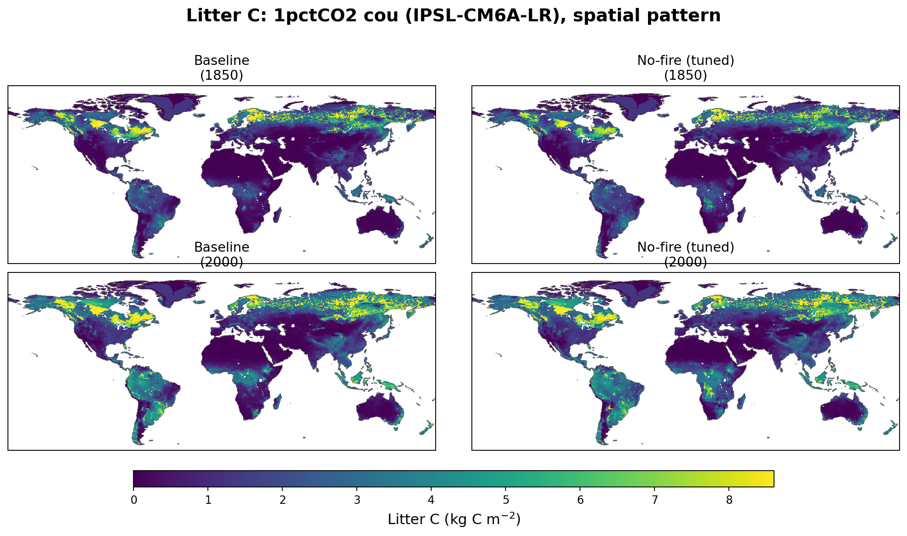
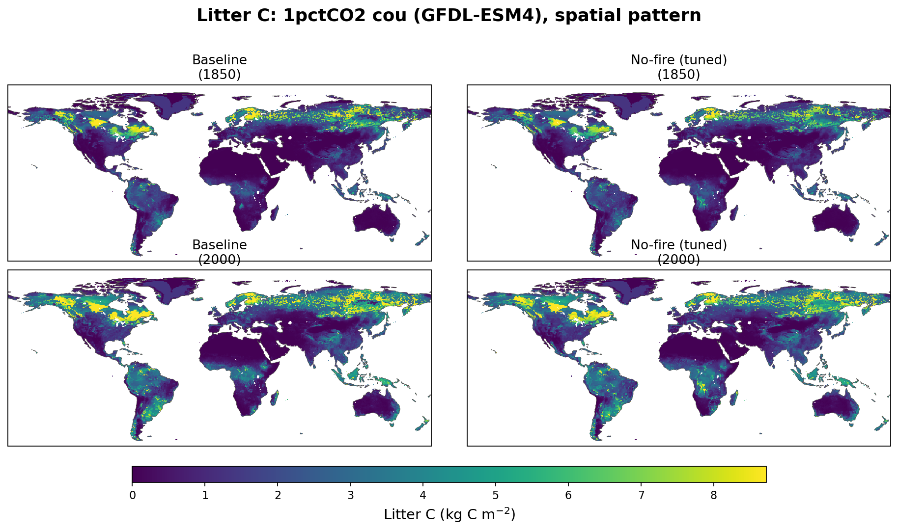

# Litter carbon: 1pctCO2

Line plot: subplots = stage (ctrl, bgc, cou), lines = factorial (baseline,
no-fire tuned, no-fire untuned). The cou panel merges all three ESM
drivers (UKESM1-0-LL, IPSL-CM6A-LR, GFDL-ESM4) into one axes: each
factorial's UKESM-driven line keeps that factorial's usual color, while
its IPSL/GFDL-driven lines get their own distinct colors - 6 lines total,
all mutually distinguishable. No-fire (untuned) only appears in the ctrl
panel (its only stage).

## Spatial pattern, 1850 vs 2000

Shared color scale per stage figure; NBP uses a diverging scale (blue = net
sink, red = net source), all other variables use a sequential scale.

### ctrl (control)

### bgc (biogeochemically-coupled)

### cou (UKESM1-0-LL)

### cou (IPSL-CM6A-LR)

### cou (GFDL-ESM4)

