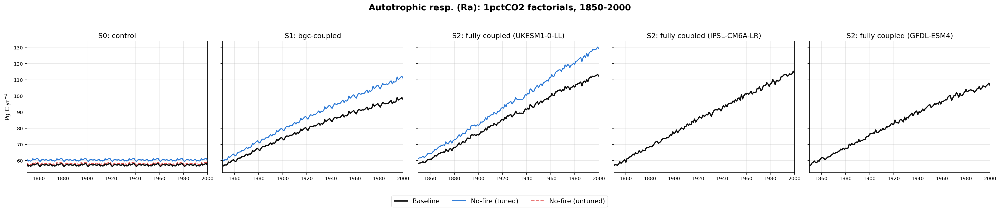
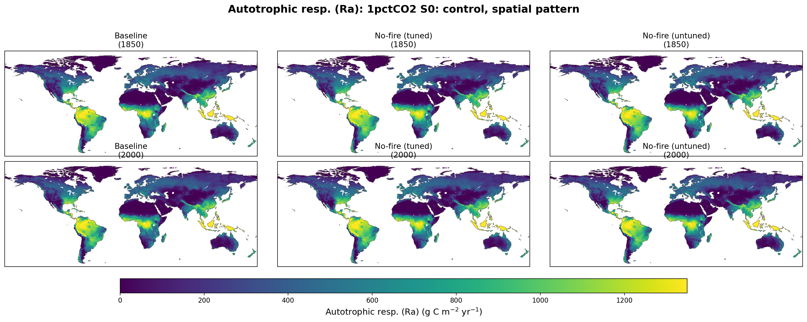
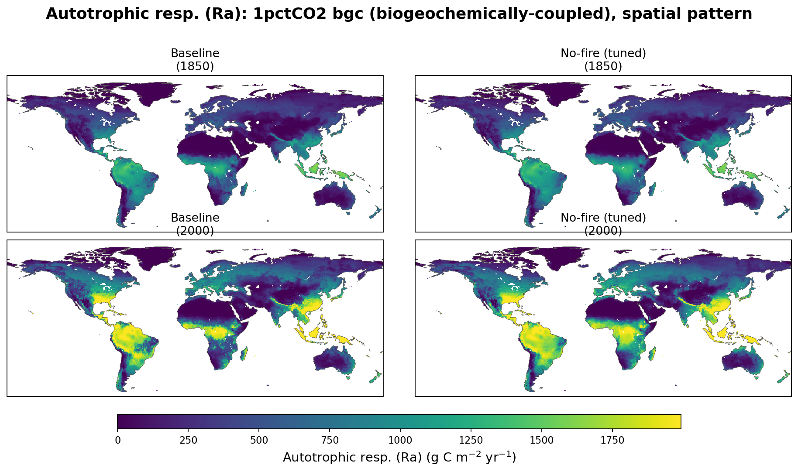
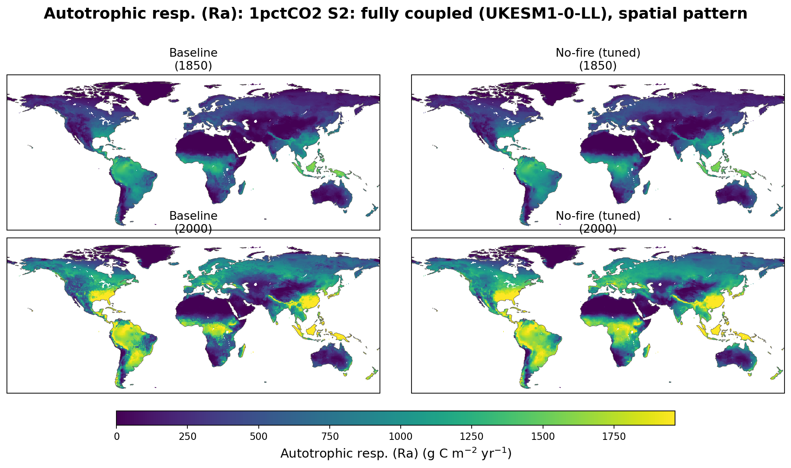
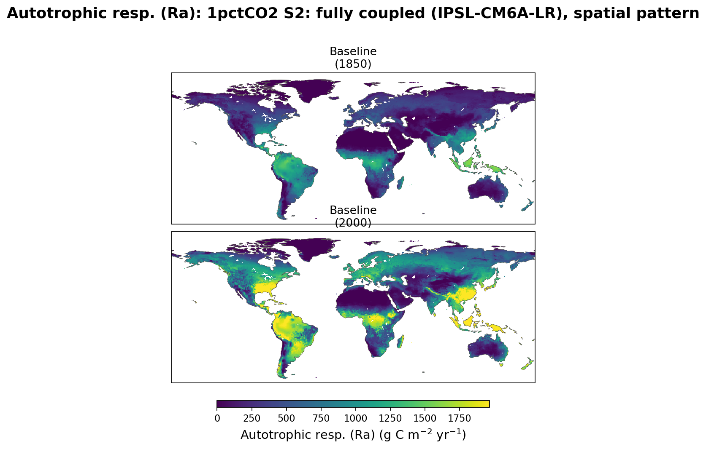
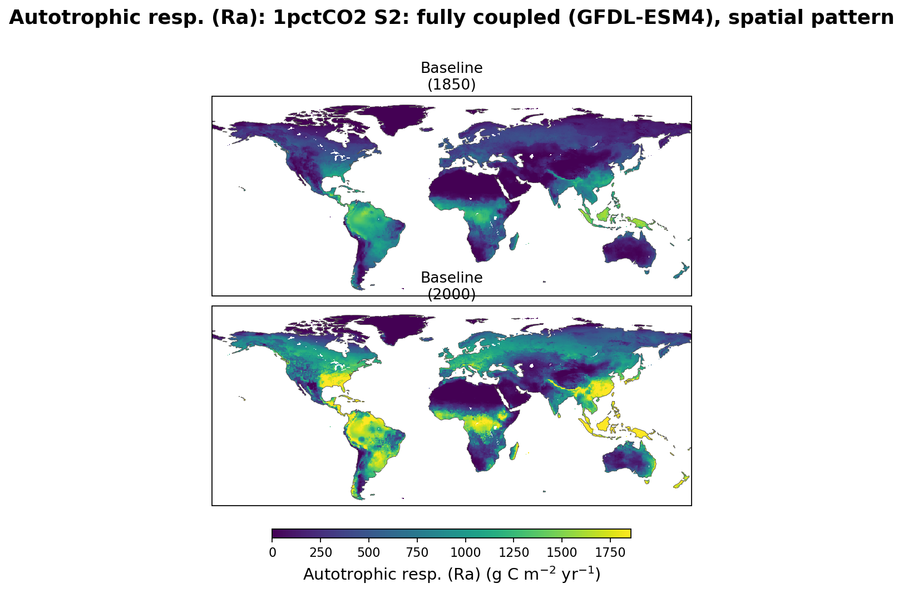

# Autotrophic respiration (Ra): 1pctCO2

Line plot: subplots = stage (S0 control, S1 bgc-coupled, S2 fully coupled —
UKESM1-0-LL, IPSL-CM6A-LR, GFDL-ESM4), lines = factorial (baseline, no-fire
tuned, no-fire untuned). No-fire (untuned) only appears in the S0 panel
(its only stage); no-fire (tuned) only appears in S0/S1/S2-UKESM (its only
ESM driver) — the S2-IPSL and S2-GFDL panels show baseline only, since no
other factorial was run with those ESM drivers.

## Spatial pattern, 1850 vs 2000

Shared color scale per stage figure; NBP uses a diverging scale (blue = net
sink, red = net source), all other variables use a sequential scale.

### S0: control

### S1: bgc-coupled

### S2: fully coupled (UKESM1-0-LL)

### S2: fully coupled (IPSL-CM6A-LR)

Baseline only — no-fire has no IPSL-driven stage.

### S2: fully coupled (GFDL-ESM4)

Baseline only — no-fire has no GFDL-driven stage.

