# Overshoot + historical benchmarking

Global, area-weighted (`Σ value × cell area`) annual totals for the historical
run (`LPJ-hist-transientN`, S2, 1850–2023) continued by all six UKESM1-0-LL
overshoot future scenarios (2024–2300): **L**, **ML**, **ML (counterfactual)**,
**M**, **HL**, **HL (counterfactual)** — an ordered low→high overshoot-severity
spectrum, with each `_CF` variant being the WIEMIP-protocol counterfactual
pathway for its base scenario. The drift control (`LPJ-hist-ctrl`, S0) is not
shown here — see [**Historical vs control**](../../overshoots/lpj_results/hist_vs_control.md)
for that comparison.

Monthly output is grouped by calendar year and summed to an annual value
before area-weighting (a no-op for variables already reported annually).
Carbon stocks & fluxes are in **Pg C** / **Pg C yr⁻¹**; the nitrogen-cycle
variables (soil N₂O, biological N fixation) are in **Tg N yr⁻¹**;
evapotranspiration is an area-weighted global-mean depth in **mm yr⁻¹**.

!!! note "wet_frac omitted"
    Wetland fraction (`wet_frac`) was requested but is not present in the
    LPJ-EOSIM output configuration for any of these runs — it is omitted here
    rather than approximated.

## Global timeseries, 1850–2300

GPP, NPP, heterotrophic respiration (Rh), NBP, soil/vegetation/litter carbon,
soil N₂O, fire carbon emission, establishment flux, ecosystem respiration
(Reco), autotrophic respiration (Ra), biological N fixation (BNF), and
evapotranspiration — one panel per variable, historical (dark, solid) followed
by all six scenarios (L blue, ML green, M violet, HL red; dashed = the
scenario's counterfactual variant).

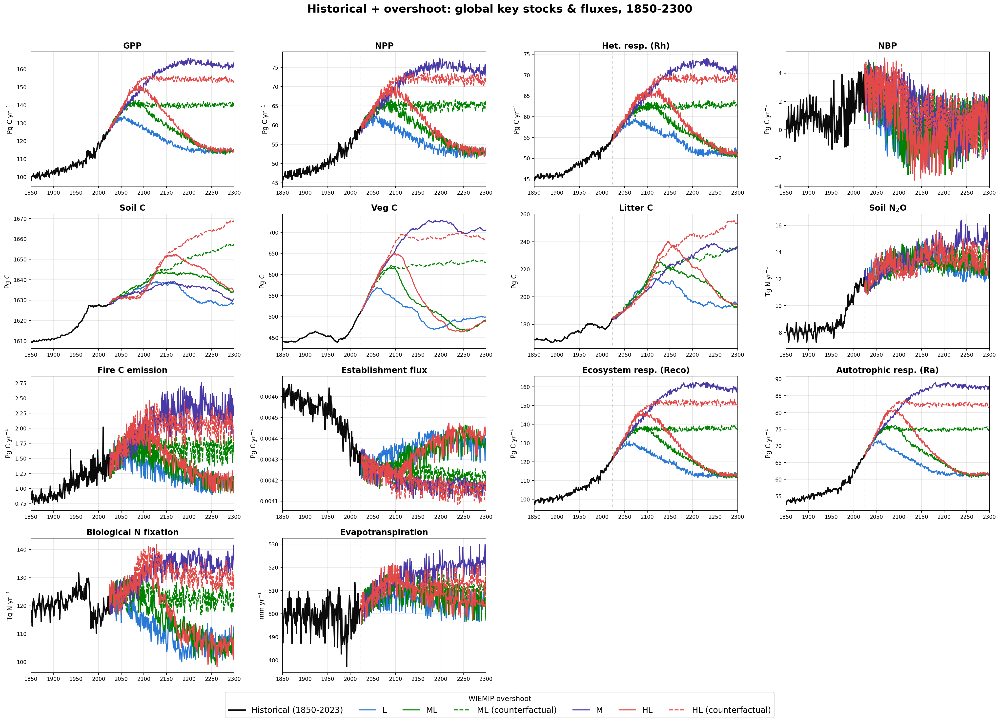

## Spatial patterns: start vs end of each run

For each variable, two map figures: the annual field at the **start** of each
run (1850 for historical, 2024 — the historical branch point — for every
future scenario) and at the **end** of each run (2023 for historical, 2300 for
the futures), on a shared color scale per figure so panels are directly
comparable. NBP uses a diverging scale (blue = net sink, red = net source);
all other variables use a sequential scale.

### GPP

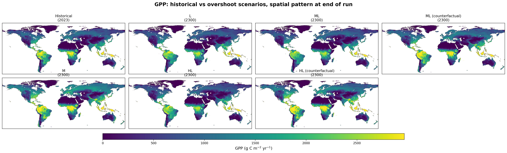

### NPP

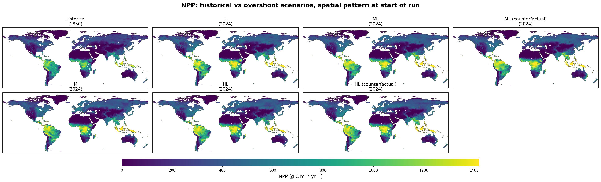
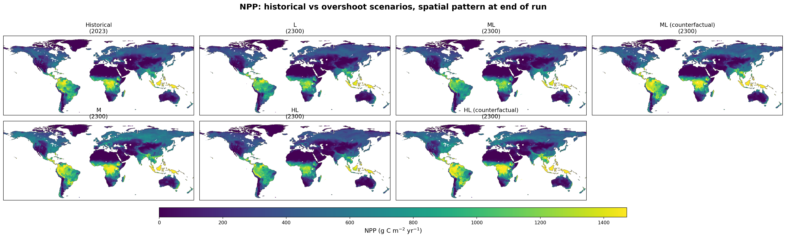

### Heterotrophic respiration (Rh)

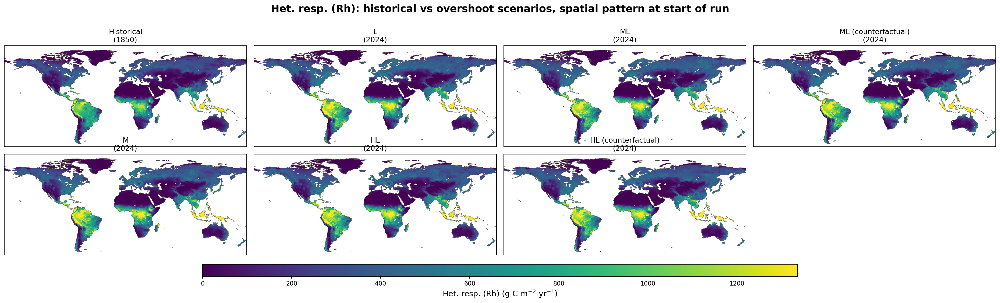
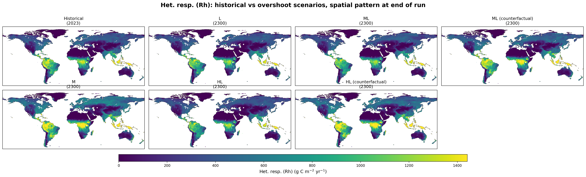

### NBP

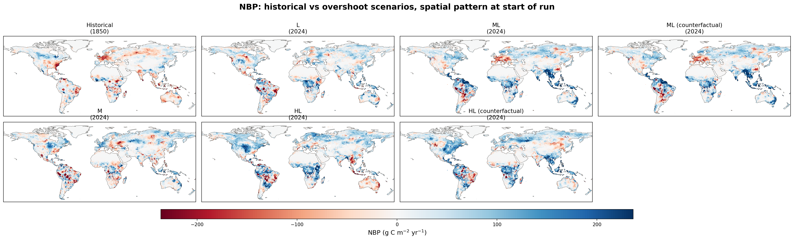
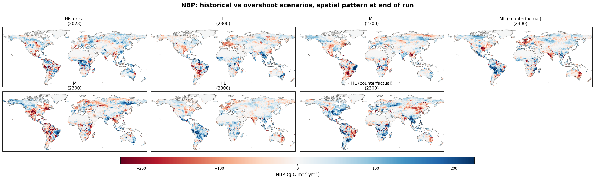

### Soil carbon

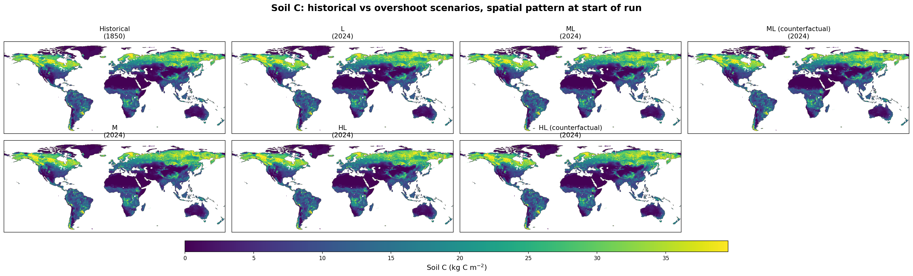
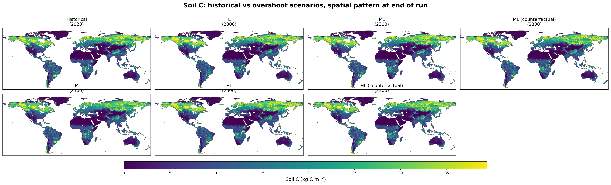

### Vegetation carbon

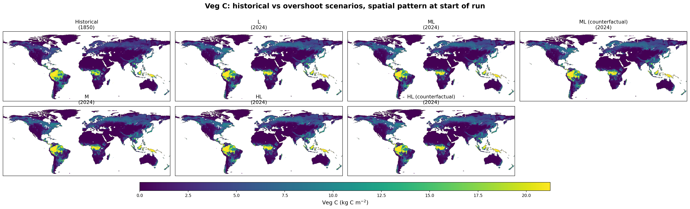
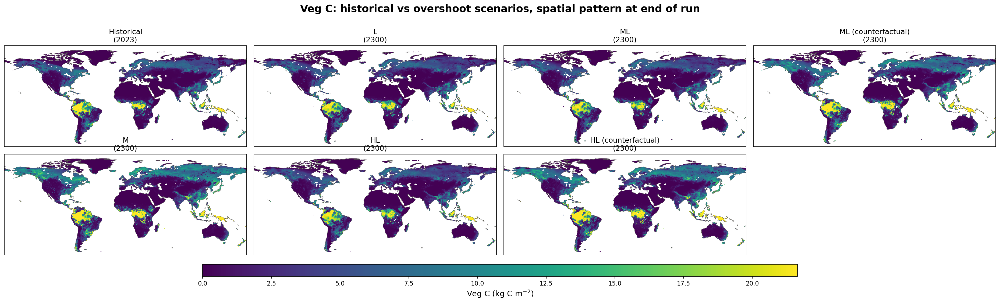

### Litter carbon

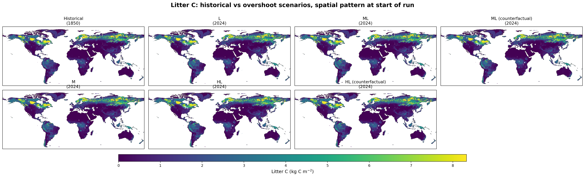
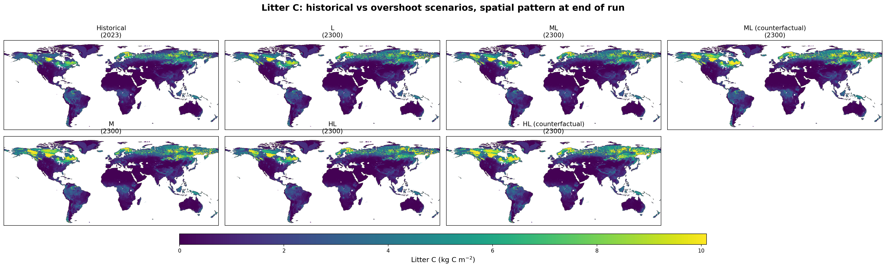

### Soil N₂O

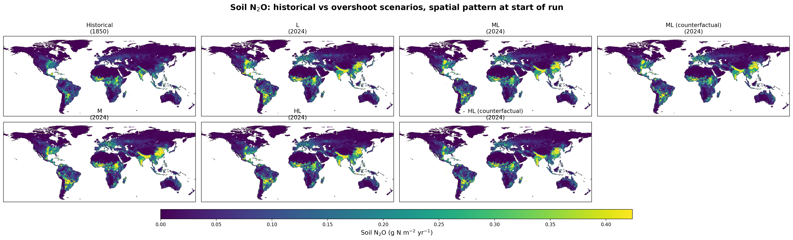
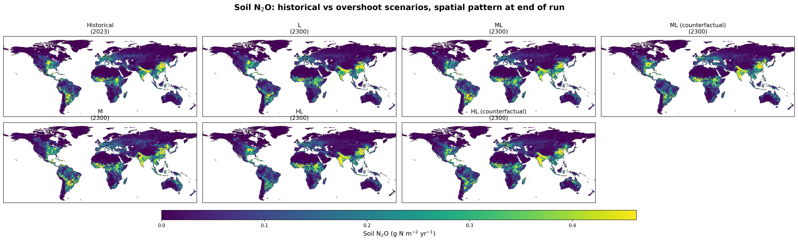

### Fire carbon emission

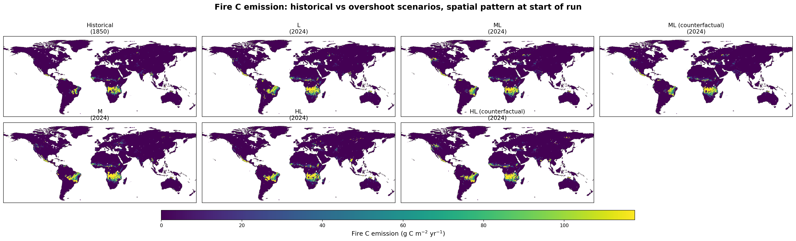

### Establishment flux

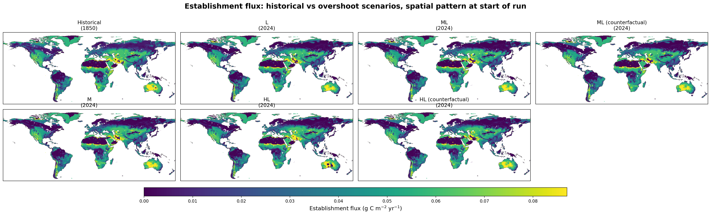

### Ecosystem respiration (Reco)

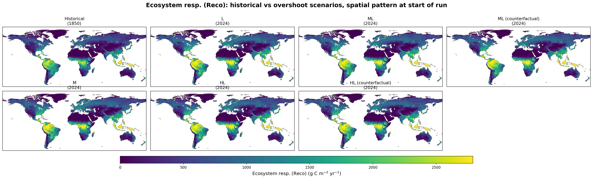
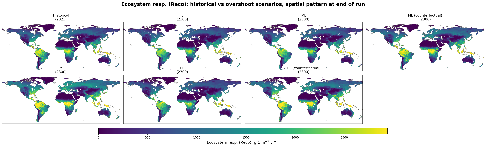

### Autotrophic respiration (Ra)

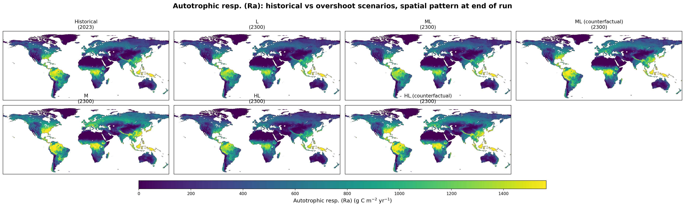

### Biological N fixation (BNF)

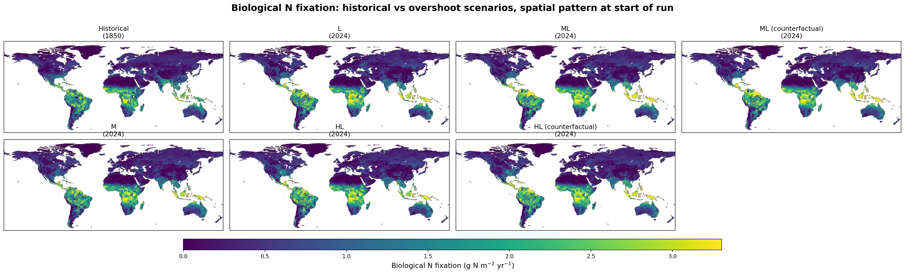
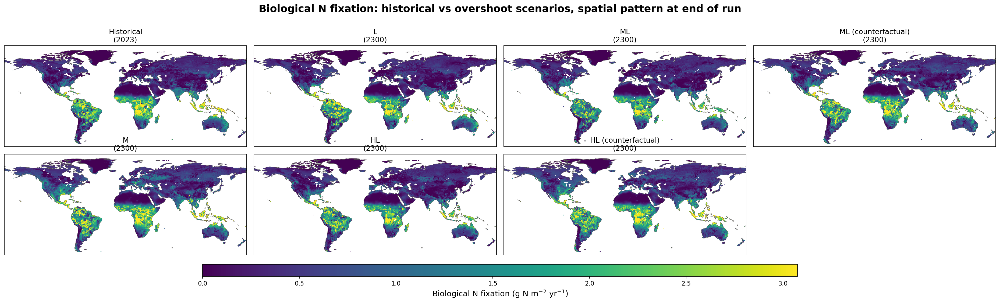

### Evapotranspiration

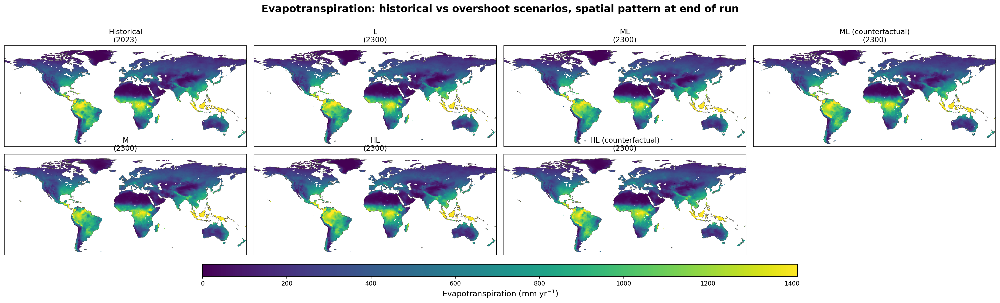
