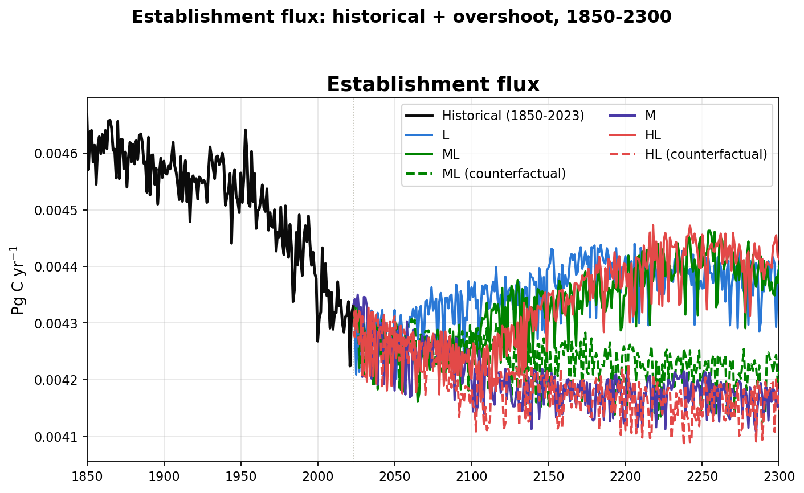

# Establishment flux: historical + overshoot

## Spatial pattern: start vs end of each run

Start of run = 1850 for historical, 2024 (the historical branch point) for
every future scenario; end of run = 2023 for historical, 2300 for the
futures. Shared color scale per figure; NBP uses a diverging scale (blue =
net sink, red = net source), all other variables use a sequential scale.

### Start of run

### End of run

