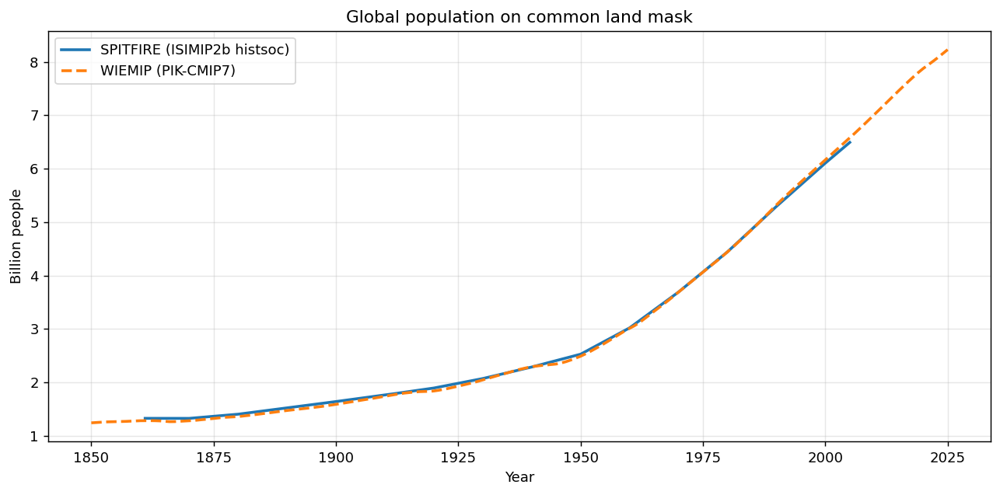
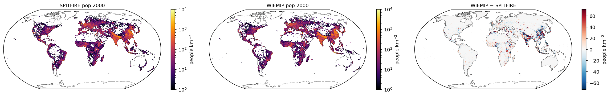
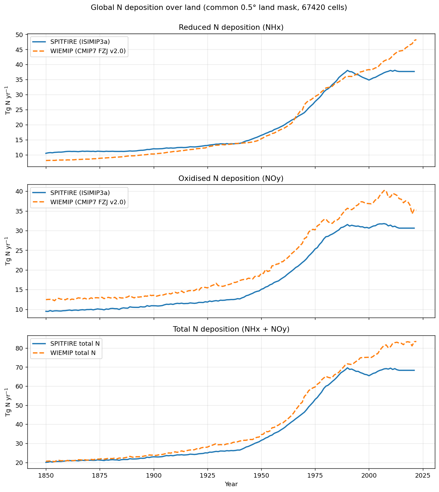
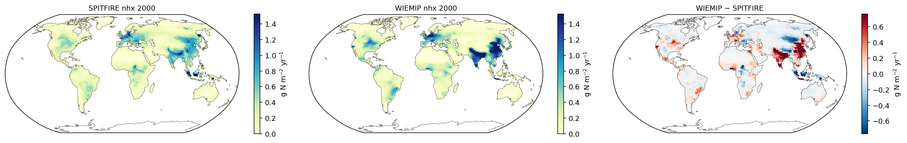
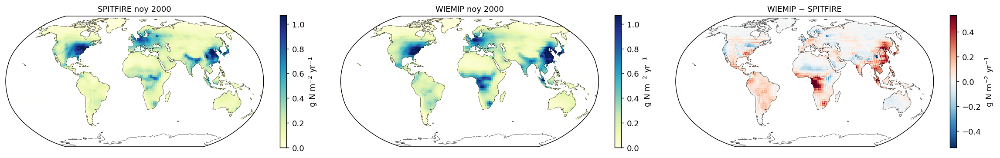

# WIEMIP vs SPITFIRE drivers — population & N deposition

Cross-check of two non-climate driver families against the converted **WIEMIP
historical** inputs:

| Variable | SPITFIRE / LPJmL driver | WIEMIP source |
|---|---|---|
| Population | `population_histsoc_0p5deg_annual_1861-2005` (ISIMIP2b *histsoc*) | `pop-dens … PIK-CMIP-1-0-1` (input4MIPs CMIP7) |
| Reduced N deposition (NHx) | `nh4-deposition_isimip3a_histsoc_1850-2021` (ISIMIP3a) | `drynhx … FZJ-CMIP-nitrogen-2-0` (input4MIPs CMIP7) |
| Oxidised N deposition (NOy) | `no3-deposition_isimip3a_histsoc_1850-2021` (ISIMIP3a) | `drynoy … FZJ-CMIP-nitrogen-2-0` (input4MIPs CMIP7) |

Everything below is computed on the **common 0.5° land mask** — the 67 420
land cells of the LPJmL CRU grid. WIEMIP fields (full-globe 720×360) are sampled
onto exactly those cells, so global aggregates are over an identical set of
cells and are directly comparable.

!!! note "Units — read before comparing magnitudes"
    The two driver families behave differently when checked in their **raw,
    untransformed** units:

    * **Population** — both files store `number_of_people` per grid cell
      (units `1`). They are directly comparable with **no conversion**; the
      WIEMIP file was already converted from `pop_dens` (people km⁻²) to a head
      count via `× gridarea ÷ 1e6`. ✅ Raw magnitudes match.
    * **N deposition** — the SPITFIRE `.clm` is in **g m⁻² day⁻¹** (monthly
      time steps), whereas the WIEMIP NetCDF is in **g N m⁻² month⁻¹**. These
      are *not* the same raw quantity — they differ by roughly the number of
      days in a month (~30×). ⚠️ To compare you **must** multiply the SPITFIRE
      values by days-in-month. Below, both are converted to an annual flux and
      reported as a global total in **Tg N yr⁻¹**.

    Conversions used: N flux × cell area → summed over the 12 months
    (365-day year, matching the WIEMIP calendar) → Tg N yr⁻¹. Population is a
    straight head-count sum → billions.

## Population

Same units, no transformation. The two records are effectively
indistinguishable over the whole 1861–2005 overlap — a good sign that the
CMIP7 conversion (density → head count) was applied correctly.

| Year | SPITFIRE (billion) | WIEMIP (billion) |
|---|---|---|
| 1861 | 1.327 | 1.283 |
| 1950 | 2.528 | 2.490 |
| 2000 | 6.106 | 6.164 |
| 2005 | 6.493 | 6.579 |

Spatial pattern for 2000 (people km⁻², log scale; right panel is the
difference). The distributions are near-identical; residuals are small and
sit at coastlines/megacity pixels, i.e. sub-grid placement rather than a bulk
offset.

## Nitrogen deposition

Converted to **Tg N yr⁻¹** on the common land mask (see units note above).
NHx, NOy and their sum:

| Variable / Year | SPITFIRE (Tg N yr⁻¹) | WIEMIP (Tg N yr⁻¹) |
|---|---|---|
| NHx 1900 | 12.04 | 10.30 |
| NHx 1950 | 16.51 | 15.37 |
| NHx 2000 | 34.85 | 38.31 |
| NHx 2021 | 37.69 | 47.94 |
| NOy 1900 | 10.89 | 13.55 |
| NOy 1950 | 15.06 | 19.18 |
| NOy 2000 | 30.63 | 36.87 |
| NOy 2021 | 30.63 | 35.37 |

Magnitudes agree to first order — both reach a global land total of order
70–85 Tg N yr⁻¹ by 2000 — but they are **not** the same dataset and the
differences are real, not unit artefacts:

* **NHx** tracks closely up to ~1990, then the WIEMIP (CMIP7) record keeps
  rising while SPITFIRE (ISIMIP3a) plateaus — by 2021 WIEMIP is ~27 % higher.
* **NOy** is systematically higher in WIEMIP across the whole record
  (~20–25 %), and shows the well-known post-2000 decline in the WIEMIP series
  that the ISIMIP3a series renders as a flat plateau.

Spatial pattern for 2000 (g N m⁻² yr⁻¹; right panel is WIEMIP − SPITFIRE).
Both place the hotspots over India, eastern China, Europe and the US Midwest;
the difference map shows WIEMIP is higher over the East/South Asian hotspots
and parts of Europe.

### NHx (reduced N)

### NOy (oxidised N)

## Method / reproducibility

* SPITFIRE `.clm` files are read directly from the binary using the sidecar
  `.json` metadata (datatype, `ncell`, `nstep`, `nbands`, `scalar`, byte order,
  `cellyear` cell-major ordering). The reader was validated cell-for-cell
  against the source `population_histsoc … .nc4`.
* WIEMIP NetCDFs are sampled at the SPITFIRE land-cell coordinates (both are on
  the same 0.5° longitude grid; WIEMIP is full-globe in latitude).
* Cell areas from the spherical-cap formula on a 6371 km sphere.
* Scripts: `/mnt/beegfs/scratch/tc229954e/wiemip_compare/` (`clmlib.py`,
  `analyze.py`).
